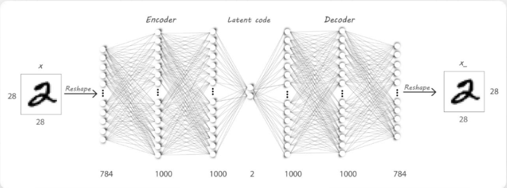
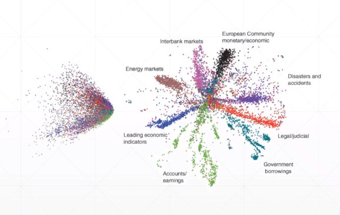
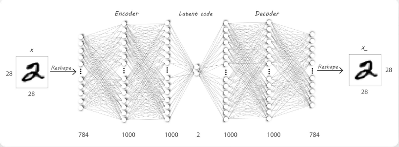
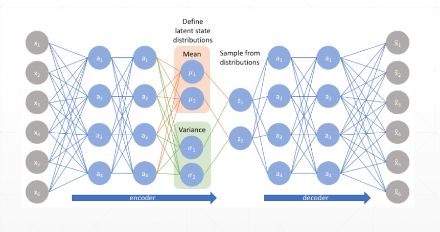

# TensorFlow2自编码器


## 简介
深度学习中也有很多无监督学习的算法，其中，自编码器是最为典型的代表。事实上，人工标注的数据毕竟是少数，互联网每天都在产生海量的无标签数据，如何利用这些数据就是无监督学习研究的重点。自编码器被广泛应用于特征提取（数据降维），其降维后的数据，样本之间保留了较多的相关信息。


## 自编码器
对自编码器这种结构，进行无监督学习的方法就是将输入作为输出，尽可能通过先降维后升维的运算后，保持输入的不变性，从而，降维后的数据包含更多原始的信息。所以，自编码器的端到端过程其实是一个数据重建过程。

关于自编码器的训练，对于不同的数据（二分输入或真值输入）采用不同的损失函数（MSE或CE）。相比于PCA这类矩阵运算方法，自编码器由于非线性特性，丢失信息较少；而且PCA降维后的数据，可解释性变得很低，而AE降维后的数据解释性强且具有聚类效果。
下图左侧为PCA降维后各类数据的二维显示，右侧为自编码器的效果。


## 自编码器变种
Denoising AutoEncoders（降噪自编码器），训练时将原始数据加入随机噪声（如高斯噪声），这样，自编码器模型可以较好地从噪声图片中还原真实图片。

Adversarial AutoEncoders（对抗自编码器），训练同时设定一个鉴别器（discriminator），用于坚定中间隐层的输出是否符合标准的指定分布（这是采用GAN（对抗生成网络）的思路）。

Variational AutoEncoders（变分自编码器），用于生成与训练数据类似分布的数据，尽管曾今有过瞩目的表现，但是随着GAN的发展，收到了极大的冲击。


## 自编码器实战
通过普通的神经元神经网络，利用低维隐层捕获特征，实现如下模型。
```python
"""
Author: Zhou Chen
Date: 2019/11/17
Desc: About
"""
import os
import tensorflow as tf
import numpy as np
from tensorflow import keras
from tensorflow.keras import Sequential, layers
from PIL import Image
os.environ['TF_CPP_MIN_LOG_LEVEL'] = '2'


def save_images(imgs, name):
    """
    多图整合保存
    :param imgs:
    :param name:
    :return:
    """
    new_im = Image.new('L', (280, 280))

    index = 0
    for i in range(0, 280, 28):
        for j in range(0, 280, 28):
            im = imgs[index]
            im = Image.fromarray(im, mode='L')
            new_im.paste(im, (i, j))
            index += 1

    new_im.save(name)


h_dim = 20
batchsz = 512
lr = 1e-3

(x_train, y_train), (x_test, y_test) = keras.datasets.fashion_mnist.load_data()
x_train, x_test = x_train.astype(np.float32) / 255., x_test.astype(np.float32) / 255.
train_db = tf.data.Dataset.from_tensor_slices(x_train)
train_db = train_db.shuffle(batchsz * 5).batch(batchsz)
test_db = tf.data.Dataset.from_tensor_slices(x_test)
test_db = test_db.batch(batchsz)

print(x_train.shape, y_train.shape)
print(x_test.shape, y_test.shape)


class AE(keras.Model):

    def __init__(self):
        super(AE, self).__init__()

        # Encoders
        self.encoder = Sequential([
            layers.Dense(256, activation=tf.nn.relu),
            layers.Dense(128, activation=tf.nn.relu),
            layers.Dense(h_dim)
        ])

        # Decoders
        self.decoder = Sequential([
            layers.Dense(128, activation=tf.nn.relu),
            layers.Dense(256, activation=tf.nn.relu),
            layers.Dense(784)
        ])

    def call(self, inputs, training=None):
        # [b, 784] => [b, 10]
        h = self.encoder(inputs)
        # [b, 10] => [b, 784]
        x_hat = self.decoder(h)

        return x_hat


model = AE()
model.build(input_shape=(None, 784))
model.summary()

optimizer = tf.optimizers.Adam(lr=lr)

for epoch in range(100):

    for step, x in enumerate(train_db):

        # [b, 28, 28] => [b, 784]
        x = tf.reshape(x, [-1, 784])

        with tf.GradientTape() as tape:
            x_rec_logits = model(x)

            rec_loss = tf.losses.binary_crossentropy(x, x_rec_logits, from_logits=True)
            rec_loss = tf.reduce_mean(rec_loss)

        grads = tape.gradient(rec_loss, model.trainable_variables)
        optimizer.apply_gradients(zip(grads, model.trainable_variables))

        if step % 100 == 0:
            print('epoch', epoch, 'step', step, float(rec_loss))

        # evaluation
        x = next(iter(test_db))
        logits = model(tf.reshape(x, [-1, 784]))
        x_hat = tf.sigmoid(logits)
        # [b, 784] => [b, 28, 28]
        x_hat = tf.reshape(x_hat, [-1, 28, 28])

        # [b, 28, 28] => [2b, 28, 28]
        x_concat = tf.concat([x, x_hat], axis=0)
        x_concat = x_hat
        x_concat = x_concat.numpy() * 255.
        x_concat = x_concat.astype(np.uint8)
        save_images(x_concat, 'images/rec_epoch_%d.png' % epoch)
```

VAE学习的是数据分布，依据该分布sample出结果。
```python
"""
Author: Zhou Chen
Date: 2019/11/17
Desc: About
"""
import os
import tensorflow as tf
import numpy as np
from tensorflow import keras
from tensorflow.keras import Sequential, layers
from PIL import Image
os.environ['TF_CPP_MIN_LOG_LEVEL'] = '2'


def save_images(imgs, name):
    new_im = Image.new('L', (280, 280))

    index = 0
    for i in range(0, 280, 28):
        for j in range(0, 280, 28):
            im = imgs[index]
            im = Image.fromarray(im, mode='L')
            new_im.paste(im, (i, j))
            index += 1

    new_im.save(name)


h_dim = 20
batchsz = 512
lr = 1e-3

(x_train, y_train), (x_test, y_test) = keras.datasets.fashion_mnist.load_data()
x_train, x_test = x_train.astype(np.float32) / 255., x_test.astype(np.float32) / 255.
# we do not need label
train_db = tf.data.Dataset.from_tensor_slices(x_train)
train_db = train_db.shuffle(batchsz * 5).batch(batchsz)
test_db = tf.data.Dataset.from_tensor_slices(x_test)
test_db = test_db.batch(batchsz)

print(x_train.shape, y_train.shape)
print(x_test.shape, y_test.shape)

z_dim = 10


class VAE(keras.Model):

    def __init__(self):
        super(VAE, self).__init__()

        # Encoder
        self.fc1 = layers.Dense(128)
        self.fc2 = layers.Dense(z_dim)  # 均值
        self.fc3 = layers.Dense(z_dim)  # 方差

        # Decoder
        self.fc4 = layers.Dense(128)
        self.fc5 = layers.Dense(784)

    def encoder(self, x):
        h = tf.nn.relu(self.fc1(x))
        mu = self.fc2(h)
        log_var = self.fc3(h)  # 取log方差
        return mu, log_var

    def decoder(self, z):
        out = tf.nn.relu(self.fc4(z))
        out = self.fc5(out)

        return out

    def reparameterize(self, mu, log_var):
        epsilon = tf.random.normal(log_var.shape)
        std = tf.exp(log_var) ** 0.5
        z = mu + std * epsilon
        return z

    def call(self, inputs, training=None):
        # [b, 784] => mu:[b, z_dim], log_var[b, z_dim]
        mu, log_var = self.encoder(inputs)
        # reparameterization技巧
        z = self.reparameterize(mu, log_var)

        x_hat = self.decoder(z)

        return x_hat, mu, log_var


model = VAE()
model.build(input_shape=(3, 784))
optimizer = tf.optimizers.Adam(lr)

for epoch in range(1000):

    for step, x in enumerate(train_db):

        x = tf.reshape(x, [-1, 784])

        with tf.GradientTape() as tape:
            x_rec_logits, mu, log_var = model(x)

            rec_loss = tf.nn.sigmoid_cross_entropy_with_logits(labels=x, logits=x_rec_logits)
            rec_loss = tf.reduce_sum(rec_loss) / x.shape[0]
            kl_div = -0.5 * (log_var + 1 - mu ** 2 - tf.exp(log_var))
            kl_div = tf.reduce_sum(kl_div) / x.shape[0]

            loss = rec_loss + 1. * kl_div

        grads = tape.gradient(loss, model.trainable_variables)
        optimizer.apply_gradients(zip(grads, model.trainable_variables))

        if step % 100 == 0:
            print(epoch, step, 'kl div:', float(kl_div), 'rec loss:', float(rec_loss))

    # evaluation
    z = tf.random.normal((batchsz, z_dim))
    logits = model.decoder(z)
    x_hat = tf.sigmoid(logits)
    x_hat = tf.reshape(x_hat, [-1, 28, 28]).numpy() * 255.
    x_hat = x_hat.astype(np.uint8)
    save_images(x_hat, 'images/sampled_epoch%d.png' % epoch)

    x = next(iter(test_db))
    x = tf.reshape(x, [-1, 784])
    x_hat_logits, _, _ = model(x)
    x_hat = tf.sigmoid(x_hat_logits)
    x_hat = tf.reshape(x_hat, [-1, 28, 28]).numpy() * 255.
    x_hat = x_hat.astype(np.uint8)
    save_images(x_hat, 'images/rec_epoch%d.png' % epoch)

```
## 补充说明
- 本文介绍了Auto-Encoder在TensorFlow2中的实现，更详细的可以查看官方文档。
- 具体的代码同步至[我的Github仓库](https://github.com/luanshiyinyang/Tutorial/tree/TensorFlow2)欢迎star；博客同步至我的[个人博客网站](https://luanshiyinyang.github.io)，欢迎查看其他文章。
- 如有疏漏，欢迎指正。