# TensorFlow2高阶操作

## 合并与分割
- `tf.concat([a, b], axis)`
  - 沿着axis轴（维度）拼接若干个张量，必须保证参与拼接的各个张量除需要拼接的维度其他维度必须一致，concat不会创建新的维度，而是在原来的维度上累加。
  - 示例。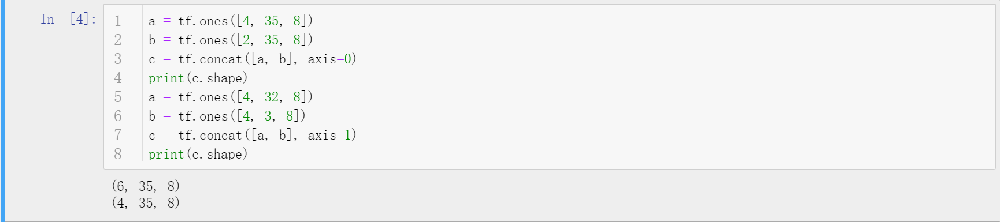
- `tf.stack([a, b], axis)`
  - 拼接若干个张量（必须每个维度都是一致的），在指定的axis位置创建新的维度。
  - 示例。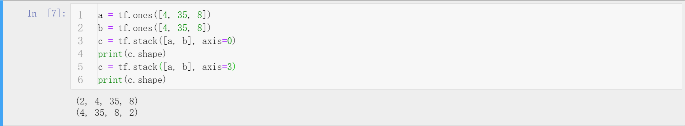
- `tf.unstack(a, axis)`
  - 在指定的轴上将张量分离，指定轴维度为多少则分离为多少个张量。
  - 示例。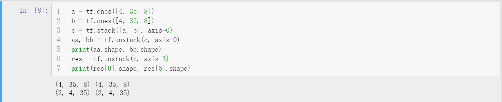
- `tf.split(a, axis, num_or_size_splits)`
  - 在指定维度上分离张量，如果num_or_size_splits给出的是整形数则均分为多个张量，如果给定的是列表，则按照列表的内容划分。
  - 示例。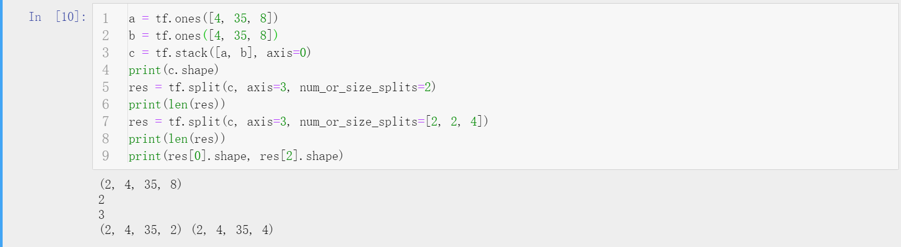

## 数据统计
- 范数`tf.norm(a, ord, axis)`
  - 沿着axis轴，求解张量a的ord范数。（ord表示范数类似，1范数、2范数、无穷范数等，不指定ord则默认二范数）
  - 示例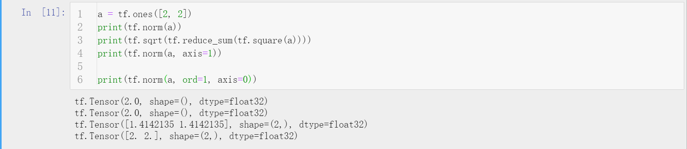
- 最值均值`tf.reduce_min/max/mean(a, axis)`
  - 在指定维度上计算最值和均值，若不指定axis则将张量当成向量处理。
  - 示例。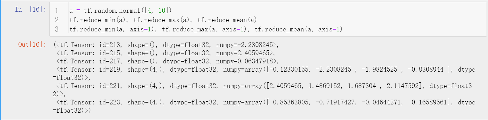
- 最值位置`tf.argmax/min(a, axis)`
  - 在指定维度上计算最值的位置下标，不指定axis则在第一个维度上进行计算。
  - 示例。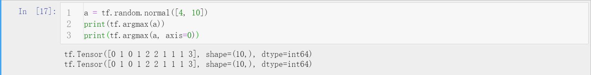
- 等值判断`tf.equal(a, b)`
  - 两个张量对应位置比较是否值相等，返回与进行比较的两个张量同shape的张量，该位置相等为True，不等为False。
  - 示例。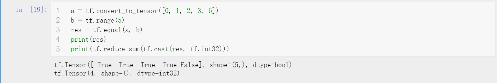
- 张量去重`tf.unique(a)`
  - 返回一个Unique类型的变量，包含两个Tensor，一个是去重后的Tensor，一个是原Tensor中每个元素在去重后Tensor中的下标。根据返回的下标可以通过gather方法得到去重前Tensor。
  - 示例。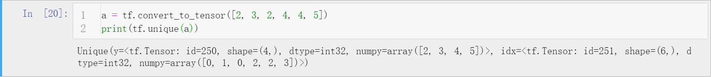

## 张量排序
- `tf.sort(a, direction)/tf.argsort(a, direction)`
  - 按照指定的升序或者降序方向，对张量进行排序。当张量的维度大于1时，默认对最后一个维度进行排序。
  - 示例。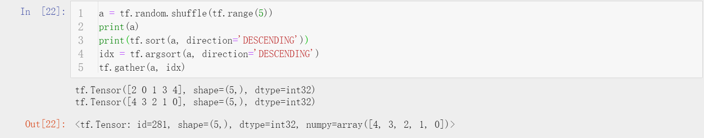
- `tf.math.top_k(a, k)`
  - 找到k个最大或者最小值，返回值和该值所在下标。
  - 示例。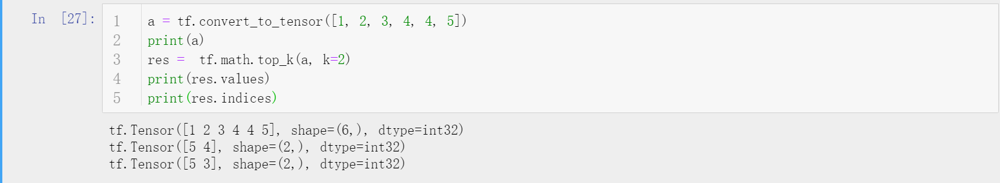

## 填充与复制
- `tf.pad(a, [[A, B], [A, B],...])`
  - [A, B]表示每个维度的前后是否padding， 1表示填充，0表示不填充。
  - 示例。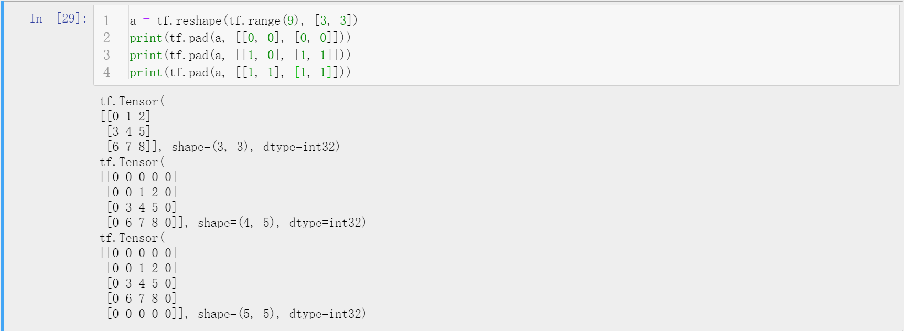
- `tf.tile(a, multiples)`
  - multiples用一个列表传入，表示各个维度复制多少次，最小为1。**一般，能使用broadcast的情形不建议使用tile，因为broadcast不会因为复制而多占用内存，TensorFlow中很多运算符是默认支持broadcast的。**
  - 示例。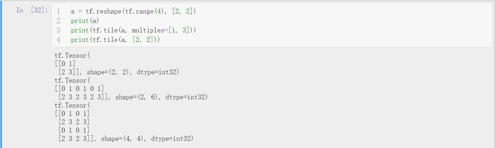

## 张量限幅
- `tf.maximum(a, num)/tf.minimum(a, num)`
  - 将张量一边用阈值限定，超过则元素置为阈值。缺点是该函数只能限制一边。
  - 示例。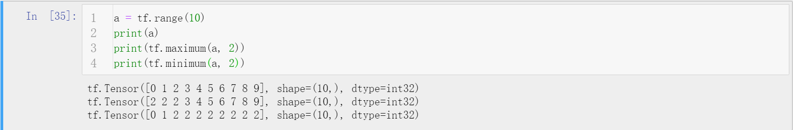
- `tf.clip_by_value(a, min, max)`
  - 将张量的元素值限制在[min, max]之间，比min小的设为min值，比max大的设为max值。
  - 示例。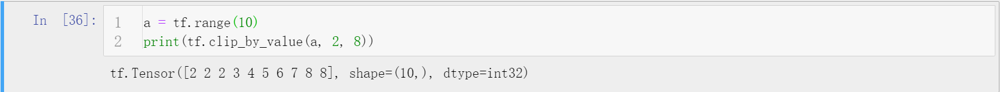
- `tf.clip_by_norm(a, norm)`
  - 根据范数值进行限幅，保证梯度方向不变，模改变的常见手段。
  - 示例。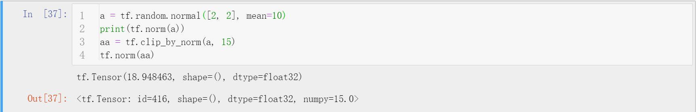
- `tf.clip_by_global_norm(a, norm)`
  - 根据范数值，整体同比例缩放梯度值。

## 高阶操作
- `tf.where(a)/tf.where(cond, A, B)`
  - 前者用法，返回张量中为True的具体下标，下标的格式依据张量的维度而定，配合gather方法可以定位异常值。后者用法，依据条件张量，为True的位置从A取值，不满足从B取值，返回最终张量。
  - 示例。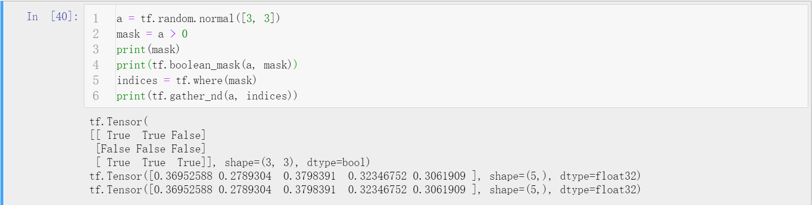
- `tf.scatter_nd(indices, updates, shape)`
  - 在给定shape的底板张量（全0）上，indices标明位置更新为updates值。
  - 示例。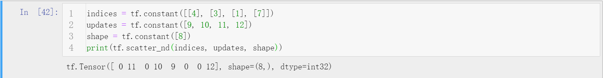
- `tf.meshgrid(x, y)`
  - 组合x和y张量，生成分布存储的组合结果。有效避免了Python循环的使用且能支持GPU运算。
  - 示例。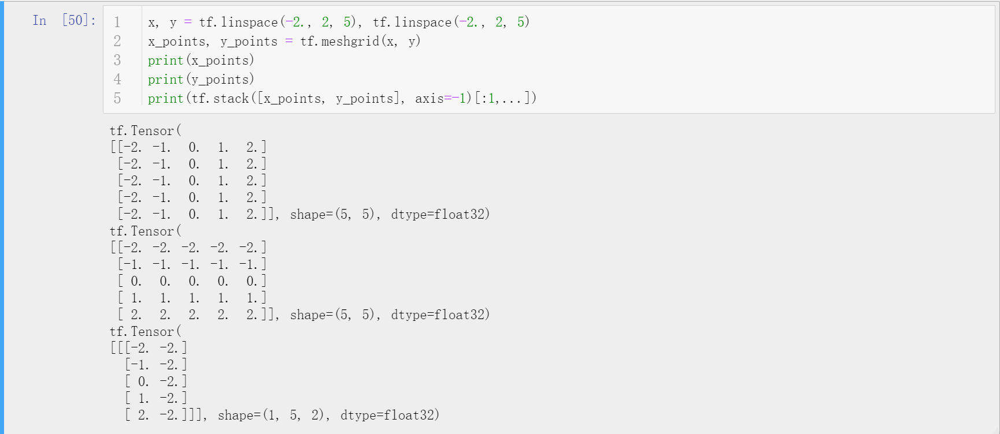

## 补充说明
- 本文主要讲解了TensorFlow2提供的一些较为高级的操作的API解析。
- 博客同步至我的[个人博客网站](https://luanshiyinyang.github.io/tensorflow2/2019/10/03/AdvancedOperation/)，欢迎浏览其他文章。
- 如有错误，欢迎指正。