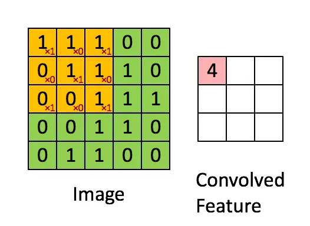
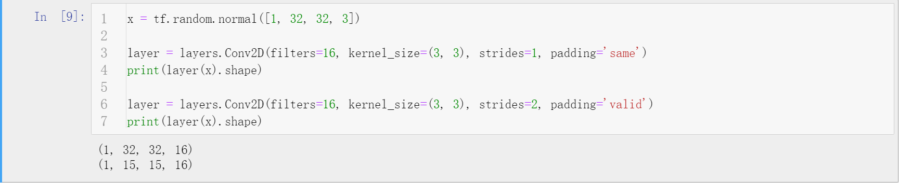
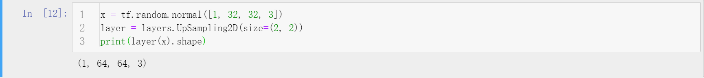
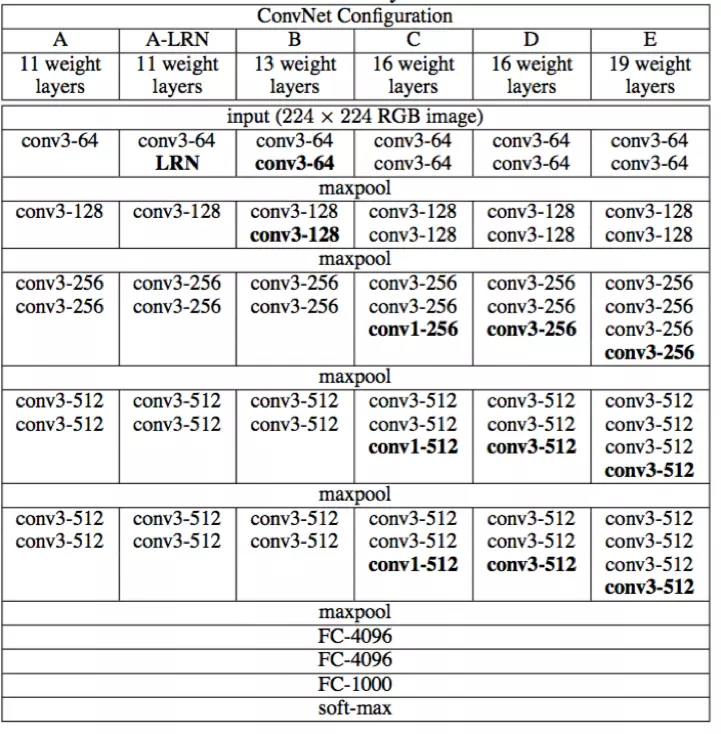

# TensorFlow2卷积神经网络


## 简介
卷积神经网络广泛使用于计算机视觉领域，主要用于提取图片的特征图（feature map）。不同于数学中的卷积，这里的卷积指的是对矩阵的一种运算方式（本质上就是离散化的数学卷积），使用卷积核对图片矩阵进行操作，可以减少图片的位置信息，增加图片的通道信息，从而得到高层语义信息。


## 卷积操作
在提出卷积的运算方式之前必须清楚，为什么不使用全连接神经网络对图片处理，为什么使用卷积操作，为什么可以使用卷积。
- 之所以不使用全连接神经网络是因为，全连接神经网络处理图片这类特征量很大的数据，即使是浅层神经网络，其参数量、数据量、梯度量都是极为庞大的，如此庞大的数据量是很难存储运算的（在过去很长一段时间内是不可能的）。而且，全连接神经网络在图片数据上的表现并不好。
- 依据动物的局部感受野机制（每次观察只注意小部分区域），卷积神经网络诞生了。如果说全连接神经网络每次提取特征面向的是全局（每次全面观察，这是费力且没有必要的），卷积神经网络则是使用卷积核每次提取局部的特征(每次观察图片的一小部分，且观察方式不变)，使用不同的卷积核就可以观察到各种特征信息。通过卷积神经网络代替全连接神经网络，网络的参数量大大减少了（卷积神经网络的参数只存在于卷积核中）。
- 使用卷积核扫描区域并将卷积核对应位置的参数和扫描区域数值相乘求和得到特征值，扫描多个区域得到多个特征值组合的矩阵就是特征图（feature map）。**需要注意的是**，卷积操作是针对矩阵区域的，对多个通道的同区域会进行相应合并得到一个特征图（合并一般是分别对每个通道提取特征，然后特征值求和得到该区域的特征）。之所以使用卷积操作提取特征，这是由来已久的，在计算机视觉的历史上使用特定的滤波器处理图片是个常用手段，卷积很早就被提出了，不过那时候对于不同的任务人为设计不同的滤波器（卷积核），这里只是在深度学习的基础上沿用罢了（卷积核变为自动学习而不是人为设计）。



## 卷积神经网络
通过上述卷积操作，可以得到尺寸变小的高通道特征图，如使用16个3\*3卷积核提取5\*5图片特征（图片如第二节文末）会得到维度为[3, 3, 16]的特征图，很显然，图片的尺寸变小了。当然，区域维度的信息减少，位置维度的信息增加，这就是卷积神经网络提取特征的目的（**这个过程表现为feature map长宽减小，channel增加，所以卷积神经网络的卷积核数目逐层增加或不变**）。但是无法控制的变化是不必要的，这个尺寸变换的过程在深层网络中不容易明确，需要步步计算才能得到，为了解决这个麻烦，提出了Padding方法（填充方法）和Stride方法（步长方法）。
  - Padding是指在原图周围补上一圈全0的数值，使得变换后的矩阵尺寸不变。
  - 同时，为了调节特征图尺寸，控制stride也是不错的选择（一般的深度学习框架步长默认为1）。

卷积神经网络的体系逐渐发展，产生了固定的一些结构，如卷积层、池化层、上采样层等。这些固定的矩阵操作层在TensorFlow2中的keras模块中得到了封装。
- 2D卷积的接口如下，指明卷积核数目，卷积核大小，步长，以及填充方式（same表示自动等尺寸，valid表示不进行padding）等即可。
- 2D池化（下采样）接口如下，指明步长即可。根据给定的步长将该区域的所有值取最大或者平均。
- 上采样是下采样的逆操作，有不同的方法，指明采用大小即可。

还有一个很关键的问题在卷积神经网络中，就是如何求出输出loss关于卷积核参数的梯度。这个计算并不复杂，根据链式法则可以知道最终Loss关于某层feature map的梯度为Loss关于O的梯度乘以O关于参数w的梯度，这个过程不复杂，TensorFlow是自动完成的。


## 经典网络
在80年代后期，SVM几乎统治了机器学习世界，深度学习的发展受阻，直到2012年AlexNet的突破性表现，深度卷积神经网络在计算机视觉的发展才如火如荼起来，先后出现了VGGNet、GoogLeNet、ResNet、DenseNet等，总体的发展趋势围绕Google和微软产生了两种，越来越宽或者越来越深。由于这些网络的提出解析都需要大量篇幅介绍，这里只提一下突破性的成就，设计自己的应用网络时可以借鉴这些突破点。
- AlexNet
  - 由Hinton主导（深度学习三驾马车之一）相比较于之前的LeNet结构类似，不过提出了Max pooling、Relu激活函数、Dropout正则化，并且第一次使用GPU加速训练。
  - 不过，AlexNet由于当时显卡限制，手工进行网络的双卡切分，如今的显卡以及深度框架会帮助完成这些。
- VGGNet
  - 由牛津大学VGG组提出，主要贡献是采用多层小卷积核代替大卷积核计算量减少且效果更好。计算量较大。
- GoogLeNet
  - 由Google设计，主要贡献为使用1\*1调整通道数目，对同一层使用多种卷积核以获得不同感受野得到不同信息，使得网络更宽。
- ResNet
  - 华人学者何凯明于微软亚洲研究院提出残差模块，解决了过深网络难以训练（主要是梯度弥散）的情况。这是深层卷积神经网络发展的基础，也是计算机视觉近几年最突破的成就之一。
- DenseNet
  - 每一层都与前面所有层连接，连接极为密集，信息量很大的网络设计，基于ResNet设计。


## Cifar100与VGG13实战
VGGNet在卷积神经网络的历史上地位举足轻重，其做出了很多新的尝试并产生很多贡献。具体的介绍可以查看我关于[VGGNet的博文](https://blog.csdn.net/zhouchen1998/article/details/92700960)。这里通过构建VGG13网络对Cifar100进行分类实战。具体Pipeline流程为加载数据集、构建网络、训练网络、测试网络。VGGNet是很简单粗暴的容易理解的卷积神经网络之一，它的设计思路也是按照卷积神经网络的基本设计思想。
VGGNet的具体网络配置如下。
具体的Python代码下面给出。
```python
"""
Author: Zhou Chen
Date: 2019/11/2
Desc: VGG13 for Cifar100
"""
import os
import tensorflow as tf
from tensorflow.keras import layers, optimizers, datasets, Sequential
os.environ['TF_CPP_MIN_LOG_LEVEL'] = '2'  # 忽略低级别警告

conv_layers = [
    # block1
    layers.Conv2D(64, kernel_size=[3, 3], padding="same", activation=tf.nn.relu),
    layers.Conv2D(64, kernel_size=[3, 3], padding="same", activation=tf.nn.relu),
    layers.MaxPool2D(pool_size=[2, 2], strides=2, padding='same'),

    # block2
    layers.Conv2D(128, kernel_size=[3, 3], padding="same", activation=tf.nn.relu),
    layers.Conv2D(128, kernel_size=[3, 3], padding="same", activation=tf.nn.relu),
    layers.MaxPool2D(pool_size=[2, 2], strides=2, padding='same'),

    # block3
    layers.Conv2D(256, kernel_size=[3, 3], padding="same", activation=tf.nn.relu),
    layers.Conv2D(256, kernel_size=[3, 3], padding="same", activation=tf.nn.relu),
    layers.MaxPool2D(pool_size=[2, 2], strides=2, padding='same'),

    # block4
    layers.Conv2D(512, kernel_size=[3, 3], padding="same", activation=tf.nn.relu),
    layers.Conv2D(512, kernel_size=[3, 3], padding="same", activation=tf.nn.relu),
    layers.MaxPool2D(pool_size=[2, 2], strides=2, padding='same'),

    # block5
    layers.Conv2D(512, kernel_size=[3, 3], padding="same", activation=tf.nn.relu),
    layers.Conv2D(512, kernel_size=[3, 3], padding="same", activation=tf.nn.relu),
    layers.MaxPool2D(pool_size=[2, 2], strides=2, padding='same')

]


def preprocess(x, y):
    # [0~1]
    x = tf.cast(x, dtype=tf.float32) / 255.
    y = tf.cast(y, dtype=tf.int32)
    return x, y


(x, y), (x_test, y_test) = datasets.cifar100.load_data()
y, y_test = tf.squeeze(y, axis=1), tf.squeeze(y_test, axis=1)
print(x.shape, y.shape, x_test.shape, y_test.shape)

train_db = tf.data.Dataset.from_tensor_slices((x, y))
train_db = train_db.shuffle(1000).map(preprocess).batch(128)

test_db = tf.data.Dataset.from_tensor_slices((x_test, y_test))
test_db = test_db.map(preprocess).batch(64)

sample = next(iter(train_db))
print('sample:', sample[0].shape, sample[1].shape,
      tf.reduce_min(sample[0]), tf.reduce_max(sample[0]))


def main():
    # [b, 32, 32, 3] => [b, 1, 1, 512]
    conv_net = Sequential(conv_layers)

    fc_net = Sequential([
        layers.Dense(256, activation=tf.nn.relu),
        layers.Dense(128, activation=tf.nn.relu),
        layers.Dense(100, activation=None),
    ])

    conv_net.build(input_shape=[None, 32, 32, 3])
    fc_net.build(input_shape=[None, 512])
    optimizer = optimizers.Adam(lr=1e-4)

    variables = conv_net.trainable_variables + fc_net.trainable_variables  # 拼接变量列表

    # training
    for epoch in range(50):

        for step, (x, y) in enumerate(train_db):

            with tf.GradientTape() as tape:
                # [b, 32, 32, 3] => [b, 1, 1, 512]
                out = conv_net(x)
                out = tf.reshape(out, [-1, 512])
                # [b, 512] => [b, 100]
                logits = fc_net(out)
                y_onehot = tf.one_hot(y, depth=100)
                # compute loss
                loss = tf.losses.categorical_crossentropy(y_onehot, logits, from_logits=True)
                loss = tf.reduce_mean(loss)

            grads = tape.gradient(loss, variables)
            optimizer.apply_gradients(zip(grads, variables))

            if step % 100 == 0:
                print(epoch, step, 'loss:', float(loss))

        total_num = 0
        total_correct = 0
        for x, y in test_db:
            out = conv_net(x)
            out = tf.reshape(out, [-1, 512])
            logits = fc_net(out)
            prob = tf.nn.softmax(logits, axis=1)
            pred = tf.argmax(prob, axis=1)
            pred = tf.cast(pred, dtype=tf.int32)

            correct = tf.cast(tf.equal(pred, y), dtype=tf.int32)
            correct = tf.reduce_sum(correct)

            total_num += x.shape[0]
            total_correct += int(correct)

        acc = total_correct / total_num
        print(epoch, 'acc:', acc)


if __name__ == '__main__':
    main()

```


## Cifar100与ResNet18实战
尽管VGG曾今取得过瞩目的成就，然而过于庞大的计算量在今天如此深层的网络下已经有些不合适了，因此ResNet的提出解决了这个问题。这里通过ResNet18对Cifar100进行训练测试，对比其与VGGNet的效果。下面给出模型构建代码，训练代码类似之前，可以在文末的Github地址找到。
```python
"""
Author: Zhou Chen
Date: 2019/11/2
Desc: ResNet实现
"""
import tensorflow as tf
from tensorflow import keras
from tensorflow.keras import layers, Sequential


class BasicBlock(layers.Layer):

    def __init__(self, filter_num, stride=1):
        super(BasicBlock, self).__init__()

        self.conv1 = layers.Conv2D(filter_num, (3, 3), strides=stride, padding='same')
        self.bn1 = layers.BatchNormalization()
        self.relu = layers.Activation('relu')

        self.conv2 = layers.Conv2D(filter_num, (3, 3), strides=1, padding='same')
        self.bn2 = layers.BatchNormalization()

        if stride != 1:
            self.downsample = Sequential()
            self.downsample.add(layers.Conv2D(filter_num, (1, 1), strides=stride))
        else:
            self.downsample = lambda x: x

    def call(self, inputs, training=None):

        # [b, h, w, c]
        out = self.conv1(inputs)
        out = self.bn1(out, training=training)
        out = self.relu(out)

        out = self.conv2(out)
        out = self.bn2(out, training=training)

        identity = self.downsample(inputs)

        output = layers.add([out, identity])
        output = tf.nn.relu(output)

        return output


class ResNet(keras.Model):

    def __init__(self, layer_dims, num_classes=100):  # [2, 2, 2, 2]
        super(ResNet, self).__init__()

        self.stem = Sequential([layers.Conv2D(64, (3, 3), strides=(1, 1)),
                                layers.BatchNormalization(),
                                layers.Activation('relu'),
                                layers.MaxPool2D(pool_size=(2, 2), strides=(1, 1), padding='same')
                                ])

        self.layer1 = self.build_resblock(64, layer_dims[0])
        self.layer2 = self.build_resblock(128, layer_dims[1], stride=2)
        self.layer3 = self.build_resblock(256, layer_dims[2], stride=2)
        self.layer4 = self.build_resblock(512, layer_dims[3], stride=2)

        # output: [b, 512, h, w],
        self.avgpool = layers.GlobalAveragePooling2D()
        self.fc = layers.Dense(num_classes)

    def call(self, inputs, training=None):
        x = self.stem(inputs, training=training)

        x = self.layer1(x, training=training)
        x = self.layer2(x, training=training)
        x = self.layer3(x, training=training)
        x = self.layer4(x, training=training)

        # [b, c]
        x = self.avgpool(x)
        # [b, 100]
        x = self.fc(x)

        return x

    def build_resblock(self, filter_num, blocks, stride=1):
        res_blocks = Sequential()
        # may down sample
        res_blocks.add(BasicBlock(filter_num, stride))

        for _ in range(1, blocks):
            res_blocks.add(BasicBlock(filter_num, stride=1))

        return res_blocks


def resnet18():
    return ResNet([2, 2, 2, 2])

```


## 补充说明
- 本文介绍了卷积神经网络相关内容以及在TensorFlow2中如何实现CNN模型。
- 具体的代码同步至[我的Github仓库](https://github.com/luanshiyinyang/Tutorial/tree/TensorFlow2)欢迎star；博客同步至我的[个人博客网站](https://luanshiyinyang.github.io)，欢迎查看其他文章。
- 如有疏漏，欢迎指正。