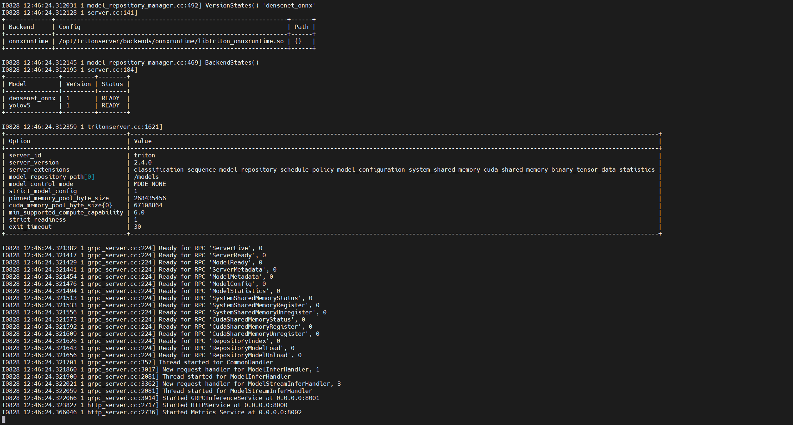
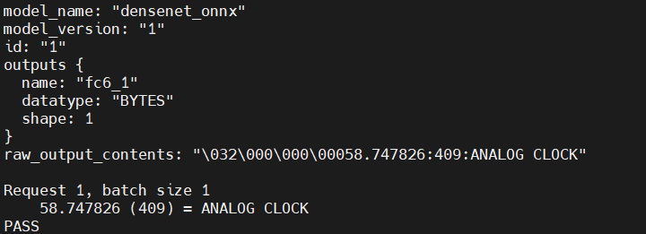
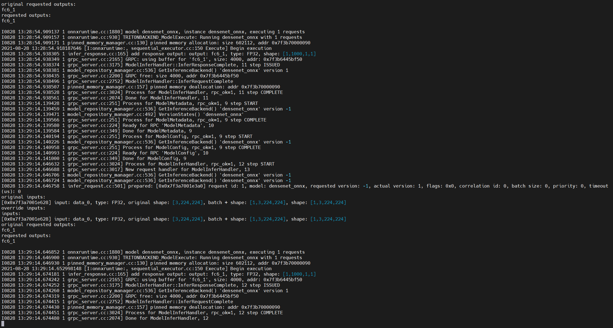

# TIS教程-客户端

## 简介

在[之前的文章](https://blog.csdn.net/zhouchen1998/category_11287638.html)中，我们主要关注服务端的配置和部署，这无可厚非，因为Triton Inference Server本就是服务端框架。但是，作为一个完善的生态，Triton也对客户端请求做了诸多封装以方便开发者的使用，这样我们就不需要过分关注协议通讯等诸多细节。为了提供这种封装，简化与Triton的通信，Triton团队提供了几个客户端库并给出了使用示例，本文将围绕Python SDK进行讲解，感兴趣的也可以查看C++库和其他语言的支持（[grpc_generated](https://developers.google.com/protocol-buffers/docs/tutorials)）。

## 安装

Python客户端库的最简单方式就是使用pip进行安装，当然也支持源码安装和docker镜像的使用，但是这里**为了开发方便我个人比较建议客户端sdk就在虚拟环境中安装而不是使用docker**。

在前面的文章中，我们已经介绍了Triton Inference Server主要支持两种协议，即HTTP和GRPC，因此他提供单独某种协议的Python包安装或者两种协议均支持的Python包安装，命令如下，需要支持指定协议只需要将下面的`all`更改为http或者grpc即可。使用all表示同时安装HTTP/REST和GRPC客户端库。 

```shell
pip install nvidia-pyindex
pip install tritonclient[all]
```

**需要注意的是，pip安装目前仅支持Linux，且系统必须包含perf_analyzer，这个包在Ubuntu 20.04上默认是有的，之前的版本可以通过下面的命令补上。**

```shell
sudo apt update
sudo apt install libb64-dev
```

## 使用

使用该库必须要有GRPC和HTTP的基础知识并且去阅读官方文档和源码，我们下面看几个典型的应用。

### Bytes/String 数据类型

一些框架支持张量，其中张量中的每个元素都是可变长度的二进制数据。 每个元素可以保存一个字符串或任意字节序列。 在客户端，此数据类型为 BYTES（具体[参考](https://github.com/triton-inference-server/server/blob/master/docs/model_configuration.md#datatypes)）。

Python客户端**使用numpy来表示输入输出张量**。对于BYTES张量，numpy中对应的数据类型应该为`np.object_`， 为了与以前版本的客户端库向后兼容，`np.bytes_` 也可以用于 BYTES 张量。但是，不建议使用`np.bytes_`，因为使用此 dtype 会导致 numpy 从每个数组元素中删除所有尾随零。 因此，以零结尾的二进制序列将无法正确表示。

关于BYTES/STRING张量的Python示例代码可以访问[官方示例](https://github.com/triton-inference-server/client/blob/main/src/python/examples/simple_grpc_string_infer_client.py)，其中构建输入并发起请求的核心代码如下，我已经进行了详细注释。

```python
# 构建输入输出
inputs = []
outputs = []
# 设定发起请求的请求体数据格式
inputs.append(grpcclient.InferInput('INPUT0', [1, 16], "BYTES"))
inputs.append(grpcclient.InferInput('INPUT1', [1, 16], "BYTES"))

# 模拟输入数据
in0 = np.arange(start=0, stop=16, dtype=np.int32)
in0 = np.expand_dims(in0, axis=0)
in1 = np.ones(shape=(1, 16), dtype=np.int32)
expected_sum = np.add(in0, in1)
expected_diff = np.subtract(in0, in1)

# 这里的演示模型期待两个BYTES张量，每个张量内部元素是UTF8的字符串表示的整数
in0n = np.array([str(x).encode('utf-8') for x in in0.reshape(in0.size)], dtype=np.object_)
input0_data = in0n.reshape(in0.shape)
in1n = np.array([str(x).encode('utf-8') for x in in1.reshape(in1.size)], dtype=np.object_)
input1_data = in1n.reshape(in1.shape)

# 初始化数据
inputs[0].set_data_from_numpy(input0_data)
inputs[1].set_data_from_numpy(input1_data)

outputs.append(grpcclient.InferRequestedOutput('OUTPUT0'))
outputs.append(grpcclient.InferRequestedOutput('OUTPUT1'))

# 请求服务端进行推理
results = triton_client.infer(model_name=model_name,
                                inputs=inputs,
                                outputs=outputs)

# 获得推理respose中对应键的数据
output0_data = results.as_numpy('OUTPUT0')
output1_data = results.as_numpy('OUTPUT1')
```

### 系统共享内存

在某些情况下，使用系统共享内存在客户端库和 Triton服务端 之间通信张量可以显着提高性能。

关于使用系统共享内存的示例代码可以访问[官方示例](https://github.com/triton-inference-server/client/blob/main/src/python/examples/simple_grpc_shm_client.py)。

不过，由于Python 没有分配和访问共享内存的标准方法，因此作为示例，官方提供了一个简单的系统共享内存模块，可与 Python 客户端库一起使用以创建、设置和销毁系统共享内存。

这部分的代码可以自己去阅读，理解起来并不难。

### CUDA共享内存

在某些情况下，使用 CUDA 共享内存在客户端库和 Triton服务端 之间进行张量通信可以显着提高性能。

关于使用CUDA共享内存的示例可以访问[官方示例](https://github.com/triton-inference-server/client/blob/main/src/python/examples/simple_http_cudashm_client.py)，它的整体流程就如代码中所示。

同样，由于Python 没有分配和访问共享内存的标准方法，因此作为示例，提供了一个简单的 CUDA 共享内存模块，可与 Python 客户端库一起使用以创建、设置和销毁 CUDA 共享内存。

### 补充

此外还有很多操作，比如有状态模型的推理序列的控制等等，这些后续用到了我会补充。

## 图像分类示例

下面我们以官方的图像分类源码为示例来理解客户端工作的整个流程。

### 服务端配置

首先，这个客户端要想成功运行首先需要部署一个分类模型并开启服务端访问，具体可以参考官方的[quickstart](https://github.com/triton-inference-server/server/blob/main/docs/quickstart.md)。我们按照这个quickstart教程和[官方的模型仓库示例文件](https://github.com/triton-inference-server/server/tree/main/docs/examples)组织模型仓库的文件如下。

```
model_repository/
├── densenet_onnx
    ├── 1
    │   └── model.onnx
    ├── config.pbtxt
    └── densenet_labels.txt
```

接着，我们使用[之前文章](https://zhouchen.blog.csdn.net/article/details/119712373)下载的docker镜像运行Triton服务器，命令如下（这里选项里面设置了使用1号GPU卡并显式服务器日志）。

```shell
docker run --gpus '"device=1"' --rm -p8000:8000 -p8001:8001 -p8002:8002 -v/home/zhouchen/model_repository:/models nvcr.io/nvidia/tritonserver:20.10-py3 tritonserver --model-repository=/models  --log-verbose 1
```

此时我们应该可以看到如下的日志界面，这代表服务器成功部署并运行着，然后我们就可以着手客户端的配置了。



### 客户端配置

虚拟环境的创建和相关库的安装本文第二节已经提到了，这里不多赘述，我们直接看[官方的源码](https://github.com/triton-inference-server/client/blob/main/src/python/examples/image_client.py)，这个代码比较长长，我这里删去了模型解析函数、预处理和后处理函数来进行解析，这样会清晰直观一点，因此这个代码是无法跑通的，可以跑通的源码去[这个链接](https://github.com/triton-inference-server/client/blob/main/src/python/examples/image_client.py)查看。

处理后的带有我详细注释的代码如下所示（从main开始看），整体流程为“构建想要使用的协议的client对象”--->“预处理数据”--->“然后创建请求体”--->“向服务端发起模型推理请求”--->“得到服务端反馈结果”--->“后处理结果数据”--->“显示渲染后的结果”。

```python
import argparse
from functools import partial
import os
import sys

from PIL import Image
import numpy as np
from attrdict import AttrDict

import tritonclient.grpc as grpcclient
import tritonclient.grpc.model_config_pb2 as mc
import tritonclient.http as httpclient
from tritonclient.utils import InferenceServerException
from tritonclient.utils import triton_to_np_dtype

if sys.version_info >= (3, 0):
    import queue
else:
    import Queue as queue


class UserData:

    def __init__(self):
        self._completed_requests = queue.Queue()


# Callback function used for async_stream_infer()
def completion_callback(user_data, result, error):
    # passing error raise and handling out
    user_data._completed_requests.put((result, error))


FLAGS = None


def requestGenerator(batched_image_data, input_name, output_name, dtype, FLAGS):
    protocol = FLAGS.protocol.lower()

    if protocol == "grpc":
        client = grpcclient
    else:
        client = httpclient

    # Set the input data
    inputs = [client.InferInput(input_name, batched_image_data.shape, dtype)]
    inputs[0].set_data_from_numpy(batched_image_data)

    outputs = [
        client.InferRequestedOutput(output_name, class_count=FLAGS.classes)
    ]

    yield inputs, outputs, FLAGS.model_name, FLAGS.model_version


def convert_http_metadata_config(_metadata, _config):
    _model_metadata = AttrDict(_metadata)
    _model_config = AttrDict(_config)

    return _model_metadata, _model_config


if __name__ == '__main__':‘
    # 命令行参数
    parser = argparse.ArgumentParser()
    parser.add_argument('-v', '--verbose', action="store_true", required=False, default=False,
                        help='Enable verbose output')
    parser.add_argument('-a', '--async', dest="async_set", action="store_true", required=False, default=False,
                        help='Use asynchronous inference API')
    parser.add_argument('--streaming', action="store_true", required=False, default=False,
                        help='Use streaming inference API. ' + 'The flag is only available with gRPC protocol.')
    parser.add_argument('-m', '--model-name', type=str, required=True, help='Name of model')
    parser.add_argument('-x', '--model-version', type=str, required=False, default="",
                        help='Version of model. Default is to use latest version.')
    parser.add_argument('-b', '--batch-size', type=int, required=False, default=1, help='Batch size. Default is 1.')
    parser.add_argument('-c', '--classes', type=int, required=False, default=1,
                        help='Number of class results to report. Default is 1.')
    parser.add_argument('-s', '--scaling', type=str, choices=['NONE', 'INCEPTION', 'VGG'], required=False,
                        default='NONE', help='Type of scaling to apply to image pixels. Default is NONE.')
    parser.add_argument('-u', '--url', type=str, required=False, default='localhost:8000',
                        help='Inference server URL. Default is localhost:8000.')
    parser.add_argument('-i', '--protocol', type=str, required=False, default='HTTP',
                        help='Protocol (HTTP/gRPC) used to communicate with ' + 'the inference service. Default is HTTP.')
    parser.add_argument('image_filename', type=str, nargs='?', default=None, help='Input image / Input folder.')
    # 从命令行解析参数
    FLAGS = parser.parse_args()

    if FLAGS.streaming and FLAGS.protocol.lower() != "grpc":
        raise Exception("Streaming is only allowed with gRPC protocol")

    try:
        # 根据协议命令行参数给的协议类型创建client对象
        if FLAGS.protocol.lower() == "grpc":
            # Create gRPC client for communicating with the server
            triton_client = grpcclient.InferenceServerClient(
                url=FLAGS.url, verbose=FLAGS.verbose)
        else:
            # Specify large enough concurrency to handle the
            # the number of requests.
            concurrency = 20 if FLAGS.async_set else 1
            triton_client = httpclient.InferenceServerClient(
                url=FLAGS.url, verbose=FLAGS.verbose, concurrency=concurrency)
    except Exception as e:
        print("client creation failed: " + str(e))
        sys.exit(1)
    # 确认模型和需求相符并且得到预处理需要的模型配置参数
    try:
        model_metadata = triton_client.get_model_metadata(
            model_name=FLAGS.model_name, model_version=FLAGS.model_version)
    except InferenceServerException as e:
        print("failed to retrieve the metadata: " + str(e))
        sys.exit(1)

    try:
        model_config = triton_client.get_model_config(
            model_name=FLAGS.model_name, model_version=FLAGS.model_version)
    except InferenceServerException as e:
        print("failed to retrieve the config: " + str(e))
        sys.exit(1)

    if FLAGS.protocol.lower() == "grpc":
        model_config = model_config.config
    else:
        model_metadata, model_config = convert_http_metadata_config(
            model_metadata, model_config)
    # 解析模型配置
    max_batch_size, input_name, output_name, c, h, w, format, dtype = parse_model(
        model_metadata, model_config)
    # 得到输入图像文件名列表
    filenames = []
    if os.path.isdir(FLAGS.image_filename):
        filenames = [
            os.path.join(FLAGS.image_filename, f)
            for f in os.listdir(FLAGS.image_filename)
            if os.path.isfile(os.path.join(FLAGS.image_filename, f))
        ]
    else:
        filenames = [
            FLAGS.image_filename,
        ]

    filenames.sort()

    # 输入数据预处理为符合模型输入的格式
    # requirements
    image_data = []
    for filename in filenames:
        img = Image.open(filename)
        image_data.append(
            preprocess(img, format, dtype, c, h, w, FLAGS.scaling,
                       FLAGS.protocol.lower()))

    # 按照batchsize发起请求
    requests = []
    responses = []
    result_filenames = []
    request_ids = []
    image_idx = 0
    last_request = False
    user_data = UserData()

    # Holds the handles to the ongoing HTTP async requests.
    async_requests = []

    sent_count = 0

    if FLAGS.streaming:
        triton_client.start_stream(partial(completion_callback, user_data))

    while not last_request:
        input_filenames = []
        repeated_image_data = []

        for idx in range(FLAGS.batch_size):
            input_filenames.append(filenames[image_idx])
            repeated_image_data.append(image_data[image_idx])
            image_idx = (image_idx + 1) % len(image_data)
            if image_idx == 0:
                last_request = True

        if max_batch_size > 0:
            batched_image_data = np.stack(repeated_image_data, axis=0)
        else:
            batched_image_data = repeated_image_data[0]

        # 发送请求
        try:
            for inputs, outputs, model_name, model_version in requestGenerator(
                    batched_image_data, input_name, output_name, dtype, FLAGS):
                sent_count += 1
                if FLAGS.streaming:
                    triton_client.async_stream_infer(
                        FLAGS.model_name,
                        inputs,
                        request_id=str(sent_count),
                        model_version=FLAGS.model_version,
                        outputs=outputs)
                elif FLAGS.async_set:
                    if FLAGS.protocol.lower() == "grpc":
                        triton_client.async_infer(
                            FLAGS.model_name,
                            inputs,
                            partial(completion_callback, user_data),
                            request_id=str(sent_count),
                            model_version=FLAGS.model_version,
                            outputs=outputs)
                    else:
                        async_requests.append(
                            triton_client.async_infer(
                                FLAGS.model_name,
                                inputs,
                                request_id=str(sent_count),
                                model_version=FLAGS.model_version,
                                outputs=outputs))
                else:
                    responses.append(
                        triton_client.infer(FLAGS.model_name,
                                            inputs,
                                            request_id=str(sent_count),
                                            model_version=FLAGS.model_version,
                                            outputs=outputs))

        except InferenceServerException as e:
            print("inference failed: " + str(e))
            if FLAGS.streaming:
                triton_client.stop_stream()
            sys.exit(1)

    if FLAGS.streaming:
        triton_client.stop_stream()

    if FLAGS.protocol.lower() == "grpc":
        if FLAGS.streaming or FLAGS.async_set:
            processed_count = 0
            while processed_count < sent_count:
                (results, error) = user_data._completed_requests.get()
                processed_count += 1
                if error is not None:
                    print("inference failed: " + str(error))
                    sys.exit(1)
                responses.append(results)
    else:
        if FLAGS.async_set:
            # Collect results from the ongoing async requests
            # for HTTP Async requests.
            for async_request in async_requests:
                responses.append(async_request.get_result())
    # 得到响应，并解析响应得到需要的结果，后处理结果
    for response in responses:
        if FLAGS.protocol.lower() == "grpc":
            this_id = response.get_response().id
        else:
            this_id = response.get_response()["id"]
        print("Request {}, batch size {}".format(this_id, FLAGS.batch_size))
        postprocess(response, output_name, FLAGS.batch_size, max_batch_size > 0)

    print("PASS")

```

我们将客户端代码文件也放在服务端的机器上进行测试，因此地址填写localhost即可，使用下面的命令对任意一个图片进行推理，得到下图的反馈，这表示请求正常反馈了。

```shell
python image_client.py -m densenet_onnx  --verbose --protocol grpc -u "localhost:8001"  -s NONE ./data/car.jpg
```



同时，可以在服务端日志上看到如下的处理流程日志。



至此，我们就完成了使用客户端sdk进行图像分类的演示。

## 总结

本文主要介绍了TIS客户端SDK的使用，并使用图像分类任务进行了演示，具体的可以查看[官方文档](https://github.com/triton-inference-server/client)。