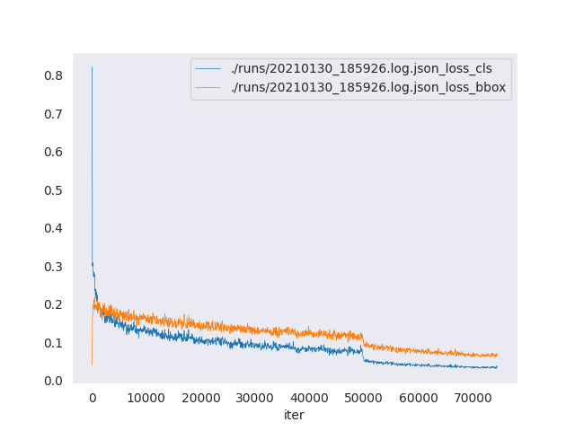
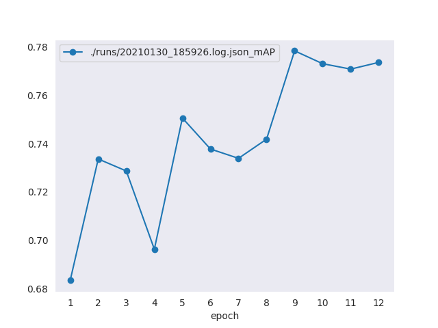

# MMDetection-配置文件

## 简介

在本专栏的上一篇文章中，初步介绍了MMDetection的由来以及环境的配置，并提到了控制整个pipeline的配置文件，本文就来详细聊一聊配置文件的点点滴滴。

## 配置文件结构

不同于Detectron2采用YAML文件作为配置文件的方式，MMDetection采用Python脚本作为配置文件，这一定程度上方便了解析。不过，在谈具体的配置文件的结构之前，首先介绍一个官方提供的工具，它位于mmdetection根目录的tools文件夹中，你可以在根目录下通过`python tools/misc/print_config.py /path/to/config_file`来查看完整的配置，例如我们打印最基础的faster r-cnn的配置，命令为`python tools/misc/print_config.py configs/faster_rcnn/faster_rcnn_r50_fpn_1x_coco.py`。

查看`faster_rcnn_r50_fpn_1x_coco.py`文件其实会发现，它只有如下的几行内容，显然，它是继承了_base_的配置文件作为自己的配置的，而`print_config.py`则打印层层继承后最终的配置文件内容，具体如下。

```python
_base_ = [
    '../_base_/models/faster_rcnn_r50_fpn.py',
    '../_base_/datasets/coco_detection.py',
    '../_base_/schedules/schedule_1x.py', '../_base_/default_runtime.py'
]
```

```python
Config:
model = dict(
    type='FasterRCNN',
    pretrained='torchvision://resnet50',
    backbone=dict(
        type='ResNet',
        depth=50,
        num_stages=4,
        out_indices=(0, 1, 2, 3),
        frozen_stages=1,
        norm_cfg=dict(type='BN', requires_grad=True),
        norm_eval=True,
        style='pytorch'),
    neck=dict(
        type='FPN',
        in_channels=[256, 512, 1024, 2048],
        out_channels=256,
        num_outs=5),
    rpn_head=dict(
        type='RPNHead',
        in_channels=256,
        feat_channels=256,
        anchor_generator=dict(
            type='AnchorGenerator',
            scales=[8],
            ratios=[0.5, 1.0, 2.0],
            strides=[4, 8, 16, 32, 64]),
        bbox_coder=dict(
            type='DeltaXYWHBBoxCoder',
            target_means=[0.0, 0.0, 0.0, 0.0],
            target_stds=[1.0, 1.0, 1.0, 1.0]),
        loss_cls=dict(
            type='CrossEntropyLoss', use_sigmoid=True, loss_weight=1.0),
        loss_bbox=dict(type='L1Loss', loss_weight=1.0)),
    roi_head=dict(
        type='StandardRoIHead',
        bbox_roi_extractor=dict(
            type='SingleRoIExtractor',
            roi_layer=dict(type='RoIAlign', output_size=7, sampling_ratio=0),
            out_channels=256,
            featmap_strides=[4, 8, 16, 32]),
        bbox_head=dict(
            type='Shared2FCBBoxHead',
            in_channels=256,
            fc_out_channels=1024,
            roi_feat_size=7,
            num_classes=80,
            bbox_coder=dict(
                type='DeltaXYWHBBoxCoder',
                target_means=[0.0, 0.0, 0.0, 0.0],
                target_stds=[0.1, 0.1, 0.2, 0.2]),
            reg_class_agnostic=False,
            loss_cls=dict(
                type='CrossEntropyLoss', use_sigmoid=False, loss_weight=1.0),
            loss_bbox=dict(type='L1Loss', loss_weight=1.0))),
    train_cfg=dict(
        rpn=dict(
            assigner=dict(
                type='MaxIoUAssigner',
                pos_iou_thr=0.7,
                neg_iou_thr=0.3,
                min_pos_iou=0.3,
                match_low_quality=True,
                ignore_iof_thr=-1),
            sampler=dict(
                type='RandomSampler',
                num=256,
                pos_fraction=0.5,
                neg_pos_ub=-1,
                add_gt_as_proposals=False),
            allowed_border=-1,
            pos_weight=-1,
            debug=False),
        rpn_proposal=dict(
            nms_across_levels=False,
            nms_pre=2000,
            nms_post=1000,
            max_num=1000,
            nms_thr=0.7,
            min_bbox_size=0),
        rcnn=dict(
            assigner=dict(
                type='MaxIoUAssigner',
                pos_iou_thr=0.5,
                neg_iou_thr=0.5,
                min_pos_iou=0.5,
                match_low_quality=False,
                ignore_iof_thr=-1),
            sampler=dict(
                type='RandomSampler',
                num=512,
                pos_fraction=0.25,
                neg_pos_ub=-1,
                add_gt_as_proposals=True),
            pos_weight=-1,
            debug=False)),
    test_cfg=dict(
        rpn=dict(
            nms_across_levels=False,
            nms_pre=1000,
            nms_post=1000,
            max_num=1000,
            nms_thr=0.7,
            min_bbox_size=0),
        rcnn=dict(
            score_thr=0.05,
            nms=dict(type='nms', iou_threshold=0.5),
            max_per_img=100)))
dataset_type = 'CocoDataset'
data_root = 'data/coco/'
img_norm_cfg = dict(
    mean=[123.675, 116.28, 103.53], std=[58.395, 57.12, 57.375], to_rgb=True)
train_pipeline = [
    dict(type='LoadImageFromFile'),
    dict(type='LoadAnnotations', with_bbox=True),
    dict(type='Resize', img_scale=(1333, 800), keep_ratio=True),
    dict(type='RandomFlip', flip_ratio=0.5),
    dict(
        type='Normalize',
        mean=[123.675, 116.28, 103.53],
        std=[58.395, 57.12, 57.375],
        to_rgb=True),
    dict(type='Pad', size_divisor=32),
    dict(type='DefaultFormatBundle'),
    dict(type='Collect', keys=['img', 'gt_bboxes', 'gt_labels'])
]
test_pipeline = [
    dict(type='LoadImageFromFile'),
    dict(
        type='MultiScaleFlipAug',
        img_scale=(1333, 800),
        flip=False,
        transforms=[
            dict(type='Resize', keep_ratio=True),
            dict(type='RandomFlip'),
            dict(
                type='Normalize',
                mean=[123.675, 116.28, 103.53],
                std=[58.395, 57.12, 57.375],
                to_rgb=True),
            dict(type='Pad', size_divisor=32),
            dict(type='ImageToTensor', keys=['img']),
            dict(type='Collect', keys=['img'])
        ])
]
data = dict(
    samples_per_gpu=2,
    workers_per_gpu=2,
    train=dict(
        type='CocoDataset',
        ann_file='data/coco/annotations/instances_train2017.json',
        img_prefix='data/coco/train2017/',
        pipeline=[
            dict(type='LoadImageFromFile'),
            dict(type='LoadAnnotations', with_bbox=True),
            dict(type='Resize', img_scale=(1333, 800), keep_ratio=True),
            dict(type='RandomFlip', flip_ratio=0.5),
            dict(
                type='Normalize',
                mean=[123.675, 116.28, 103.53],
                std=[58.395, 57.12, 57.375],
                to_rgb=True),
            dict(type='Pad', size_divisor=32),
            dict(type='DefaultFormatBundle'),
            dict(type='Collect', keys=['img', 'gt_bboxes', 'gt_labels'])
        ]),
    val=dict(
        type='CocoDataset',
        ann_file='data/coco/annotations/instances_val2017.json',
        img_prefix='data/coco/val2017/',
        pipeline=[
            dict(type='LoadImageFromFile'),
            dict(
                type='MultiScaleFlipAug',
                img_scale=(1333, 800),
                flip=False,
                transforms=[
                    dict(type='Resize', keep_ratio=True),
                    dict(type='RandomFlip'),
                    dict(
                        type='Normalize',
                        mean=[123.675, 116.28, 103.53],
                        std=[58.395, 57.12, 57.375],
                        to_rgb=True),
                    dict(type='Pad', size_divisor=32),
                    dict(type='ImageToTensor', keys=['img']),
                    dict(type='Collect', keys=['img'])
                ])
        ]),
    test=dict(
        type='CocoDataset',
        ann_file='data/coco/annotations/instances_val2017.json',
        img_prefix='data/coco/val2017/',
        pipeline=[
            dict(type='LoadImageFromFile'),
            dict(
                type='MultiScaleFlipAug',
                img_scale=(1333, 800),
                flip=False,
                transforms=[
                    dict(type='Resize', keep_ratio=True),
                    dict(type='RandomFlip'),
                    dict(
                        type='Normalize',
                        mean=[123.675, 116.28, 103.53],
                        std=[58.395, 57.12, 57.375],
                        to_rgb=True),
                    dict(type='Pad', size_divisor=32),
                    dict(type='ImageToTensor', keys=['img']),
                    dict(type='Collect', keys=['img'])
                ])
        ]))
evaluation = dict(interval=1, metric='bbox')
optimizer = dict(type='SGD', lr=0.02, momentum=0.9, weight_decay=0.0001)
optimizer_config = dict(grad_clip=None)
lr_config = dict(
    policy='step',
    warmup='linear',
    warmup_iters=500,
    warmup_ratio=0.001,
    step=[8, 11])
total_epochs = 12
checkpoint_config = dict(interval=1)
log_config = dict(interval=50, hooks=[dict(type='TextLoggerHook')])
dist_params = dict(backend='nccl')
log_level = 'INFO'
load_from = None
resume_from = None
workflow = [('train', 1)]
```

这个配置文件稍稍有点长，它是使用ResNet50作为backbone并以FPN为neck的一个Faster R-CNN检测器的配置，从最外层来看其实内容不多。首先是`model`，它包含了关于模型的所有配置，包括backbone、neck、head等等，具体的后面文章会专门讲解；接着就是`dataset`的配置，包括数据集类型、数据加载pipeline、训练集验证集和测试集的加载配置等等；最后是`runtime`相关的东西，包括评估指标、优化器、学习率及其调度配置、训练总轮数、工作流等等。

大体聊了聊**配置文件的内容结构**，再来回到原来的问题上，**配置文件的组织结构**，打开`configs`目录的`_base_`文件夹，其实会看到`dataset`, `model`, `schedule`三个文件夹和`default_runtime.py`这四个基本组件，它们的内容也是顾名思义为数据集、模型，而schedule和runtime通常合并看作运行时，这个`_base_`文件夹的目录树如下。

```
.
├── datasets
│   ├── cityscapes_detection.py
│   ├── cityscapes_instance.py
│   ├── coco_detection.py
│   ├── coco_instance.py
│   ├── coco_instance_semantic.py
│   ├── deepfashion.py
│   ├── lvis_v0.5_instance.py
│   ├── lvis_v1_instance.py
│   ├── voc0712.py
│   └── wider_face.py
├── models
│   ├── cascade_mask_rcnn_r50_fpn.py
│   ├── cascade_rcnn_r50_fpn.py
│   ├── faster_rcnn_r50_caffe_c4.py
│   ├── faster_rcnn_r50_caffe_dc5.py
│   ├── faster_rcnn_r50_fpn.py
│   ├── fast_rcnn_r50_fpn.py
│   ├── mask_rcnn_r50_caffe_c4.py
│   ├── mask_rcnn_r50_fpn.py
│   ├── retinanet_r50_fpn.py
│   ├── rpn_r50_caffe_c4.py
│   ├── rpn_r50_fpn.py
│   └── ssd300.py
├── schedules
│    ├── schedule_1x.py
│    ├── schedule_20e.py
│    └── schedule_2x.py
└── default_runtime.py
```

如上所示，datasets里包含了常见数据集的数据集配置（如COCO、VOC）、models里则是最基础的一些模型结构的配置、schedules和default_runtime.py是常用的运行时配置。显然，通过它们我们可以轻松构建一些新的检测器配置，在这里作为被继承对象的`_base_`里的内容称为**原始配置**。

一般，当创建一个新的方法的时候，会创建以方法名为名的文件夹，里面放置各种存在不同之处的配置文件，如`configs/faster_rcnn`文件夹。官方推荐的是，对一个方法文件夹内最好只存在一个原始配置，其他的配置文件都继承自它即可，如`faster_rcnn`下的配置文件均继承自`faster_rcnn_r50_fpn_1x_coco.py`和`faster_rcnn_r50_fpn_2x_coco.py`，而它俩又继承自`_base_`，因此，最大继承等级为3。

官方推荐从现有的检测器方法去创建新的方法，如对Faster R-CNN进行修改工作，那么在配置文件中指定`_base_ = ../faster_rcnn/faster_rcnn_r50_fpn_1x_coco.py`，然后修改必要的字段即可。当然，绝大多是情况还是我上面所说的不与现有方法共享结构的新配置，这是就需要configs下新建方法文件夹了（注意，这是规范，不是必须）。

到这里，大体的配置文件结构就讲完了，实际上这里使用的是mmcv的一个Config类进行封装的，更详细的内容可以参考[文档](https://mmcv.readthedocs.io/en/latest/utils.html#config)。

## 配置文件命名规范

官方建议的配置文件命名规范如下，其中用大括号括起来的是必须的，中括号内的则为可选内容，每个字段的说明也如下。

```
{model}_[model setting]_{backbone}_{neck}_[norm setting]_[misc]_[gpu x batch_per_gpu]_{schedule}_{dataset}
```

- {model}: 模型名称，如faster_rcnn。
- [model setting]: 特定的模型设置，如moment for reppoints。
- {backbone}: 骨干网络名称如r50 (ResNet-50), x101 (ResNeXt-101)。
- {neck}: 颈部网络名称如fpn, pafpn, nasfpn, c4。
- [norm_setting]: 标准化设置，默认为BN可选为 gn (Group Normalization), syncbn (Synchronized Batch Normalization)，其中gn-head/gn-neck 表示GN仅仅用在head/neck中, 而gn-all意味着GN被用在整个模型中包括backbone、neck、head等。
- [misc]: 杂项设置或者模型插件, 如dconv, gcb, attention等。
- [gpu x batch_per_gpu]: GPU数目和每个GPU上放置样本量，默认为8x2，表示有8张卡，每张卡放两个样本。
- {schedule}: 训练计划表，可选的是1x、2x、20e等。1x和2x表示单位轮数的几倍（默认12轮为一个单位轮数），20e在级联模型中使用，表示20轮。对于1x/2x，初始学习速率在8/16和11/22时衰减10倍。对于20e，初始学习速率在第16和第19个时期衰减10倍。
- {dataset}: 数据集名称，如coco、voc_0712等。

## VOC训练示例

上文讲解了配置文件的文件结构和命名规则，其中继承机制尤为重要，这里只需要记住继承内容后有要重写的，只要覆盖对应的参数即可（换句话说，只改要改的字典参数）。下面就构造用Faster R-CNN在VOC数据集上进行训练的配置文件，Pascal VOC数据集是一个常用的目标检测数据集，它的数据集格式的解析已经被MMDetection封装了，所以可以直接用，只是数据集本地路径需要修改。（关于全新的数据集格式则需要自己写解析，或者将其处理为已有的数据集格式，这个后面的文章会详细说明。）

关于VOC数据集，可以去官方下载，也可以评论获取百度网盘链接，解压后的数据集文件结构应该时如下的结构。

```shell
.
└── VOCdevkit
    ├── create_segmentations_from_detections.m
    ├── devkit_doc.pdf
    ├── example_action.m
    ├── example_action_nobb.m
    ├── example_classifier.m
    ├── example_detector.m
    ├── example_layout.m
    ├── example_segmenter.m
    ├── local
    │   ├── VOC2006
    │   ├── VOC2007
    │   └── VOC2012
    ├── results
    │   ├── VOC2006
    │   ├── VOC2007
    │   └── VOC2012
    ├── viewanno.m
    ├── viewdet.m
    ├── VOC2007
    │   ├── Annotations
    │   ├── ImageSets
    │   ├── JPEGImages
    │   ├── SegmentationClass
    │   └── SegmentationObject
    ├── VOC2012
    │   ├── Annotations
    │   ├── ImageSets
    │   ├── JPEGImages
    │   ├── SegmentationClass
    │   └── SegmentationObject
    └── VOCcode
        ├── PASemptyobject.m
        ├── PASemptyrecord.m
        ├── PASerrmsg.m
        ├── PASreadrecord.m
        ├── PASreadrectxt.m
        ├── VOCap.m
        ├── VOCevalaction.m
        ├── VOCevalcls.m
        ├── VOCevaldet.m
        ├── VOCevallayout.m
        ├── VOCevallayout_pr.m
        ├── VOCevalseg.m
        ├── VOChash_init.m
        ├── VOChash_lookup.m
        ├── VOCinit.m
        ├── VOClabelcolormap.m
        ├── VOCreadrecxml.m
        ├── VOCreadxml.m
        ├── VOCwritexml.m
        └── VOCxml2struct.m

```

首先，我们要在`configs/faster_rcnn/`里新建`faster_rcnn_r50_fpn_1x_voc0712.py`文件，然后按部件分别继承模型、数据集和运行时的内容，然后修改数据集配置文件中的同名项`data_root`及相关的一些配置即可，同时模型的最终类别头的类别数也要修改，具体内容如下。

```
_base_ = [
    '../_base_/models/faster_rcnn_r50_fpn.py',
    '../_base_/datasets/voc0712.py',
    '../_base_/schedules/schedule_1x.py', '../_base_/default_runtime.py'
]

model = dict(
    roi_head=dict(
        bbox_head=dict(num_classes=20)))

dataset_type = 'VOCDataset'
data_root = '/home/zhouchen/Datasets/VOC/VOCdevkit/'
img_norm_cfg = dict(
    mean=[123.675, 116.28, 103.53], std=[58.395, 57.12, 57.375], to_rgb=True)
train_pipeline = [
    dict(type='LoadImageFromFile'),
    dict(type='LoadAnnotations', with_bbox=True),
    dict(type='Resize', img_scale=(1000, 600), keep_ratio=True),
    dict(type='RandomFlip', flip_ratio=0.5),
    dict(type='Normalize', **img_norm_cfg),
    dict(type='Pad', size_divisor=32),
    dict(type='DefaultFormatBundle'),
    dict(type='Collect', keys=['img', 'gt_bboxes', 'gt_labels']),
]
test_pipeline = [
    dict(type='LoadImageFromFile'),
    dict(
        type='MultiScaleFlipAug',
        img_scale=(1000, 600),
        flip=False,
        transforms=[
            dict(type='Resize', keep_ratio=True),
            dict(type='RandomFlip'),
            dict(type='Normalize', **img_norm_cfg),
            dict(type='Pad', size_divisor=32),
            dict(type='ImageToTensor', keys=['img']),
            dict(type='Collect', keys=['img']),
        ])
]
data = dict(
    samples_per_gpu=2,
    workers_per_gpu=2,
    train=dict(
        type='RepeatDataset',
        times=3,
        dataset=dict(
            type=dataset_type,
            ann_file=[
                data_root + 'VOC2007/ImageSets/Main/trainval.txt',
                data_root + 'VOC2012/ImageSets/Main/trainval.txt'
            ],
            img_prefix=[data_root + 'VOC2007/', data_root + 'VOC2012/'],
            pipeline=train_pipeline)),
    val=dict(
        type=dataset_type,
        ann_file=data_root + 'VOC2007/ImageSets/Main/test.txt',
        img_prefix=data_root + 'VOC2007/',
        pipeline=test_pipeline),
    test=dict(
        type=dataset_type,
        ann_file=data_root + 'VOC2007/ImageSets/Main/test.txt',
        img_prefix=data_root + 'VOC2007/',
        pipeline=test_pipeline))
evaluation = dict(interval=1, metric='mAP')
```

然后我们使用`python tools/train.py configs/faster_rcnn/faster_rcnn_r50_fpn_1x_voc0712.py --work-dir runs`在单卡上进行训练（需要注意的是，我这里没有按照官方建议修改学习率）。由于我这边是四卡的机器，因此我采用`bash tools/dist_train.sh configs/faster_rcnn/faster_rcnn_r50_fpn_1x_voc0712.py 4 --work-dir ./runs/`命令进行单机多卡训练。

这也训练的话，训练日志默认保存在了项目根目录下的`work_dirs`里面，找到对应的实验，可以对其进行可视化分析，日志分析的模块对应的是`tools/analysis_tools/analyze_logs.py`，我这里简单进行了loss和mAP曲线可视化，如下图。





## 总结

本文主要介绍了MMDetetion的配置文件相关的内容，这是组织各个组件的关键，也是学习这个框架必须了解的东西，这部分对应的官方文档这里给出[链接](https://mmdetection.readthedocs.io/en/latest/tutorials/config.html)。最后，如果我的文章对你有所帮助，欢迎点赞收藏评论一键三连，你的支持是我不懈创作的动力。

