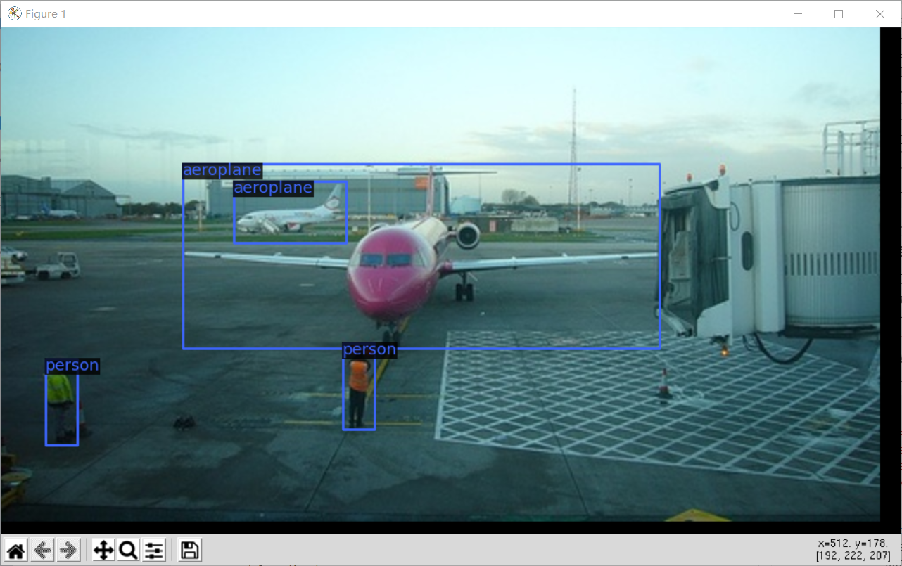
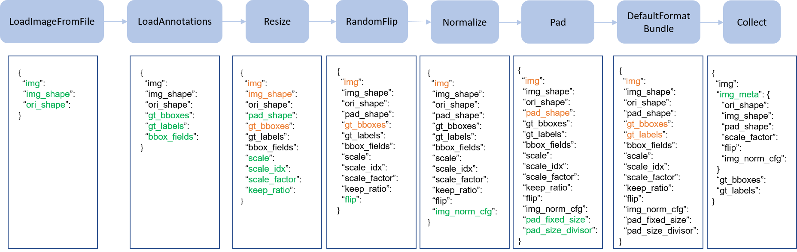

# MMDetection-数据准备

## 简介

在本专栏的上一篇文章中，介绍了统筹控制整个MMDetection工作pipeline的配置文件，它是非常重要的。但是，其实也可以发现，配置文件里其实是一系列的键值对，这些类或者方法的具体定义其实都在mmdet这个文件夹下，它是MMDetection的核心。而熟悉PyTorch的都知道，数据和模型是整个工作流的两个核心配置，本文和后一篇文章就针对MMDetection的数据准备和模型展开介绍。

## 数据集

### 数据集格式

首先，我们需要知道，目标检测的两个基准数据集（COCO和VOC）使用了两种不同的数据集存放格式（data format），关于这两种格式的具体介绍，我这里不细说了，不太了解的可以参考[我的博文](https://zhouchen.blog.csdn.net/article/details/113619236)。而MMDetection其实已经对几种常用的数据集格式进行了PyTorch的Dataset的封装，COCO和VOC当然在其中。

### 自定义Dataset

熟悉PyTorch的都知道，我们使用没有出现过的自定义数据集（或者数据集格式），就要构建对应的Dataset类，这个类其实是对数据集存储格式解析、标注文件读取、图像文件读取等流程定义的一套操作，这些类定义在`mmdet`文件夹下的`datasets`目录下，如`mmdet/datasets/voc.py`，就是定义了对PASCAL VOC数据集的处理。

下面以VOC数据集为例，不妨直接来看其源码，内容如下（我这里略去了在数据集上进行mAP评估的函数）。可以看到它的主要函数都继承自XMLDataset，这是因为VOC数据集是以XML文件的形式存储标注的，为了复用单独将XMLDataset独立出来。

```python
@DATASETS.register_module()
class VOCDataset(XMLDataset):

    CLASSES = ('aeroplane', 'bicycle', 'bird', 'boat', 'bottle', 'bus', 'car',
               'cat', 'chair', 'cow', 'diningtable', 'dog', 'horse',
               'motorbike', 'person', 'pottedplant', 'sheep', 'sofa', 'train',
               'tvmonitor')

    def __init__(self, **kwargs):
        super(VOCDataset, self).__init__(**kwargs)
        if 'VOC2007' in self.img_prefix:
            self.year = 2007
        elif 'VOC2012' in self.img_prefix:
            self.year = 2012
        else:
            raise ValueError('Cannot infer dataset year from img_prefix')
```

来看下面这个XMLDataset的具体实现，我这里省略部分函数的具体实现，其中最为核心的是两个函数`load_annotations`和`get_ann_info`，前者读取所有图像的id和size信息以列表信息存储，后者则根据图像的id具体来读取图像的所有目标边界框信息和边界框类别标签。

```python
@DATASETS.register_module()
class XMLDataset(CustomDataset):

    def __init__(self, min_size=None, **kwargs):
        assert self.CLASSES or kwargs.get(
            'classes', None), 'CLASSES in `XMLDataset` can not be None.'
        super(XMLDataset, self).__init__(**kwargs)
        self.cat2label = {cat: i for i, cat in enumerate(self.CLASSES)}
        self.min_size = min_size

    def load_annotations(self, ann_file):
        data_infos = []
        img_ids = mmcv.list_from_file(ann_file)
        for img_id in img_ids:
            filename = f'JPEGImages/{img_id}.jpg'
            xml_path = osp.join(self.img_prefix, 'Annotations',
                                f'{img_id}.xml')
            tree = ET.parse(xml_path)
            root = tree.getroot()
            size = root.find('size')
            if size is not None:
                width = int(size.find('width').text)
                height = int(size.find('height').text)
            else:
                img_path = osp.join(self.img_prefix, 'JPEGImages',
                                    '{}.jpg'.format(img_id))
                img = Image.open(img_path)
                width, height = img.size
            data_infos.append(
                dict(id=img_id, filename=filename, width=width, height=height))

        return data_infos

    def _filter_imgs(self, min_size=32):
        pass

    def get_ann_info(self, idx):
        img_id = self.data_infos[idx]['id']
        xml_path = osp.join(self.img_prefix, 'Annotations', f'{img_id}.xml')
        tree = ET.parse(xml_path)
        root = tree.getroot()
        bboxes = []
        labels = []
        bboxes_ignore = []
        labels_ignore = []
        for obj in root.findall('object'):
            name = obj.find('name').text
            if name not in self.CLASSES:
                continue
            label = self.cat2label[name]
            difficult = int(obj.find('difficult').text)
            bnd_box = obj.find('bndbox')
            # TODO: check whether it is necessary to use int
            # Coordinates may be float type
            bbox = [
                int(float(bnd_box.find('xmin').text)),
                int(float(bnd_box.find('ymin').text)),
                int(float(bnd_box.find('xmax').text)),
                int(float(bnd_box.find('ymax').text))
            ]
            ignore = False
            if self.min_size:
                assert not self.test_mode
                w = bbox[2] - bbox[0]
                h = bbox[3] - bbox[1]
                if w < self.min_size or h < self.min_size:
                    ignore = True
            if difficult or ignore:
                bboxes_ignore.append(bbox)
                labels_ignore.append(label)
            else:
                bboxes.append(bbox)
                labels.append(label)
        if not bboxes:
            bboxes = np.zeros((0, 4))
            labels = np.zeros((0, ))
        else:
            bboxes = np.array(bboxes, ndmin=2) - 1
            labels = np.array(labels)
        if not bboxes_ignore:
            bboxes_ignore = np.zeros((0, 4))
            labels_ignore = np.zeros((0, ))
        else:
            bboxes_ignore = np.array(bboxes_ignore, ndmin=2) - 1
            labels_ignore = np.array(labels_ignore)
        ann = dict(
            bboxes=bboxes.astype(np.float32),
            labels=labels.astype(np.int64),
            bboxes_ignore=bboxes_ignore.astype(np.float32),
            labels_ignore=labels_ignore.astype(np.int64))
        return ann

    def get_cat_ids(self, idx):
        pass
```

但是上面两个依此继承的Dataset类并没有出现我们PyTorch中最常出现的`__getitem__()`函数，它其实在XMLDataset继承的CustomDataset中具体实现了，这个类也是MMDetection中所有自定义数据集类的根源，它其实定义了通用的目标检测数据集处理的内容，包括`__getitem__(idx)`这个函数，按照id去读取对应的标注和图像（这里的图像处理会经过一个称为pipeline的处理，在MMDetection中，pipeline定义了一个序列的对图像的处理过程）。

上面说了这么多，又以MMDetection对VOC数据集封装的Dataset为例简要介绍Dataset结构，就是想说明，若你要使用全新的数据集就需要为其定义符合CustomDataset接口的类，或者**将现有数据集转换为MMDetection已经支持的这几种格式（如COCO和PASCAL VOC）或中间格式（middle format）。** 官方推荐的是这种数据集转换的方法，可选离线转换或者在线转换两种方式，前者的意思是通过一个脚本重新组织数据集本地文件的格式，后者则是手写一个新的Dataset类自定义其中读取数据集部分的代码，当训练时一批一批的进行格式转换。在MMDetection中，推荐离线转为COCO格式，这样一劳永逸并且用户**只需要修改配置文件中的数据集标注路径和类别列表**即可，而且，在MMDetection中，只支持COCO格式数据集的mask AP评估。

COCO基本标注格式如下，其中的必要项及其含义可以参考[我关于COCO数据集格式解析的博客](https://zhouchen.blog.csdn.net/article/details/113619236)。不过，也不用担心转换数据集脚本的麻烦，大多数开源数据集都会提供转换的工具箱代码的，使用标注工具自己标注的数据集处理方式网上也有很多开源代码。在MMDetection中，建议将离线数据集转换的脚本放在根目录下的`tools/dataset_converters/`目录下，该目录下官方已经预定义了将VOC数据集和Cityscapes数据集转化为COCO格式的脚本。

```python
'images': [
    {
        'file_name': 'COCO_val2014_000000001268.jpg',
        'height': 427,
        'width': 640,
        'id': 1268
    },
    ...
],

'annotations': [
    {
        'segmentation': [[192.81,
            247.09,
            ...
            219.03,
            249.06]],  # if you have mask labels
        'area': 1035.749,
        'iscrowd': 0,
        'image_id': 1268,
        'bbox': [192.81, 224.8, 74.73, 33.43],
        'category_id': 16,
        'id': 42986
    },
    ...
],

'categories': [
    {'id': 0, 'name': 'car'},
 ]
```

### 自定义数据准备

我这里通过官方的脚本通过命令` python tools/dataset_converters/pascal_voc.py /VOC/VOCdevkit/ -o /VOC/VOCdevkit/ --out-format coco`将VOC数据集转换为了COCO格式（由于VOC2012测试集没有标注，因而需要修改官方脚本测试集转换的部分），得到了一个合适的COCO格式的自定义数据集（只不过我这里自定义数据集以VOC为例），生成了如下的COCO格式的标注文件。

```
voc0712_train.json
voc0712_trainval.json
voc0712_val.json
voc07_test.json
voc07_train.json
voc07_trainval.json
voc07_val.json
voc12_train.json
voc12_trainval.json
voc12_val.json
```

到这里，我们就完成了数据集的预处理，现在要想使用该数据集训练，还需要两个步骤：**修改自定义数据集的配置文件**和**检查自定义数据集的标注**。

先是修改配置文件，我们需要在配置文件中修改三处，第一处是`dataset_type`字段，将其修改为转换为的预定于数据集类型，如`CocoDataset`；第二处是`classes`字段，这是一个所有目标类别的字符串列表（**需要注意的是这里也未必需要所有类别，也可以是所有类别的子集上进行训练，也是通过这个classes字段控制**），配合这个修改，`data`字段下具体的`train`、`val`和`test`字段也要修改classes和文件目录；第三处是`model`字段部分的`num_classes`数值，如VOC应该设置为20。例如，对于上面COCO格式的VOC，我们编写的配置文件如下。

```python
_base_ = [
    '../_base_/models/faster_rcnn_r50_fpn.py',
    '../_base_/schedules/schedule_1x.py', '../_base_/default_runtime.py'
]

model = dict(
    roi_head=dict(
        bbox_head=dict(num_classes=20)))

dataset_type = 'CocoDataset'
classes = (
        'aeroplane', 'bicycle', 'bird', 'boat', 'bottle', 'bus', 'car', 'cat',
        'chair', 'cow', 'diningtable', 'dog', 'horse', 'motorbike', 'person',
        'pottedplant', 'sheep', 'sofa', 'train', 'tvmonitor'
)
data_root = '/home/zhouchen/Datasets/VOC/VOCdevkit/'
img_norm_cfg = dict(
    mean=[123.675, 116.28, 103.53], std=[58.395, 57.12, 57.375], to_rgb=True)
train_pipeline = [
    dict(type='LoadImageFromFile'),
    dict(type='LoadAnnotations', with_bbox=True),
    dict(type='Resize', img_scale=(1000, 600), keep_ratio=True),
    dict(type='RandomFlip', flip_ratio=0.5),
    dict(type='Normalize', **img_norm_cfg),
    dict(type='Pad', size_divisor=32),
    dict(type='DefaultFormatBundle'),
    dict(type='Collect', keys=['img', 'gt_bboxes', 'gt_labels']),
]
test_pipeline = [
    dict(type='LoadImageFromFile'),
    dict(
        type='MultiScaleFlipAug',
        img_scale=(1000, 600),
        flip=False,
        transforms=[
            dict(type='Resize', keep_ratio=True),
            dict(type='RandomFlip'),
            dict(type='Normalize', **img_norm_cfg),
            dict(type='Pad', size_divisor=32),
            dict(type='ImageToTensor', keys=['img']),
            dict(type='Collect', keys=['img']),
        ])
]
data = dict(
    samples_per_gpu=2,
    workers_per_gpu=2,
    train=dict(
        type=dataset_type,
        classes=classes,
        ann_file=data_root + 'voc0712_train.json',
        img_prefix=data_root,
        pipeline=train_pipeline),
    val=dict(
        type=dataset_type,
        classes=classes,
        ann_file=data_root + 'voc0712_val.json',
        img_prefix=data_root,
        pipeline=test_pipeline),
    test=dict(
        type=dataset_type,
        classes=classes,
        ann_file=data_root + 'voc0712_val.json',
        img_prefix=data_root,
        pipeline=test_pipeline))
evaluation = dict(interval=1, metric='bbox')
```

接着，我们应该检查自定义数据集的标注是否合法，因为标注不准确，一切的训练都是无效的。下面是一个合法的COCO标注格式示例。我们也可以通过官方提供的简单的可视化脚本来检查标注读下来是否正确，具体为执行`python tools/misc/browse_dataset.py config.py`命令即可，通过可视化的如下图结果，可以确定标注应该是没什么问题的。

```json
'annotations': [
    {
        'segmentation': [[192.81,
            247.09,
            ...
            219.03,
            249.06]],  # if you have mask labels
        'area': 1035.749,
        'iscrowd': 0,
        'image_id': 1268,
        'bbox': [192.81, 224.8, 74.73, 33.43],
        'category_id': 16,
        'id': 42986
    },
    ...
],

# MMDetection automatically maps the uncontinuous `id` to the continuous label indices.
'categories': [
    {'id': 1, 'name': 'a'}, {'id': 3, 'name': 'b'}, {'id': 4, 'name': 'c'}, {'id': 16, 'name': 'd'}, {'id': 17, 'name': 'e'},
 ]

```



> [官方教程](https://mmdetection.readthedocs.io/en/latest/tutorials/customize_dataset.html)这里还介绍了一种可用的中间格式数据集（middle format），我个人觉得这个用途不是特别广泛，所以这里就跳过了。

### 数据集包装

MMDetection还支持在现有数据集的基础上进行包装从而对现有数据集进行混合或者修改分布，目前MMDetection支持三种包装方式，分别如下。

- `RepeatDataset`: 简单重复整个数据集
- `ClassBalancedDataset`: 以类别平衡的方式重复数据集
- `ConcatDataset`: 级联数据集

对第一个`RepeatDataset`的使用方式也很简单，假定原始数据集为A，那么为了重复只需要给定重复次数`times`即可，应当构建如下的`data.train`字段。

```python
dataset_A_train = dict(
        type='RepeatDataset',
        times=N,
        dataset=dict(  # This is the original config of Dataset_A
            type='Dataset_A',
            ...
            pipeline=train_pipeline
        )
    )
```

对第二个`ClassBalancedDataset`，这是一种基于类别频率的重复数据集的方式，使用该方法要求定义的Dataset类实现了`get_cat_ids(idx)`方法，该数据集构建需要指定阈值`oversample_thr`即可，它会修改原始数据集使得类别接近平衡，示例如下。

```python
dataset_A_train = dict(
        type='ClassBalancedDataset',
        oversample_thr=1e-3,
        dataset=dict(  # This is the original config of Dataset_A
            type='Dataset_A',
            ...
            pipeline=train_pipeline
        )
    )
```

最后，重点提一下关键的`ConcatDataset`，我们之前的VOC0712其实就是两个数据集级联而成的，数据集的级联有三种情况，分别叙述。

- 若需要级联的数据集标注是同种格式如VOC2007和VOC2012，则可以采用如下方式级联，这样构建的数据集默认在各个子数据集上评估，如果要在整个级联后的数据集上评估，应当将下面的`separate_eval`设为False。

    ```python
    dataset_A_train = dict(
        type='Dataset_A',
        ann_file = ['anno_file_1', 'anno_file_2'],
        pipeline=train_pipeline,
        separate_eval=True,
    )
    ```
- 若需要级联的数据集格式不同，需要类似下面这种方式进行级联，它同样和上面一样支持`separate_eval`的修改。

    ```python
    dataset_A_train = dict()
    dataset_B_train = dict()

    data = dict(
        imgs_per_gpu=2,
        workers_per_gpu=2,
        train = [
            dataset_A_train,
            dataset_B_train
        ],
        val = dataset_A_val,
        test = dataset_A_test
        )
    ```

- 同样也支持如下显式的级联数据集，

    ```python
    dataset_A_val = dict()
    dataset_B_val = dict()

    data = dict(
        imgs_per_gpu=2,
        workers_per_gpu=2,
        train=dataset_A_train,
        val=dict(
            type='ConcatDataset',
            datasets=[dataset_A_val, dataset_B_val],
            separate_eval=False))
    ```

## 数据管道

在MMDetection中，数据准备pipeline和数据集的定义是解耦开的，一个Dataset定义了如何处理标注文件而一个Pipeline则定义了一套准备数据字典（这个数据字典就是Dataset对象提供的item）的步骤，因此它通常是一个操作序列，每一步的操作都输入一个字典输出一个新字典用于下一步的转换。



上图是一个经典的pipeline，蓝框是操作名，随着数据在pipeline内的流动，每个操作会向原有的字典中添加新的键（图中的绿色部分）或者更新已有的键（图中的黄色部分）。

这些所有的pipeline中的操作分为数据加载、预处理、格式化和测试时数据增强，

下面是一个经典的Faster R-CNN的pipeline配置，具体操作的参数和函数用途及对字典的修改可以查看[官网教程](https://mmdetection.readthedocs.io/en/latest/tutorials/data_pipeline.html)。

```python
img_norm_cfg = dict(
    mean=[123.675, 116.28, 103.53], std=[58.395, 57.12, 57.375], to_rgb=True)
train_pipeline = [
    dict(type='LoadImageFromFile'),
    dict(type='LoadAnnotations', with_bbox=True),
    dict(type='Resize', img_scale=(1333, 800), keep_ratio=True),
    dict(type='RandomFlip', flip_ratio=0.5),
    dict(type='Normalize', **img_norm_cfg),
    dict(type='Pad', size_divisor=32),
    dict(type='DefaultFormatBundle'),
    dict(type='Collect', keys=['img', 'gt_bboxes', 'gt_labels']),
]
test_pipeline = [
    dict(type='LoadImageFromFile'),
    dict(
        type='MultiScaleFlipAug',
        img_scale=(1333, 800),
        flip=False,
        transforms=[
            dict(type='Resize', keep_ratio=True),
            dict(type='RandomFlip'),
            dict(type='Normalize', **img_norm_cfg),
            dict(type='Pad', size_divisor=32),
            dict(type='ImageToTensor', keys=['img']),
            dict(type='Collect', keys=['img']),
        ])
]
```

当然，pipeline也是支持自定义的，它以字典作为输入也以字典作为输出，同样要遵循注册（registry）机制才可用，分以下三步。

**定义my_pipeline.py。**

```python
from mmdet.datasets import PIPELINES

@PIPELINES.register_module()
class MyTransform:

    def __call__(self, results):
        results['dummy'] = True
        return results
``

**导入自定义的pipeline。**

```python
from .my_pipeline import MyTransform
```

**在配置文件中加入该操作。**

```python
img_norm_cfg = dict(
    mean=[123.675, 116.28, 103.53], std=[58.395, 57.12, 57.375], to_rgb=True)
train_pipeline = [
    dict(type='LoadImageFromFile'),
    dict(type='LoadAnnotations', with_bbox=True),
    dict(type='Resize', img_scale=(1333, 800), keep_ratio=True),
    dict(type='RandomFlip', flip_ratio=0.5),
    dict(type='Normalize', **img_norm_cfg),
    dict(type='Pad', size_divisor=32),
    dict(type='MyTransform'),
    dict(type='DefaultFormatBundle'),
    dict(type='Collect', keys=['img', 'gt_bboxes', 'gt_labels']),
]
```

## 总结

本文主要介绍了MMDetetion的数据准备相关的内容，数据是模型训练的关键，这部分对应的官方文档这里给出[链接]((https://mmdetection.readthedocs.io/en/latest/tutorials/customize_dataset.html))。最后，如果我的文章对你有所帮助，欢迎点赞收藏评论一键三连，你的支持是我不懈创作的动力。


