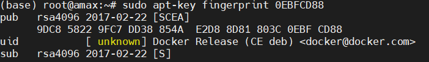
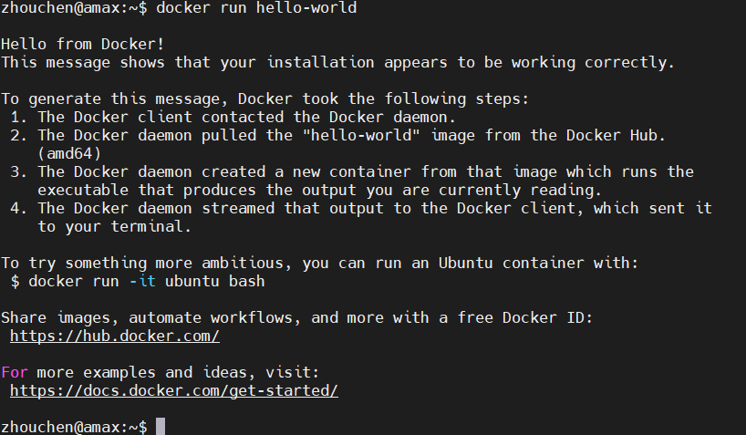
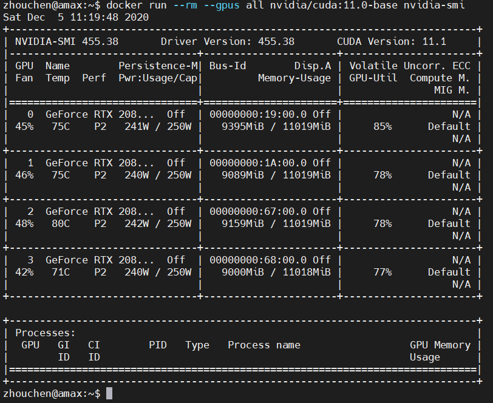
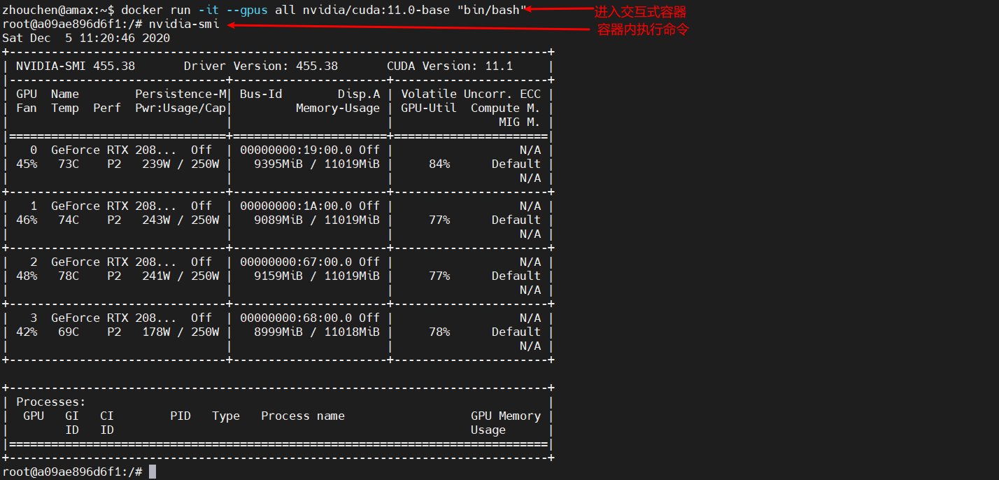
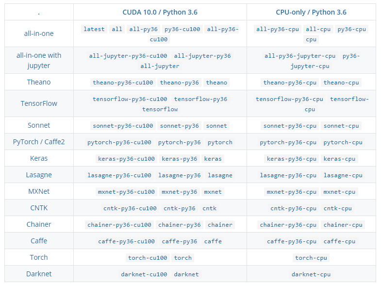
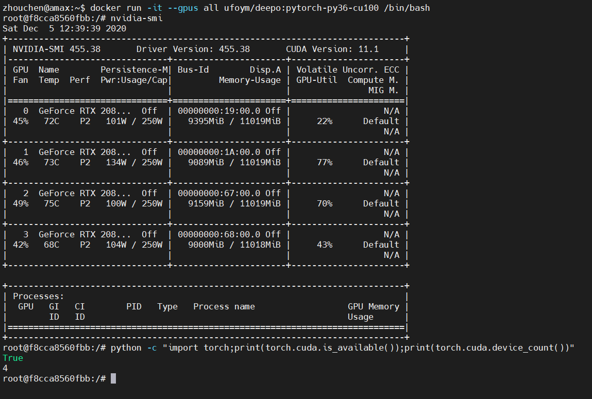
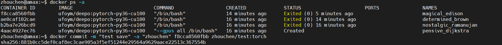
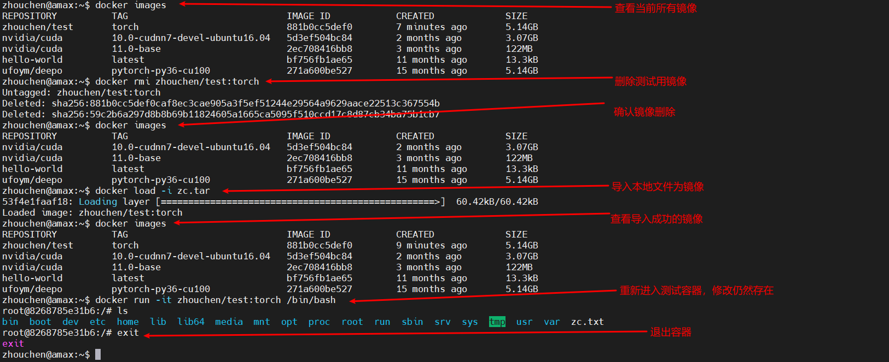

# Docker 教程-深度学习环境配置

> 最近在知乎上刷到一篇文章，标题很有意思叫《Docker，救你于「深度学习环境配置」的苦海》，感兴趣的可以去搜一下。那篇文章主要针对的是一个目前深度学习研究者的痛点：深度学习环境的配置。我在之前的开过一个[Docker 系列专栏](https://blog.csdn.net/zhouchen1998/category_9740297.html)，但是没有设计到深度学习配置这方面，本文就是补足这样一个点。

## 简介

之所以对引言中那篇文章有感而发，是因为我在实际工程中就遇到了这样的问题，cuda 版本、cudnn 版本、深度学习框架（PyTorch 或者 Tensorflow）版本难以控制，尽管现在可以通过 conda 进行环境隔离，但是 conda 相对还是依托于系统环境的，有没有一种方式可以确保在每个人不同的软硬件环境下环境配置流程不出错，甚至，我可以把整个环境打包分享出去呢？**有，这就是 Docker，用户可以将自己配置好的环境打包为镜像，然后使用别人的镜像直接进入别人配置好的环境中，我们要做的，就是提供硬件的支持。** 这类似于虚拟机，但是目前的虚拟机是不支持 GPU 资源的模拟，而且比起虚拟机动辄几个小时的装系统过程，Docker 环境配置迅速且非常轻量，占用存储空间很小。最后说明，本文教程只针对 Ubuntu 系统，其他 Linux 发行版大同小异。

## Docker 安装

参考官方的文档里的操作步骤即可，[链接](https://docs.docker.com/engine/install/ubuntu/)给出，这里建议是 LTS 版本的系统，我这里推荐官方仓库的安装，所以下面的命令也是这种安装方式。

**卸载旧版本**

```shell
sudo apt-get remove docker docker-engine docker.io containerd runc
```

**设置官方源（注意多行命令）**

```shell
sudo apt-get update

sudo apt-get install \
    apt-transport-https \
    ca-certificates \
    curl \
    gnupg-agent \
    software-properties-common

curl -fsSL https://download.docker.com/linux/ubuntu/gpg | sudo apt-key add -

sudo apt-key fingerprint 0EBFCD88
```

输出如下图则表示添加 key 成功。



添加稳定版仓库

```shell
sudo add-apt-repository \
   "deb [arch=amd64] https://download.docker.com/linux/ubuntu \
   $(lsb_release -cs) \
   stable"
```

**安装 docker**

```shell
sudo apt-get update

sudo apt-get install docker-ce docker-ce-cli containerd.io

sudo docker run hello-world
```

如果，非管理员权限的普通用户想要使用 Docker，使用下面的命令将其添加到 docker 组即可（这个用户组安装时自动创建）。

```shell
sudo usermod -aG docker username
```

**测试 docker 安装**

我将普通用户添加到 docker 中，执行`docker run hello-world`，结果如下代表安装成功（第一次执行会下载镜像，请自行查看如何配置国内源加速）。



**安装 nvidia-docker**

docker 默认是不支持在容器内 GPU 加速的，NVIDIA 官方做了个工具箱来支持容器内 GPU 加速运算，这大大方便了深度学习开发者。安装该库要求比较严格，首先必须安装了足够新的版本的 NVIDIA 显卡驱动和 Docker，可以不安装 CUDA，然后 nvidia-docker 的版本要高度适配，这里推荐按照[官方教程](https://docs.nvidia.com/datacenter/cloud-native/container-toolkit/install-guide.html#installing-on-ubuntu-and-debian)进行安装，命令下面我也给出。


```shell
distribution=$(. /etc/os-release;echo $ID$VERSION_ID) \
   && curl -s -L https://nvidia.github.io/nvidia-docker/gpgkey | sudo apt-key add - \
   && curl -s -L https://nvidia.github.io/nvidia-docker/$distribution/nvidia-docker.list | sudo tee /etc/apt/sources.list.d/nvidia-docker.list

curl -s -L https://nvidia.github.io/nvidia-container-runtime/experimental/$distribution/nvidia-container-runtime.list | sudo tee /etc/apt/sources.list.d/nvidia-container-runtime.list

sudo apt-get update

sudo apt-get install -y nvidia-docker2

sudo systemctl restart docker
```

这时，不出意外就安装成功了，我们使用命令`sudo docker run --rm --gpus all nvidia/cuda:11.0-base nvidia-smi`来测试是否成功，成功安装的显示如下。



当然你也可以交互式执行下图的操作，**注意必须添加选项--gpus 来指定使用的 GPU，all 指的是全部 GPU。**。



## 镜像使用

### **镜像拉取**

我这边分别推荐两个不错的国内外镜像源，前者为[deepo](https://hub.docker.com/r/ufoym/deepo)后者为[cuda](https://hub.docker.com/r/nvidia/cuda)。

cuda 是 nvidia 开发制作的使用 cuda 的镜像，支持不同版本的 cuda，分三个 tag 类型，分别是 base(只包含 cuda)、runtime(包含常用 cuda 数学库)、devel（包含源码文件和开发工具，适用于深度学习开发者）。我想要支持 cuda10 的 Ubuntu16 可以执行`docker pull nvidia/cuda:10.0-cudnn7-devel-ubuntu16.04`。

deepo 是国内开发者制作的深度学习镜像，包含流行的深度学习框架，通过`docker pull ufoym/deepo`就可以拉取标准的 deepo 镜像，其中包含了几乎所有的主流深度学习框架，非常庞大。我们可以通过 tag 来拉取特殊框架定制版的镜像，例如，我想获取 PyTorch 框架的镜像，只需要输入`docker pull ufoym/deepo:pytorch-py36-cu100`即可，下图是目前支持的 tag 名。



我这边出于速度考虑，推荐使用 deepo，它是很全的一个镜像库，而且支持 Jupyter，如果你是 Jupyter 的喜好者，通过`docker pull ufoym/deepo:all-jupyter`和`docker run --runtime=nvidia -it -p 8888:8888 --ipc=host ufoym/deepo:all-jupyter jupyter notebook --no-browser --ip=0.0.0.0 --allow-root --NotebookApp.token= --notebook-dir='/root'`命令就可以通过主机的 8888 端口访问 docker 容器的 8888 端口的 Jupyter 服务了。

**如果你是国内用户，docker 拉取默认是 docker hub 地址的，还是比较慢的，建议前面加上国内托管库，deepo 都支持，例如`docker pull registry.docker-cn.com/ufoym/deepo`**。

### **容器使用**

拥有镜像之后就是容器的创建和使用了，这部分我就不多赘述，详细可以查看[我此前教程](https://zhouchen.blog.csdn.net/article/details/104576846)，我这边以交互模式测试一下 deepo 的 PyTorch 的可用性，如下图，可以看到，我们可以使用主机的 4 个 GPU。



### **镜像导出**

一般镜像的导出分为两种思路：Dockerfile 和镜像打包。

前者是将配置方式导出，这要求用户手写一个 Dockerfile 文件（一般你会在开源项目的根目录中发现这个文件），然后 docker 会根据这个文件自动构建镜像并进行相应的操作。这种方式的好处是轻量方便，只需要共享一个 Dockerfile 文本文件即可，坏处就是别人用的时候还要去下载镜像进行一系列自动配置，耗时比较长。**关于 Dockerfile 的语法内容比较多，本文不多提及。**

后者则比较粗暴，首先我们必须明确，镜像是只读的，容器是镜像的一个运行时状态，这个状态一旦关闭，就会恢复为镜像本来的样子。我们想要保存的肯定是修改后的容器，因此需要将其先提交为一个新的镜像。例如，我在上面示例的 PyTorch 镜像生成的容器家目录新建了一个名为`zc.txt`的文本文件，我希望别人也能使用我的镜像生成的容器中有这个更改。

首先，通过`docker ps -a`查看容器，找到我修改后的容器，记住其`CONTAINER ID`，然后通过`docker commit -m "镜像说明" -a "作者名，最好同docker hub用户名" 容器id 作者名/镜像名:tag`命令提交镜像。操作示例如下图。



接着，我们通过`docker images`查看到了新生成的镜像，此时从这个镜像生成容器就会看到我们上面修改后添加的`zc.txt`文件，我这里不演示了，我们通过`docker save -o 文件路径及文件名 镜像名`将镜像保存为本地文件，同样导入本地文件为镜像的命令是`docker load -i 文件路径及文件名`。

下面演示我将测试用镜像导出后删除，然后导入运行，整个过程我均进行了标注，应该是很清晰的。



## 补充说明

本文简单介绍了如何在 Ubuntu 下进行 Docker 深度学习环境的配置、导出等常用操作，其他使用 Pycharm 或者 VScode 等远程连接 Docker 环境网上有不少介绍，我在后续有空的话也会补充。本文没有过多涉及 Docker 的基础概念和命令，这部分前置知识请查看[我之前的教程](https://blog.csdn.net/zhouchen1998/category_9740297.html)。最后，本文如果对你有所帮助，欢迎点赞、收藏加关注。
