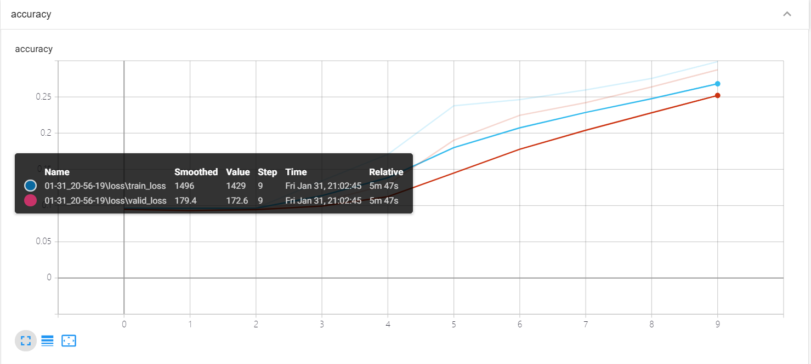
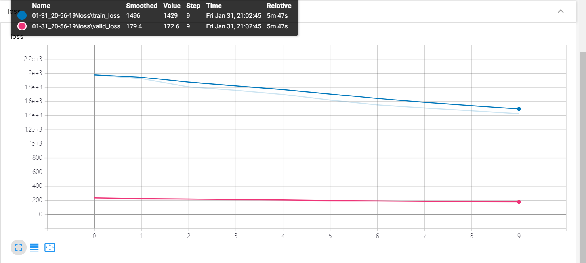

# PyTorch图像分类演示


## 简介
在之前的[系列](https://blog.csdn.net/zhouchen1998/category_8742242.html)中提到了数据的加载与增强、模型的构建、损失函数与优化器的设计、训练的可视化，本文将以Caltech101图像数据集为例，演示PyTorch的整个工作流程，以PyTorch作为工具进行深度学习项目的大体思路就是本文所述。


## 数据准备
这边采用自定义Dataset的方法批量导入数据集并进行相应的数据增广，这里采用的数据集是划分好的，同时也是生成了desc的csv文件的，具体操作见[数据准备的博客](https://blog.csdn.net/zhouchen1998/article/details/104087727)。

核心代码如下，具体整个训练代码见文末Github。
```python
class MyDataset(Dataset):

    def __init__(self, desc_file, transform=None):
        self.all_data = pd.read_csv(desc_file).values
        self.transform = transform

    def __getitem__(self, index):
        img, label = self.all_data[index, 0], self.all_data[index, 1]
        img = Image.open(img).convert('RGB')
        if self.transform is not None:
            img = self.transform(img)
        return img, label

    def __len__(self):
        return len(self.all_data)

desc_train = '../data/desc_train.csv'
desc_valid = '../data/desc_valid.csv'
desc_test = '../data/desc_test.csv'

batch_size = 16
lr = 0.001
epochs = 10
norm_mean = [0.4948052, 0.48568845, 0.44682974]
norm_std = [0.24580306, 0.24236229, 0.2603115]

train_transform = transforms.Compose([
    transforms.Resize((32, 32)),
    transforms.RandomHorizontalFlip(),
    transforms.ToTensor(),
    transforms.Normalize(norm_mean, norm_std)  # 按照imagenet标准
])

valid_transform = transforms.Compose([
    transforms.Resize((32, 32)),
    transforms.ToTensor(),
    transforms.Normalize(norm_mean, norm_std)
])

test_transform = transforms.Compose([
    transforms.Resize((32, 32)),
    transforms.ToTensor(),
    transforms.Normalize(norm_mean, norm_std)
])

train_data = MyDataset(desc_train, transform=train_transform)
valid_data = MyDataset(desc_valid, transform=valid_transform)
test_data = MyDataset(desc_test, transform=test_transform)

# 构建DataLoader
train_loader = DataLoader(dataset=train_data, batch_size=batch_size, shuffle=True)
valid_loader = DataLoader(dataset=valid_data, batch_size=batch_size)
test_loader = DataLoader(dataset=test_data, batch_size=batch_size)
```


## 模型构建
这里使用了一个简单的卷积分类模型，具体代码如下。
```python
class Net(nn.Module):

    def __init__(self):
        super(Net, self).__init__()
        self.conv1 = nn.Conv2d(in_channels=3, out_channels=32, kernel_size=(3, 3))
        self.pool1 = nn.MaxPool2d(kernel_size=2, stride=2)
        self.conv2 = nn.Conv2d(in_channels=32, out_channels=64, kernel_size=3)
        self.pool2 = nn.MaxPool2d(2, 2)
        self.fc1 = nn.Linear(64*6*6, 256)
        self.fc2 = nn.Linear(256, 128)
        self.fc3 = nn.Linear(128, 101)

    def forward(self, x):
        x = self.pool1(F.relu(self.conv1(x)))
        x = self.pool2(F.relu(self.conv2(x)))
        x = x.view(-1, 64*6*6)
        x = F.relu(self.fc1(x))
        x = F.relu(self.fc2(x))
        x = self.fc3(x)
        return x

    def init_weights(self):
        for m in self.modules():
            if isinstance(m, nn.Conv2d):
                nn.init.xavier_normal_(m.weight.data)
                if m.bias is not None:
                    m.bias.data.zero_()
            elif isinstance(m, nn.BatchNorm2d):
                m.weight.data.fill_(1)
                m.bias.data.zero_()
            elif isinstance(m, nn.Linear):
                nn.init.normal_(m.weight.data, 0, 0.01)
                m.bias.data.zero_()
```


## 损失及优化
这里的思路也是比较基础的采用交叉熵以及动量SGD的方法，同时加了一个自动的学习率衰减。
```python
criterion = nn.CrossEntropyLoss()
optimizer = optim.SGD(model.parameters(), lr=lr, momentum=0.9, dampening=0.1)
scheduler = optim.lr_scheduler.ReduceLROnPlateau(optimizer, verbose=True)
```

## 模型训练
批量训练的方法，同时在验证集上进行验证，结果可视化于TensorBoard。
```python
for epoch in range(epochs):
    # 训练集训练
    train_loss = 0.0
    correct = 0.0
    total = 0.0
    for step, data in enumerate(train_loader):
        x, y = data
        out = model(x)
        loss = criterion(out, y)
        optimizer.zero_grad()
        loss.backward()
        optimizer.step()

        _, pred = torch.max(out.data, 1)
        total += y.size(0)
        correct += (pred == y).squeeze().sum().numpy()
        train_loss += loss.item()

        if step % 100 == 0:
            print("epoch", epoch, "step", step, "loss", loss.item())

    train_acc = correct / total

    # 验证集验证
    valid_loss = 0.0
    correct = 0.0
    total = 0.0

    for step, data in enumerate(valid_loader):
        model.eval()
        x, y = data
        out = model(x)
        out.detach_()
        loss = criterion(out, y)

        _, pred = torch.max(out.data, 1)
        valid_loss += loss.item()
        total += y.size(0)
        correct += (pred == y).squeeze().sum().numpy()
    valid_acc = correct / total

    scheduler.step(valid_loss)
    writer.add_scalars('loss', {'train_loss': train_loss, 'valid_loss': valid_loss}, epoch)
    writer.add_scalars('accuracy', {'train_acc': train_acc, 'valid_acc': valid_acc}, epoch)
```
最终训练的结果可视化如下，由于训练集较小，训练轮次较少，效果不是很明显，但是可以看到模型还是正常收敛的。





## 模型保存
保存训练好的模型参数用于后续在测试集上使用，或者部署到其他机器上。
```python
net_save_path = 'net_params.pkl'
torch.save(model.state_dict(), net_save_path)
```


## 补充说明
本文主要演示了PyTorch进行深度模型训练的整个流程，事实上，PyTorch的模型训练大致流程是不变的，很多固定的写法我会在下一篇文章中提到这些常用代码。本文涉及到的所有代码均可以在[我的Github](https://github.com/luanshiyinyang/Tutorial/tree/PyTorch)找到。欢迎star或者fork。