# Docker使用

## 简介
本文主要介绍Docker正常使用过程涉及到的命令和一些基本操作，按照由简单到复杂的过程逐一讲解。

## 镜像管理
回顾我[之前博客](https://zhouchen.blog.csdn.net/article/details/104440782)所提到的，Docker允许在容器内运行应用程序，对应的命令为`docker run`，而容器就是镜像的一个实例化，我们先讲解本地镜像管理。

### 基础操作
`sudo docker images`命令可以查看本地主机上所有的Docker镜像文件，例如刚安装的docker-ce执行结果如下。

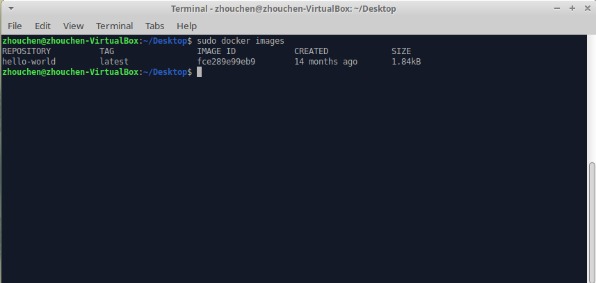

简单说明上述显示的各项含义：
- REPOSITORY：镜像的仓库源
- TAG：镜像的标签，一般代表版本
- IMAGE ID：镜像的ID
- CREATED：镜像创建时间
- SIZE：镜像大小
同一仓库源可以有不同的TAG，表示不同的版本，如ubuntu仓库源有15.10、18.04等多个版本，使用`REPOSITORY:TAG`来定义具体到版本的镜像，若不指定镜像的TAG则默认获取TAG为latest的最新版。

`docker pull repository:tag`命令来获取一个本地不存在的镜像，例如使用`sudo docker pull ubuntu:16.04`获取16.04版本的镜像文件到本地，当然，若是直接使用这个本地没有的镜像，docker也会自动下载的。

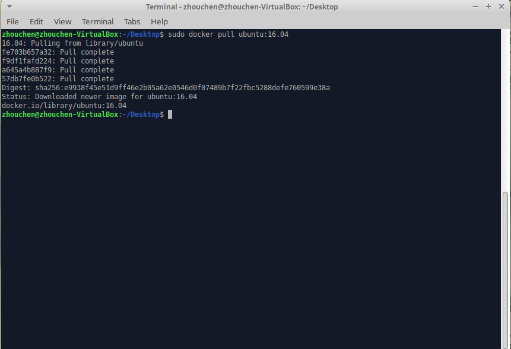

`docker search repository`命令用于从Docker Hub网站搜索可用镜像，也可以直接访问[该网站](https://hub.docker.com/)进行搜索。当你不清楚自己想要的镜像的具体名称，可以使用关键词进行搜索。下图举例搜索httpd服务的镜像。

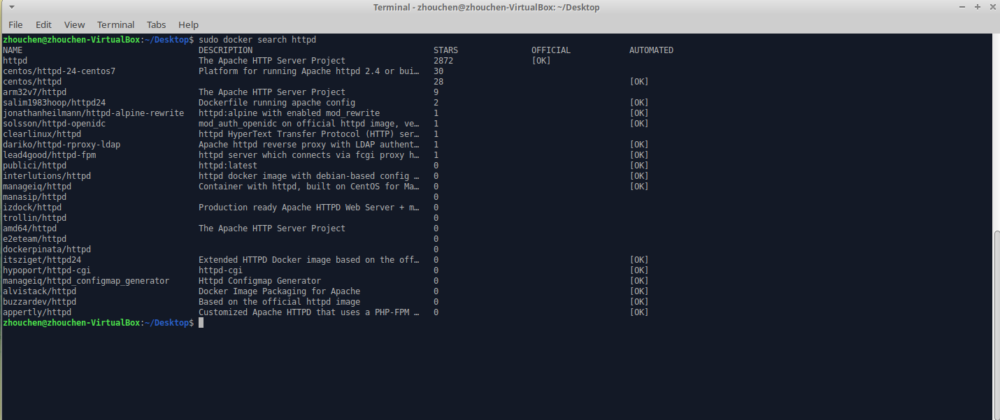

简单说明上述各项含义。
- NAME: 镜像仓库源的名称
- DESCRIPTION: 镜像的描述
- OFFICIAL: 是否为docker官方发布
- STARS: 类似Github的Star，越高则该镜像越受欢迎。
- AUTOMATED: 是否自动构建。

`sudo docker run httpd`命令用于在简单容器中运行docker镜像，可以运行下载到本地的镜像，未下载则docker会先请求下载镜像文件。（**具体容器运行的命令和参数后文提到。**）

`sudo docker rmi hello-world`命令用于删除一个镜像，例如删除hello-world镜像如下图。**注意，正在被容器使用的镜像不能删除，需要先删除容器，具体操作后文提到。**

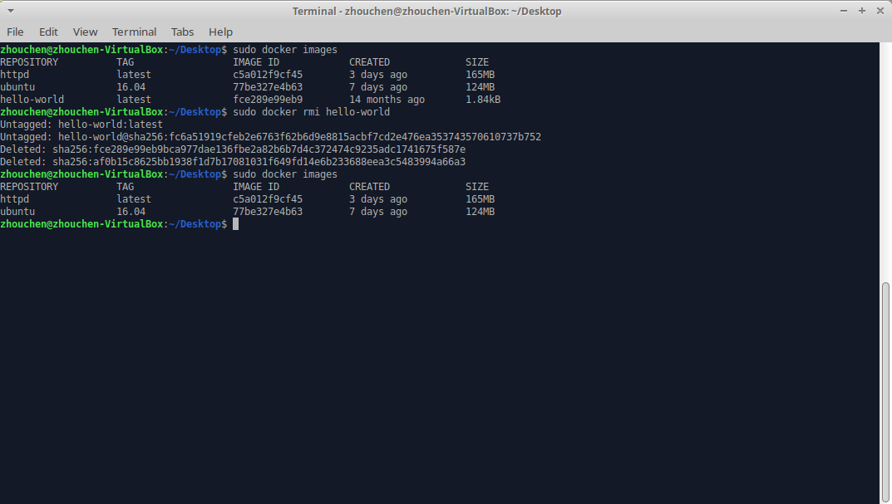

### 进阶操作
当我们从docker镜像仓库获取的镜像已经不能满足需求了，自己定制自己的镜像是必然的选择，这就涉及到镜像更改的操作，主要有两种方法：
- 从已经创建的容器中更新镜像并提交
- 利用docker build命令配合DockerFile文件从零创建新的docker镜像

相对而言，后者难度较高，对Linux需要充分了解，本文只提及第一种方法。

现在，首先运行一个容器并进行修改，随后退出容器。（**涉及容器命令后文提到**）下图id为c45e75d79135的容器就是创建的容器并已经被更改了。然后通过`docker commit -m "desc" -a "author" id 镜像名`命令来向本地仓库提交镜像副本，通过命令可以查看本地当前镜像，确实提交成功且能向其添加容器来运行。

这里先简单说一下commit命令的几个基本参数（示例如下图）：
- -m: 本次提交的镜像描述
- -a: 指定镜像作者
- c45e75d79135：当前容器id
- zhouchen/ubuntu:v2: 指定要创建的目标镜像名，一般分为仓库名和标签名两部分，`:`分隔，仓库名一般采用`作者名/应用名`的方式命名。

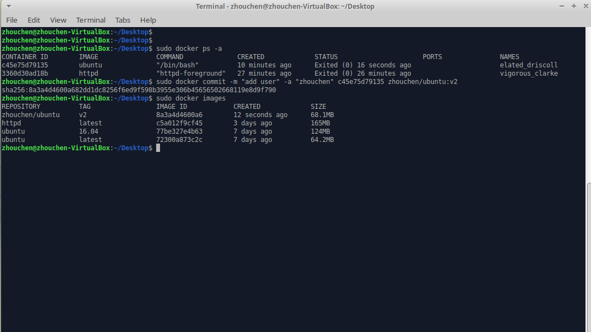

最后，`docker tag 镜像id repository:newtag`命令来为镜像添加权限的标签，示例如下，为ubuntu镜像创建了一个新的tag。

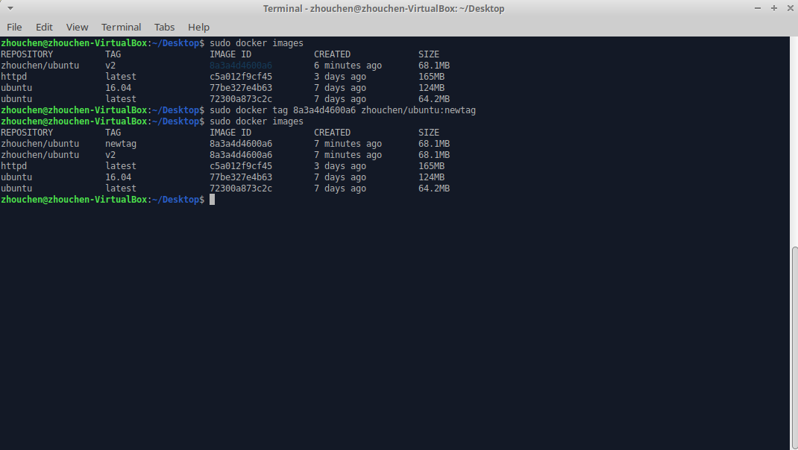

## 容器管理
这部分主要讲解容器的操作，容器是镜像运行的一个实例化，一个镜像可以产生多个容器，但每个容器只有一个对应的镜像。

### 基础操作
`docker run -i -t ubuntu /bin/bash`表示启动一个以ubuntu镜像为基础的可交互的容器，进入交互式shell后可以使用`exit`命令直接退出容器。

其具体参数说明如下：
- -i：交互式操作
- -t：指定终端
- ubuntu：镜像名
- /bin/bash：镜像名后是命令，这里使用bash获取一个交互式shell。

下图就是一个简单示例，可以通过命令行host名等变化看出容器和主机的切换。
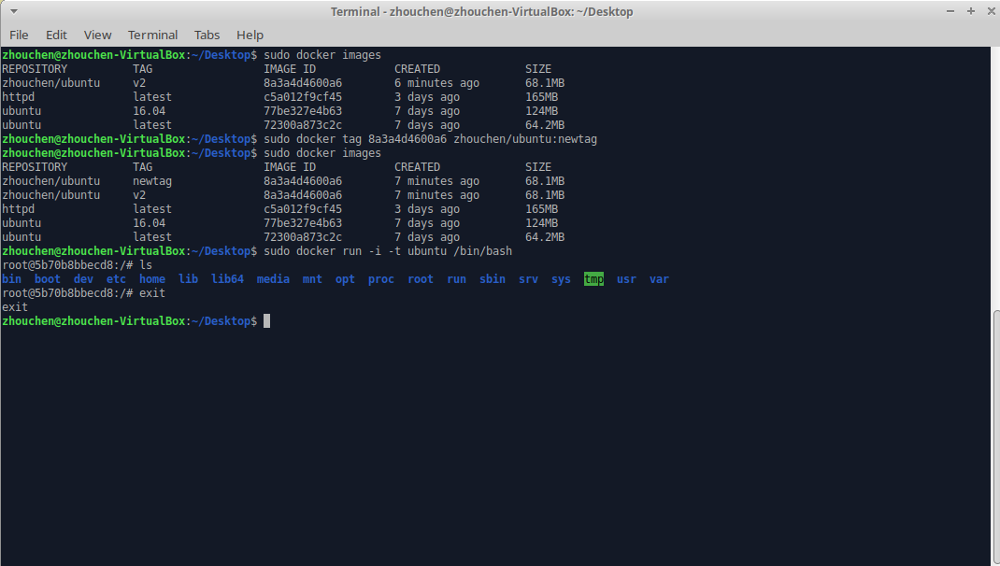

`docker ps -a`命令可以查看所有的容器的详细信息（把控镜像、容器id、创建时间、），`docker start 容器id`可以启动一个停止的容器，`docker stop 容器id`可以停止一个运行的容器，`docker restart 容器id`可以重启容器的运行。下图简单演示上述几个命令使用情况及容器状态的变化。

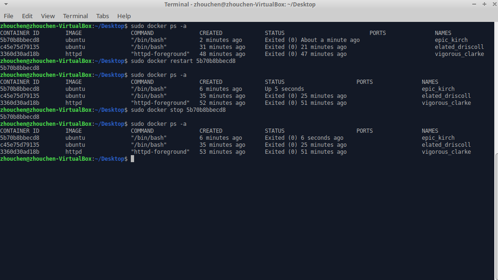

**然而，很多场景下，docker服务都是后台运行的，此时需要指定容器的运行模式。**`docker run -i -t -d ubuntu /bin/bash`表示后台运行容器，只需要在run命令中加入`-d`选项即可，加入该选项后不会默认进入该容器了只会返回一个容器id，要想进入运行的容器需要使用`attach`或者`exec`命令，强烈推荐使用后者，具体说明如下。

`docker attach 容器id`命令来重新进入后台正在运行的容器，下图就是这样操作，进入后台容器并执行一个输出语句后退出容器，**此时随着退出容器，容器的运行也会终止。**

`docker exec -it 容器id /bin/bash`命令也能进入这个运行中的容器，但是随着容器的退出，容器运行不会终止，示例如下图。

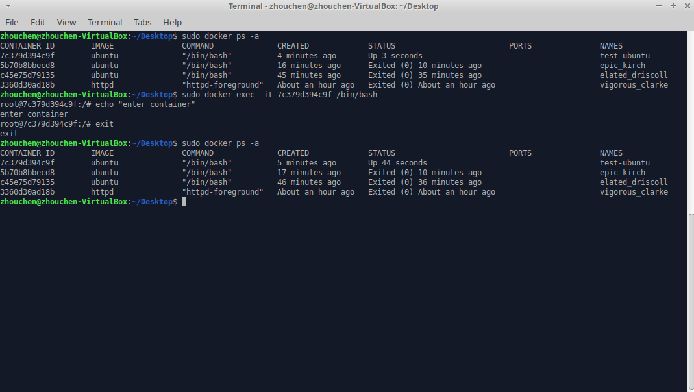

`docker rm -f 容器id`命令可以删除指定的容器，不论这个容器的运行状态如何（不加`-f`选项则不能删除运行中的容器），而`docker container prune`则可以清理掉所有的处于停止状态的容器。

### 进阶操作
下面介绍容器的导出和导入。

很多时候，异地部署，需要将容器转为本地文件导出，该命令为`docker export 容器id > file.tar`，就能将容器快照导出为本地tar文件。

`docker import`命令则可以将容器快照导入为镜像，依据该镜像可以再次创建容器。该命令接受本地文件或者远程url。

下图演示导出导入的过程，导入使用本地文件，命令为`cat file.tar | docker import - test/ubuntu:v3`。

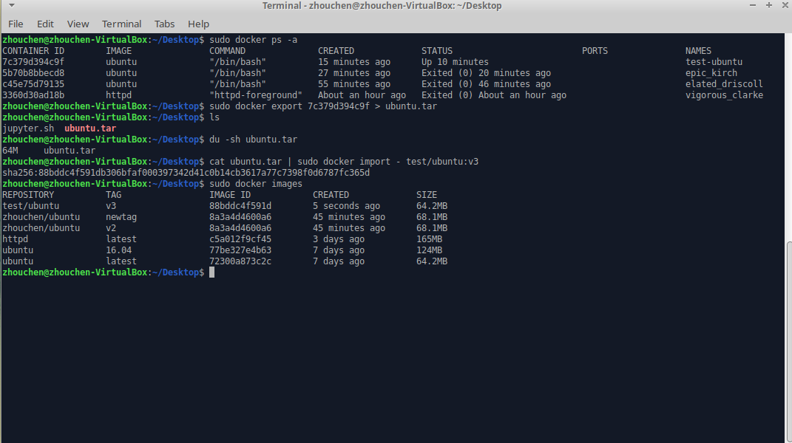

## 实战
下面具体讲解一个案例，其作用是在容器中运行一个Web程序，并进行端口映射，使得主机可以访问。

首先是拉取镜像，这里使用一个STAR数较高的演示demo，training/webapp其运行一个flask的网站程序。随后就是运行一个容器，里面运行Web服务，如下图这里`run`命令加了一个`-P`或者`-p`选项，这表示将容器内部使用的网络端口映射到主机，这样才能进行访问。

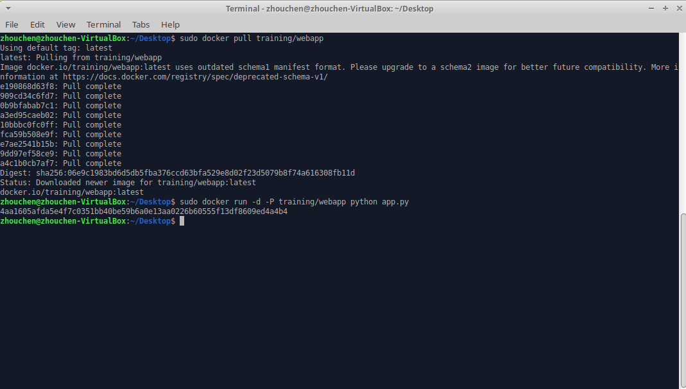

使用`docker ps`命令可以查看到这个运行中的容器，此时看到PORTS这一项有了内容，它表示将容器中5000端口（这是flask默认端口）转发到主机的32768端口，这是因为run的时候使用了`-P`选项进行随机转发，可以改用`-p 主机端口:容器端口`进行具体设置。

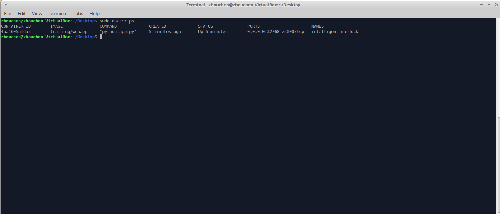

此时可以通过浏览器进行网页访问，结果如下。

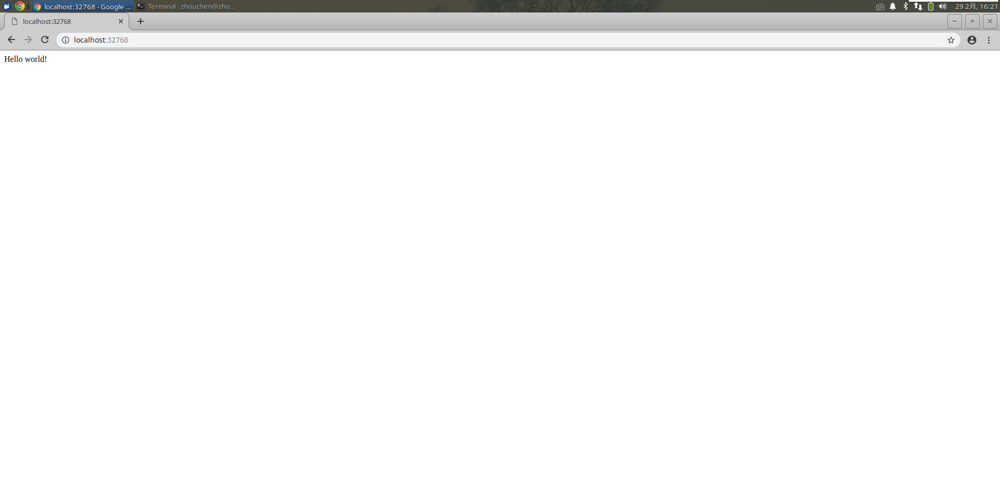

下面补充几条相关的命令。

首先，只查看端口可以使用`docker port 容器id/容器名称`查看映射情况；
接着，`docker logs -f 容器id/容器名称`命令查看容器内部标准输出，`-f`选项表示持续输出（Ctrl + C终止）；
然后，`docker top 容器id/容器名称`命令查看容器内部进程情况；
最后，`docker inspect 容器id/容器名称`可以查看Docker运行情况，返回一个包含容器配置和状态的json文件。

## 补充说明
本文主要介绍了Docker这一容器技术最基本的一些命令和使用方法，也在最后进行了一个Web程序的演示。篇幅较长，如有疏漏，欢迎评论指正。

