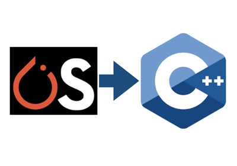

# TIS教程-导出

## 简介

众所周知，模型部署框架部署的是深度学习模型，因此我们希望TIS只对模型的推理进行处理，故而需要提供给它合适的模型。而对于PyTorch的模型而言，有着主要的两种部署级模型，一种就是通用的**ONNX模型**以便支持诸多框架，另一种则是PyTorch自带的**TorchScript模型**。本文及[本系列](https://blog.csdn.net/zhouchen1998/category_11287638.html)的其他文章都采用TorchScript模型进行部署。

## TorchScript

首先来介绍一下TorchScript是啥？



TorchScript主要的应用场景是把Python/PyTorch代码转换成等价的C++代码从而提高深度学习模型在线上生产环境部署的运行效率。Python代码会被编译成TorchScript编译器可以理解的一种格式（ScriptModule），C++的生产环境可以载入该格式的文件并用内置的JIT来执行对应的代码。

**落地到模型这个层面来说，其实就是将PyTorch模型从Python进程（一般指的是开发环境，用于模型设计和训练）中保存并加载到没有Python依赖（一般指的是部署环境，用于模型的线上部署）的进程中。这个过程中，纯Python模型转换为独立于Python的TorchScript程序，如C++环境中，使得生产环境的部署成为了可能，在这种环境中，Python程序可能由于性能和多线程的原因不适用。**

TorchScript从PyTorch1.x开始陆续完善，是PyTorch和TensorFlow竞争工业部署市场浓墨重彩的一笔。

## 模型导出


实际上，TorchScript支持的是Python到C++这类高效语言环境的转换，其中最典型的就是使用C++编写的LibTorch库。不过，TorchScript自成一个生态，也有比较底层的语法需要学习，下文我也只是介绍最基础的模型导出的常见策略，至于LibTorch的细节使用Triton Inference Server也不需要过分关注，我们只需要关注模型在TIS中的推理运行结构即可。

要想保存TorchScript模型，需要首先构建出这个模型并跟踪运行一次，就可以将模型序列化为本地文件了。

```python
import torch

x = torch.randn(1, 3, 640, 640)
model = create_model('yolov5s')
ts_model = torch.jit.trace(model, x, strict=False)
ts_model.save('yolov5.ts.pt')
```

上面就是使用TorchScript将PyTorch模型导出的实例代码，我这里是将yolov5s导出。**至于模型加载的细节，则由TIS来负责，事实上TIS支持包括TensorRT、TorchScript（LibTorch）、TensorFlow等多种后端，我们只需要去完善输入输出的配置细节即可。**

## 总结

本文只是简单介绍了TorchScript模型导出的简单操作，想要了解更多的建议去详细学习一下[官方文档](https://pytorch.org/docs/stable/jit.html)。