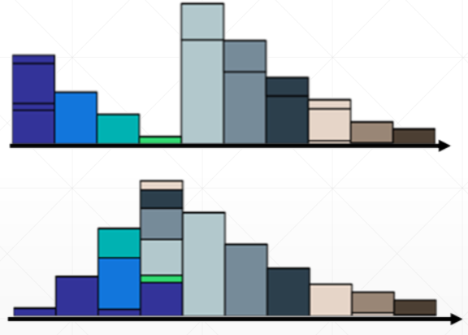
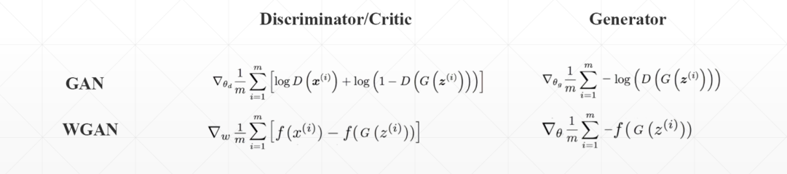
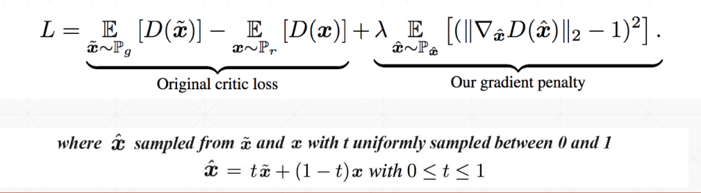
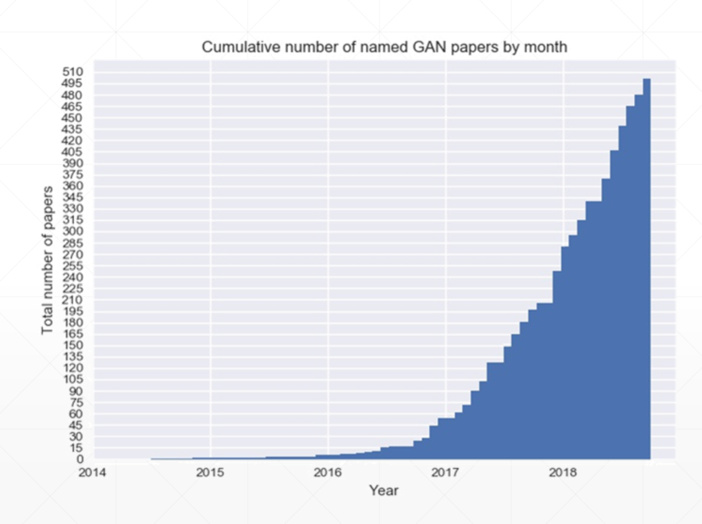
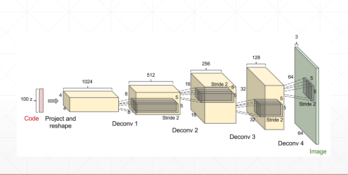
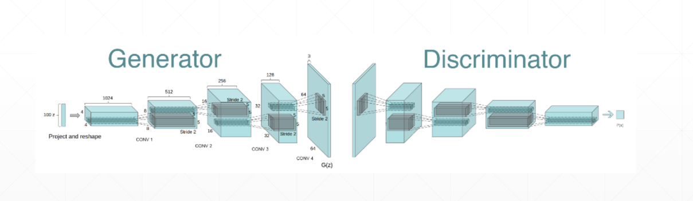

# TensorFlow2对抗生成网络
>What i can not create, i do not understand. 我不能创造的东西，我当然不能理解它。

## 简介
对抗生成网络（GAN）是时下非常热门的一种神经网络，它主要用于复现数据的分布（distribution，或者数据的表示（representation））。尽管数据的分布非常的复杂，但是依靠神经网络强大的学习能力，可以学习其中的表示。其中，最典型的技术就是图像生成。GAN的出现是神经网络技术发展极具突破的一个创新。从2014年GAN诞生之时只能和VAE旗鼓相当，到2018年WGAN的以假乱真，GAN的发展是迅速的。


## 原理
GAN网络由两个部分组成，它们是生成器（Generator）和判别器（Discriminator）。将输入数据与生成器产生的数据同时交给判别器检验，如果两者的分布接近（p_g接近p_r），则表示生成器逐渐学习数据的分布，当接近到一定程度（判别器无法判别生成数据的真假），认为学习成功。
因此关于生成器G和判别器D之间的优化目标函数如下，这就是GAN网络训练的目标。
$$
\begin{aligned} \min _{G} \max _{D} L(D, G) &=\mathbb{E}_{x \sim p_{r}(x)}[\log D(x)]+\mathbb{E}_{z \sim p_{z}(z)}[\log (1-D(G(z)))] \\ &=\mathbb{E}_{x \sim p_{r}(x)}[\log D(x)]+\mathbb{E}_{x \sim p_{z}(x)}[\log (1-D(x)]\end{aligned}
$$
衡量两种分布之间的距离，GAN使用JS散度（基于KL散度推导）衡量两种分布的差异，然而当两种分布（生成器分布和真实分布）直接没有交叉时，KL散度总是0，JS散度总是log2，这就导致JS散度无法很好量化两种分布的差异。同时，此时的将会出现梯度弥散，这也是很多GAN网络难以训练的原因。

因此，有人提出了衡量两种分布P和Q之间差异的方式是从P分布到Q分布需要经历的变化（代价），可以理解为下图的一种分布变为另一种分布需要移动的砖块数目（移土距离，Earth Mover's Distance， EM距离）。
$$
B(\gamma)=\sum_{x_{p}, x_{q}} \gamma\left(x_{p}, x_{q}\right)\left\|x_{p}-x_{q}\right\|
$$
$$
W(P, Q))=\min _{\gamma \in \Pi} B(\gamma)
$$


基于此提出了Wasserstein Distance距离如下，将网络中的JS散度替换为Wasserstein Distance的GAN，称为WGAN，它可以从根本上结局不重叠的分布距离难以衡量的问题从而避免训练早期的梯度弥散。（必须满足1-Lipschitz function，为了满足这个条件要进行weight clipping，但是即使weight clipping也不一定可以满足1-Lipschitz function条件。）
$$
W\left(\mathbb{P}_{r}, \mathbb{P}_{g}\right)=\inf _{\gamma \in \Pi\left(\mathbb{P}_{r}, \mathbb{P}_{g}\right)} \mathbb{E}_{(x, y) \sim \gamma}[\|x-y\|]
$$

因此，为了满足这个条件提出了WGAN-GP（Gradient Penalty），将这个条件写入损失函数，要求必须在1附近。



## GAN发展
从GAN思路被提出以来，产生了各种各样的GAN，每一种GAN都有自己的名字，一般以首字母简略称呼（如今A-Z已经几乎用完，可见这几年GAN的发展迅速）。

其中，比较著名的有DCGAN（反卷积GAN，用于图片扩张）。

此外，还有LSGAN、WGAN（尽管效果不如DCGAN，但是不需要花太多精力设计训练过程）等。


## GAN实战
基于日本Anime数据集生成相应的二次元人物头像，数据集的百度网盘地址[如下](https://pan.baidu.com/s/1eSifHcA)，提取码g5qa。
构建的GAN模型结构示意如下，判别器是一个基础的CNN分类器，生成器是将随机生成的数据进行升维成图。

下面给出模型结构代码，具体的训练代码可以在文末Github找到。
```python
"""
Author: Zhou Chen
Date: 2019/11/23
Desc: About
"""
import tensorflow as tf
from tensorflow import keras
from tensorflow.keras import layers


class Generator(keras.Model):

    def __init__(self):
        super(Generator, self).__init__()
        # 升维成图
        # z: [b, 100] => [b, 3*3*512] => [b, 3, 3, 512] => [b, 64, 64, 3]
        self.fc = layers.Dense(3 * 3 * 512)

        self.conv1 = layers.Conv2DTranspose(256, 3, 3, 'valid')
        self.bn1 = layers.BatchNormalization()

        self.conv2 = layers.Conv2DTranspose(128, 5, 2, 'valid')
        self.bn2 = layers.BatchNormalization()

        self.conv3 = layers.Conv2DTranspose(3, 4, 3, 'valid')

    def call(self, inputs, training=None):
        # [z, 100] => [z, 3*3*512]
        x = self.fc(inputs)
        x = tf.reshape(x, [-1, 3, 3, 512])
        x = tf.nn.leaky_relu(x)
        x = tf.nn.leaky_relu(self.bn1(self.conv1(x), training=training))
        x = tf.nn.leaky_relu(self.bn2(self.conv2(x), training=training))
        x = self.conv3(x)
        x = tf.tanh(x)  # 不使用relu

        return x


class Discriminator(keras.Model):

    def __init__(self):
        super(Discriminator, self).__init__()
        # 分类器
        # [b, 64, 64, 3] => [b, 1]
        self.conv1 = layers.Conv2D(64, 5, 3, 'valid')

        self.conv2 = layers.Conv2D(128, 5, 3, 'valid')
        self.bn2 = layers.BatchNormalization()

        self.conv3 = layers.Conv2D(256, 5, 3, 'valid')
        self.bn3 = layers.BatchNormalization()

        # [b, h, w ,c] => [b, -1]
        self.flatten = layers.Flatten()
        self.fc = layers.Dense(1)

    def call(self, inputs, training=None):
        x = tf.nn.leaky_relu(self.conv1(inputs))
        x = tf.nn.leaky_relu(self.bn2(self.conv2(x), training=training))
        x = tf.nn.leaky_relu(self.bn3(self.conv3(x), training=training))

        # [b, h, w, c] => [b, -1]
        x = self.flatten(x)
        # [b, -1] => [b, 1]
        logits = self.fc(x)

        return logits


def main():
    d = Discriminator()
    g = Generator()

    x = tf.random.normal([2, 64, 64, 3])
    z = tf.random.normal([2, 100])

    prob = d(x)
    print(prob)
    x_hat = g(z)
    print(x_hat.shape)


if __name__ == '__main__':
    main()

```
WGAN只需要在GAN代码基础上添加惩罚项，具体见Github。


## 补充说明
- 本文介绍了GAN在TensorFlow2中的实现，更详细的可以查看官方文档。
- 具体的代码同步至[我的Github仓库](https://github.com/luanshiyinyang/Tutorial/tree/TensorFlow2)欢迎star；博客同步至我的[个人博客网站](https://luanshiyinyang.github.io)，欢迎查看其他文章。
- 如有疏漏，欢迎指正。