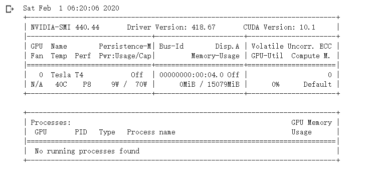
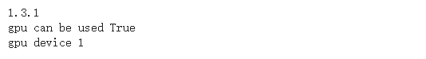
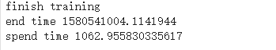
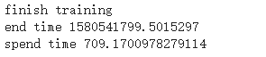

# PyTorch运算加速GPU


## 简介
在前一篇文章中完整演示了整个PyTorch进行深度模型训练的流程，然而，尽管大多时候就是按照这个思路进行模型训练的，但是我们实际上忽略了一个至关重要的问题，那就是GPU加速，目前主流的深度学习框架都是支持GPU加速运算的，PyTorch也不例外，本文介绍如何使用GPU加速模型的训练。


## GPU
事实上，想要使用GPU加速深度学习模型的训练就是将相关的内存中的变量转移到显存中，利用显卡远超CPU的运算速度得到结果。

为了将这些数据搬到显存上，需要借助CUDA这个运算平台（所以机器上必须安装合适的CUDA和Cudnn），然后将内存变量通过`.cuda()`方法转移到GPU上，这个方法由PyTorch封装完成，**训练过程中由于显存的限制一般是将模型以及当前批次的数据转移到显存中。**

本文在T4显卡上进行演示，具体配置如下。


通过下面的代码判断PyTorch是否可以使用GPU加速，以及可用的GPU数目。

```python
import torch
print(torch.__version__)
print("gpu can be used", torch.cuda.is_available())
print("gpu device", torch.cuda.device_count())
```

例如本机环境的测试结果如下。




## GPU加速训练
这一步主要的操作就是模型、每一批的数据搬到GPU上，预测的结果由于用于可视化工具或者命令行输出，所以需要是CPU类型，通过`.cpu()`方法将显存上的数据拿到内存中。主要的代码如下，涉及到修改的地方都用注释说明了。下面的案例同[之前的文章](https://zhouchen.blog.csdn.net/article/details/104128244)。

```python
import pandas as pd
import torch
from torch.utils.data import Dataset, DataLoader
from torchvision.transforms import transforms
import torch.nn as nn
import torch.nn.functional as F
from torch import optim
from PIL import Image
import time

start = time.time()
print("start time", start)


class MyDataset(Dataset):

    def __init__(self, desc_file, transform=None):
        self.all_data = pd.read_csv(desc_file).values
        self.transform = transform

    def __getitem__(self, index):
        img, label = self.all_data[index, 0], self.all_data[index, 1]
        img = Image.open(img).convert('RGB')
        if self.transform is not None:
            img = self.transform(img)
        return img, label

    def __len__(self):
        return len(self.all_data)


class Net(nn.Module):

    def __init__(self):
        super(Net, self).__init__()
        self.conv1 = nn.Conv2d(in_channels=3, out_channels=32, kernel_size=(3, 3))
        self.pool1 = nn.MaxPool2d(kernel_size=2, stride=2)
        self.conv2 = nn.Conv2d(in_channels=32, out_channels=64, kernel_size=3)
        self.pool2 = nn.MaxPool2d(2, 2)
        self.fc1 = nn.Linear(64*6*6, 256)
        self.fc2 = nn.Linear(256, 128)
        self.fc3 = nn.Linear(128, 101)

    def forward(self, x):
        x = self.pool1(F.relu(self.conv1(x)))
        x = self.pool2(F.relu(self.conv2(x)))
        x = x.view(-1, 64*6*6)
        x = F.relu(self.fc1(x))
        x = F.relu(self.fc2(x))
        x = self.fc3(x)
        return x

    def init_weights(self):
        for m in self.modules():
            if isinstance(m, nn.Conv2d):
                nn.init.xavier_normal_(m.weight.data)
                if m.bias is not None:
                    m.bias.data.zero_()
            elif isinstance(m, nn.BatchNorm2d):
                m.weight.data.fill_(1)
                m.bias.data.zero_()
            elif isinstance(m, nn.Linear):
                nn.init.normal_(m.weight.data, 0, 0.01)
                m.bias.data.zero_()


desc_train = '../data/desc_train.csv'
desc_valid = '../data/desc_valid.csv'
desc_test = '../data/desc_test.csv'

batch_size = 32
lr = 0.001
epochs = 50
norm_mean = [0.4948052, 0.48568845, 0.44682974]
norm_std = [0.24580306, 0.24236229, 0.2603115]

train_transform = transforms.Compose([
    transforms.Resize((32, 32)),
    transforms.RandomHorizontalFlip(),
    transforms.ToTensor(),
    transforms.Normalize(norm_mean, norm_std)  # 按照imagenet标准
])

valid_transform = transforms.Compose([
    transforms.Resize((32, 32)),
    transforms.ToTensor(),
    transforms.Normalize(norm_mean, norm_std)
])

test_transform = transforms.Compose([
    transforms.Resize((32, 32)),
    transforms.ToTensor(),
    transforms.Normalize(norm_mean, norm_std)
])

train_data = MyDataset(desc_train, transform=train_transform)
valid_data = MyDataset(desc_valid, transform=valid_transform)
test_data = MyDataset(desc_test, transform=test_transform)

# 构建DataLoader
train_loader = DataLoader(dataset=train_data, batch_size=batch_size, shuffle=True)
valid_loader = DataLoader(dataset=valid_data, batch_size=batch_size)
test_loader = DataLoader(dataset=test_data, batch_size=batch_size)

model = Net()
model.init_weights()
# !!! change here  !!!
model.cuda()

criterion = nn.CrossEntropyLoss()
optimizer = optim.SGD(model.parameters(), lr=lr, momentum=0.9, dampening=0.1)
scheduler = optim.lr_scheduler.ReduceLROnPlateau(optimizer, verbose=True)


for epoch in range(epochs):
    # 训练集训练
    train_loss = 0.0
    correct = 0.0
    total = 0.0
    for step, data in enumerate(train_loader):
        x, y = data
        # !!! change here  !!!
        x = x.cuda()
        y = y.cuda()

        out = model(x)
        loss = criterion(out, y)
        optimizer.zero_grad()
        loss.backward()
        optimizer.step()

        _, pred = torch.max(out.data, 1)
        total += y.size(0)
        # !!! change here  !!!
        correct += (pred == y).squeeze().sum().cpu().numpy()
        train_loss += loss.item()

        if step % 100 == 0:
            print("epoch", epoch, "step", step, "loss", loss.item())

    train_acc = correct / total

    # 验证集验证
    valid_loss = 0.0
    correct = 0.0
    total = 0.0

    for step, data in enumerate(valid_loader):
        model.eval()
        x, y = data
        # !!! change here  !!!
        x = x.cuda()
        y = y.cuda()
        out = model(x)
        out.detach_()
        loss = criterion(out, y)

        _, pred = torch.max(out.data, 1)
        valid_loss += loss.item()
        total += y.size(0)
        # !!! change here  !!!
        correct += (pred == y).squeeze().sum().cpu().numpy()
    valid_acc = correct / total

    scheduler.step(valid_loss)

print("finish training")

net_save_path = 'net_params.pkl'
torch.save(model.state_dict(), net_save_path)

end = time.time()
print("end time", end)
print("spend time", end-start)
```

为了对比GPU加速的效果，下面同样的训练配置（轮数、数据等）下，对比CPU和GPU下的花费训练时间。注意，**一开始GPU需要warm up，所以一开始的速度不会很快，之后会恢复正常。**

下图是CPU和GPU花费的训练时间对比，显然，GPU快了很多，事实上，这里数据较少，采用大量数据会更加凸显GPU加速的优势。





## 补充说明
本文主要演示了PyTorch如何使用GPU加速模型的训练，事实上只要将模型和数据迁移到显存上运算即可。本文涉及到的所有代码均可以在[我的Github](https://github.com/luanshiyinyang/Tutorial/tree/PyTorch)找到，欢迎star或者fork。