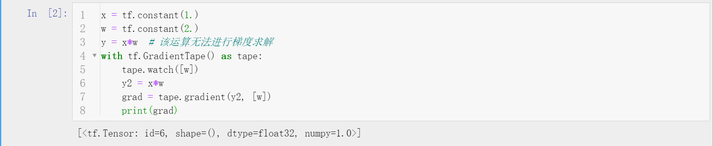
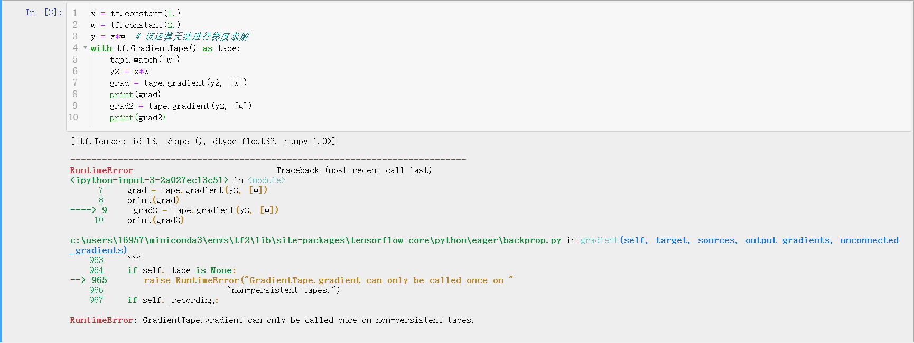
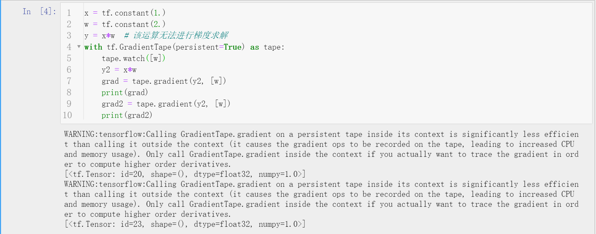
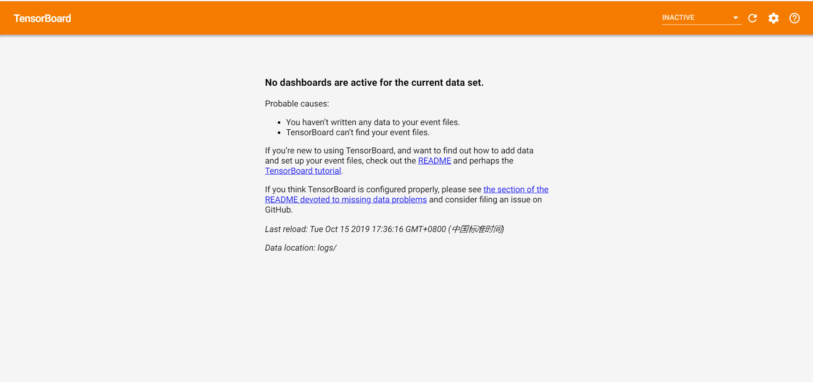
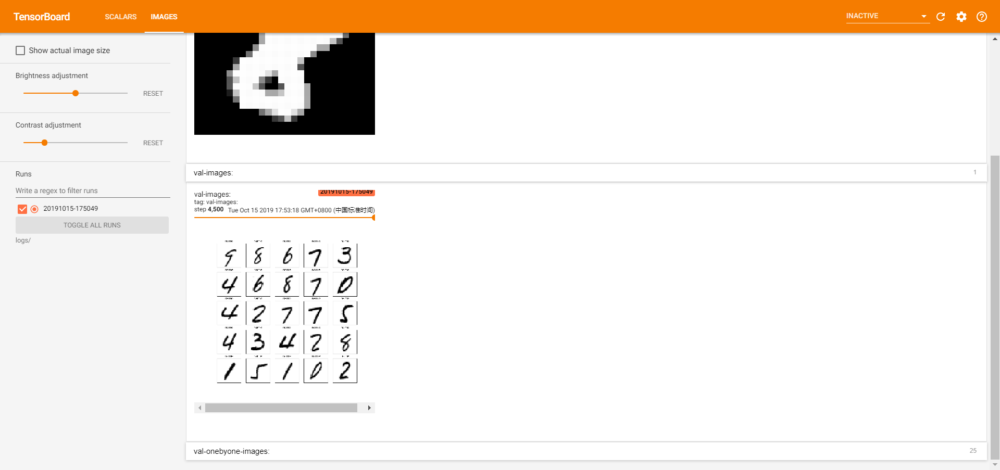

# TensorFlow2神经网络训练


## 梯度下降
- 梯度$\nabla f=\left(\frac{\partial f}{\partial x_{1}} ; \frac{\partial f}{\partial x_{2}} ; \ldots ; \frac{\partial f}{\partial x_{n}}\right)$指函数关于变量x的导数，梯度的方向表示函数值增大的方向，梯度的模表示函数值增大的速率。那么只要不断将参数的值向着梯度的反方向更新一定大小，就能得到函数的最小值（全局最小值或者局部最小值）。
$$\theta_{t+1}=\theta_{t}-\alpha_{t} \nabla f\left(\theta_{t}\right)$$  
- 上述参数更新的过程就叫做梯度下降法，但是一般利用梯度更新参数时会将梯度乘以一个小于1的学习速率（learning rate），这是因为往往梯度的模还是比较大的，直接用其更新参数会使得函数值不断波动，很难收敛到一个平衡点（这也是学习率不宜过大的原因）。
- 但是对于不同的函数，GD（梯度下降法）未必都能找到最优解，很多时候它只能收敛到一个局部最优解就不再变动了（尽管这个局部最优解已经很接近全局最优解了），这是函数性质决定的，实验证明，梯度下降法对于凸函数有着较好的表现。
- TensorFlow和PyTorch这类深度学习框架是支持自动梯度求解的，在TensorFlow2中只要将需要**进行梯度求解的代码段**包裹在GradientTape中，TensorFlow就会自动求解相关运算的梯度。但是通过`tape.gradient(loss, [w1, w2, ...])`只能调用一次，梯度作为占用显存较大的资源在被获取一次后就会被释放掉，要想多次调用需要设置`tf.GradientTape(persistent=True)`（此时注意及时释放资源）。TensorFlow2也支持多阶求导，只要将求导进行多层包裹即可。示例如下。


## 反向传播
- 反向传播算法（BP）是训练深度神经网络的核心算法，它的实现是基于链式法则的。将输出层的loss通过权值反向传播(前向传播的逆运算)回第i层（这是个反复迭代返回的过程），计算i层的梯度更新参数。具体原理见之前的[BP神经网络博客](https://blog.csdn.net/zhouchen1998/article/details/88619847)。
- 在TensorFlow2中，对于经典的BP神经网络层进行了封装，称为全连接层，自动完成BP神经网络隐层的操作。下面为使用Dense层构建BP神经网络训练Fashion_MNIST数据集进行识别的代码。
    ```python
    """
    Author: Zhou Chen
    Date: 2019/10/15
    Desc: About
    """
    import tensorflow as tf
    from tensorflow import keras
    from tensorflow.keras import datasets, layers, optimizers, Sequential, metrics

    (x, y), (x_test, y_test) = datasets.fashion_mnist.load_data()
    print(x.shape, y.shape)


    def preprocess(x, y):
        x = tf.cast(x, dtype=tf.float32) / 255.
        y = tf.cast(y, dtype=tf.int32)
        return x, y


    batch_size = 64
    db = tf.data.Dataset.from_tensor_slices((x, y))
    db = db.map(preprocess).shuffle(10000).batch(batch_size)
    db_test = tf.data.Dataset.from_tensor_slices((x_test, y_test))
    db_test = db_test.map(preprocess).shuffle(10000).batch(batch_size)

    model = Sequential([
        layers.Dense(256, activation=tf.nn.relu),  # [b, 784] => [b, 256]
        layers.Dense(128, activation=tf.nn.relu),  # [b, 256] => [b, 128]
        layers.Dense(64, activation=tf.nn.relu),  # [b, 128] => [b, 64]
        layers.Dense(32, activation=tf.nn.relu),  # [b, 64] => [b, 32]
        layers.Dense(10),  # [b, 32] => [b, 10]
    ])
    model.build(input_shape=([None, 28*28]))
    optimizer = optimizers.Adam(lr=1e-3)


    def main():
        # forward
        for epoch in range(30):
            for step, (x, y) in enumerate(db):
                x = tf.reshape(x, [-1, 28*28])
                with tf.GradientTape() as tape:
                    logits = model(x)
                    y_onthot = tf.one_hot(y, depth=10)

                    loss_mse = tf.reduce_mean(tf.losses.MSE(y_onthot, logits))
                    loss_ce = tf.reduce_mean(tf.losses.categorical_crossentropy(y_onthot, logits, from_logits=True))
                grads = tape.gradient(loss_ce, model.trainable_variables)
                # backward
                optimizer.apply_gradients(zip(grads, model.trainable_variables))

                if step % 100 == 0:
                    print(epoch, step, "loss:", float(loss_mse), float(loss_ce))
            # test
            total_correct, total_num = 0, 0
            for x, y in db_test:
                x = tf.reshape(x, [-1, 28*28])
                logits = model(x)
                prob = tf.nn.softmax(logits, axis=1)
                pred = tf.cast(tf.argmax(prob, axis=1), dtype=tf.int32)
                correct = tf.reduce_sum(tf.cast(tf.equal(pred, y), dtype=tf.int32))
                total_correct += int(correct)
                total_num += int(x.shape[0])
            acc = total_correct / total_num
            print("acc", acc)


    if __name__ == '__main__':
        main()
    ```


## 训练可视化
- TensorFlow有一套伴生的可视化工具包TensorBoard（使用pip安装， 最新版本的TensorFlow会自动安装TensorBoard），它是基于Web端的方便监控训练过程和训练数据的工具，监控数据来源于本地磁盘指定的一个目录。一般使用TensorBoard需要三步，创建log目录，创建summary实例，指定数据给summary实例。
- `tensorboard --logdir logs`监听设定的log目录，此时由于并没有写入文件，所以显示如下。
- 后面两步一般在训练过程中嵌入，示例如下。（注意，TensorBoard并没有设计组合多个sample图片而是一个个显示，组合需要自己写接口，下面的代码就写了这个接口。）
    ```python
    """
    Author: Zhou Chen
    Date: 2019/10/15
    Desc: About
    """
    import tensorflow as tf
    from tensorflow.keras import datasets, layers, optimizers, Sequential, metrics
    import datetime
    from matplotlib import pyplot as plt
    import io


    def preprocess(x, y):
        x = tf.cast(x, dtype=tf.float32) / 255.
        y = tf.cast(y, dtype=tf.int32)

        return x, y


    def plot_to_image(figure):
        # Save the plot to a PNG in memory.
        buf = io.BytesIO()
        plt.savefig(buf, format='png')
        # Closing the figure prevents it from being displayed directly inside the notebook.
        plt.close(figure)
        buf.seek(0)
        # Convert PNG buffer to TF image
        image = tf.image.decode_png(buf.getvalue(), channels=4)
        # Add the batch dimension
        image = tf.expand_dims(image, 0)
        return image


    def image_grid(images):
        """
        Return a 5x5 grid of the MNIST images as a matplotlib figure.
        """
        # Create a figure to contain the plot.
        figure = plt.figure(figsize=(10, 10))
        for i in range(25):
            # Start next subplot.
            plt.subplot(5, 5, i + 1, title='name')
            plt.xticks([])
            plt.yticks([])
            plt.grid(False)
            plt.imshow(images[i], cmap=plt.cm.binary)

        return figure


    batchsz = 128
    (x, y), (x_val, y_val) = datasets.mnist.load_data()
    print('datasets:', x.shape, y.shape, x.min(), x.max())

    db = tf.data.Dataset.from_tensor_slices((x, y))
    db = db.map(preprocess).shuffle(60000).batch(batchsz).repeat(10)

    ds_val = tf.data.Dataset.from_tensor_slices((x_val, y_val))
    ds_val = ds_val.map(preprocess).batch(batchsz, drop_remainder=True)

    network = Sequential([layers.Dense(256, activation='relu'),
                        layers.Dense(128, activation='relu'),
                        layers.Dense(64, activation='relu'),
                        layers.Dense(32, activation='relu'),
                        layers.Dense(10)])
    network.build(input_shape=(None, 28 * 28))
    network.summary()

    optimizer = optimizers.Adam(lr=0.01)

    current_time = datetime.datetime.now().strftime("%Y%m%d-%H%M%S")
    log_dir = 'logs/' + current_time
    summary_writer = tf.summary.create_file_writer(log_dir)

    # get x from (x,y)
    sample_img = next(iter(db))[0]
    # get first image instance
    sample_img = sample_img[0]
    sample_img = tf.reshape(sample_img, [1, 28, 28, 1])
    with summary_writer.as_default():
        tf.summary.image("Training sample:", sample_img, step=0)

    for step, (x, y) in enumerate(db):

        with tf.GradientTape() as tape:
            # [b, 28, 28] => [b, 784]
            x = tf.reshape(x, (-1, 28 * 28))
            # [b, 784] => [b, 10]
            out = network(x)
            # [b] => [b, 10]
            y_onehot = tf.one_hot(y, depth=10)
            # [b]
            loss = tf.reduce_mean(tf.losses.categorical_crossentropy(y_onehot, out, from_logits=True))

        grads = tape.gradient(loss, network.trainable_variables)
        optimizer.apply_gradients(zip(grads, network.trainable_variables))

        if step % 100 == 0:
            print(step, 'loss:', float(loss))
            with summary_writer.as_default():
                tf.summary.scalar('train-loss', float(loss), step=step)

                # evaluate
        if step % 500 == 0:
            total, total_correct = 0., 0

            for _, (x, y) in enumerate(ds_val):
                # [b, 28, 28] => [b, 784]
                x = tf.reshape(x, (-1, 28 * 28))
                # [b, 784] => [b, 10]
                out = network(x)
                # [b, 10] => [b]
                pred = tf.argmax(out, axis=1)
                pred = tf.cast(pred, dtype=tf.int32)
                # bool type
                correct = tf.equal(pred, y)
                # bool tensor => int tensor => numpy
                total_correct += tf.reduce_sum(tf.cast(correct, dtype=tf.int32)).numpy()
                total += x.shape[0]

            print(step, 'Evaluate Acc:', total_correct / total)

            # print(x.shape)
            val_images = x[:25]
            val_images = tf.reshape(val_images, [-1, 28, 28, 1])
            with summary_writer.as_default():
                tf.summary.scalar('test-acc', float(total_correct / total), step=step)
                tf.summary.image("val-onebyone-images:", val_images, max_outputs=25, step=step)

                val_images = tf.reshape(val_images, [-1, 28, 28])
                figure = image_grid(val_images)
                tf.summary.image('val-images:', plot_to_image(figure), step=step)
    ```
- TensorBoard的反馈效果如下。


## 补充说明
- 本文主要针对TensorFlow2中layers中Dense层以及反向传播和训练可视化进行了简略说明。
- 博客同步至我的[个人博客网站](https://luanshiyinyang.github.io/tensorflow2/2019/10/15/GradientDescent/)，欢迎浏览其他文章。
- 如有错误，欢迎指正。