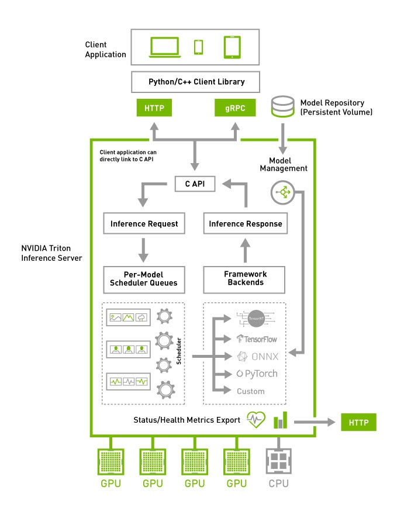
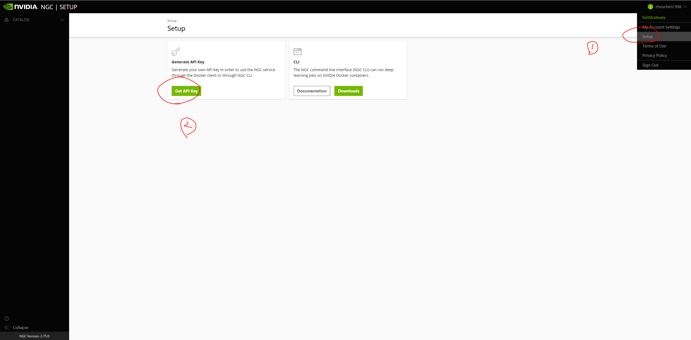
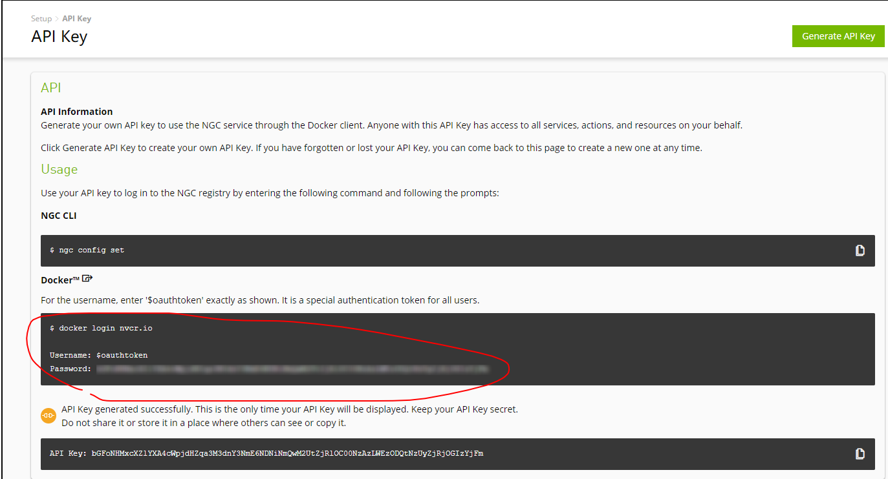
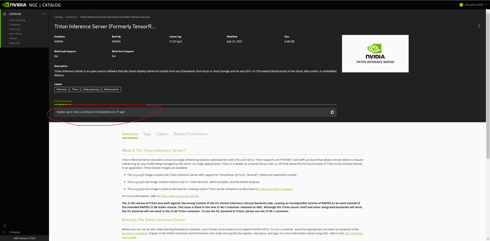

# TIS教程-安装

## 简介

TIS（Triton Inference Server）是NVIDIA推出的AI模型部署框架，前身为ensorRT Inference Server，它支持多种深度学习框架作为backend（如TensorFlow、PyTorch、TensorRT、ONNX等）甚至可以集成多个backend，如下图所示，通过TIS部署的服务可以通过HTTP或者gRPC的方式请求。目前，PyTorch的模型部署其实还不是很完善，主流的部署框架其实就是TorchServe和Triton，相较于前者使用Java，我这边还是比较喜欢Triton一些，所以这个系列的核心就是利用Triton部署PyTorch模型。



## 安装

安装Triton之前必须确保显卡驱动正确安装，且已经成功安装docker和nvidia-docker，具体可以参考[我之前的教程](https://zhouchen.blog.csdn.net/article/details/110679750)，因为后续的安装都需要基于docker来进行（也推荐采用这种方式）。

接下来，需要登录[NVIDIA NGC](https://ngc.nvidia.com/)以便于获取镜像的地址，不过这时并不能成功获取镜像，需要先获得API Key才能获取镜像，注册流程见下图。



注册后，使用下面的框中命令登录docker，登录成功后（会有Login Succeeded
提示）。



接着，再访问[TIS镜像地址](https://ngc.nvidia.com/catalog/containers/nvidia:tritonserver)获取镜像地址，并使用下图框中的命令拉取最新的镜像。当然，这个版本很新，对显卡驱动要求较高，我所用的机器的显卡驱动也才455版本，因此我这里使用旧版本，命令如下。



```shell
docker pull nvcr.io/nvidia/tritonserver:20.10-py3
```

此时也可以通过将镜像保存到本地以便使用，这是因为其实从nvidia官方下载这个镜像其实挺慢的。相关的命令如下。

```shell
# 保存镜像
docker save -o tritonserver-20.10-py3.tar nvcr.io/nvidia/tritonserver:20.10-py3

# 加载镜像
sudo docker load < tritonserver-21.07-py3.tar
```

## 运行

在运行镜像之前，我们按照官方的推荐建立一个模型仓库，该仓库中按照模型名存放着tensorrt engine文件，该文件夹有如下格式，具体如何设置配置文件后面的文章会提到（主要是模型配置文件和各个版本的模型文件，参考[官方示例](https://github.com/triton-inference-server/server/tree/r21.07/docs/examples)，这里的1指的就是版本1）。

```
model_repository/
└── inception_graphdef
    ├── 1
    │   └── model.graphdef
    ├── config.pbtxt
    └── inception_labels.txt
```

然后，我们运行可使用GPU的镜像并将模型仓库映射到容器中的根目录下的`models`文件夹中，命令如下，其中的命令均为docker常用命令（设置是使用本机第3号GPU卡），这里不多做赘述，可以查看我的Docker教程。

```shell
docker run --gpus '"device=3"' --rm -p8000:8000 -p8001:8001 -p8002:8002 -v/home/zhouchen/model_repository:/models nvcr.io/nvidia/tritonserver:20.10-py3 tritonserver --model-repository=/models
```

此时出现下图所示的状态，没有报ERROR代表服务开启成功。


由于这时候后端还没有写具体的接口，这里调用默认接口测试一下，使用命令`curl -v localhost:8000/v2/health/ready`，有如下的反馈代表后端部署成功，可以正常访问。

```
*   Trying 127.0.0.1...
* TCP_NODELAY set
* Connected to localhost (127.0.0.1) port 8000 (#0)
> GET /v2/health/ready HTTP/1.1
> Host: localhost:8000
> User-Agent: curl/7.58.0
> Accept: */*
>
< HTTP/1.1 200 OK
< Content-Length: 0
< Content-Type: text/plain
<
* Connection #0 to host localhost left intact
```

至此，初步TIS的部署就初步完成了。

## 总结

本文主要介绍了Triton Inference Server的安装教程，具体可以查看[官方文档](https://docs.nvidia.com/deeplearning/triton-inference-server/user-guide/index.html)。


