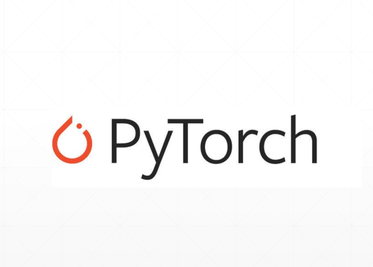
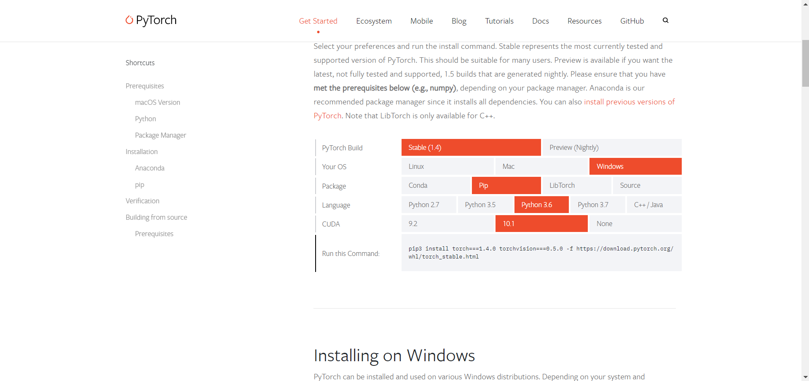

# PyTorch简介

## 简介
PyTorch是一个很著名的支持GPU加速和自动求导的深度学习框架，在最近几年收到学术界的热捧，主要是因为其动态图机制符合思维逻辑，方便调试，适合于需要将想法迅速实现的研究者。

## 发展历程
PyTorch的前身是Torch这个机器学习框架（支持GPU加速运算），它使用Lua语言作为开发语言，该框架的小众性正是因为其使用这个冷门的编程语言。

- 2016年，Facebook在Torch7的基础上重新开发了一个深度学习框架，这就是2016年10月发布的PyTorch 0.1，它使用THNN作为后端。

- 2018年12月，发布PyTorch 1.0正式版，它使用CAFFE2作为后端，以弥补PyTorch在工业部署上的不足。

- 2019年5月，发布PyTorch1.1，这是目前使用较为主流的PyTorch版本。

目前，主要的深度学习框架如下图，主要分为Google、Facebook、微软及亚马孙三大阵营。尽管有着如此多的深度学习框架，但是到目前这个阶段来看，主流的深度学习框架就只有两个TensorFlow和PyTorch。在TensorFlow2发布之前，**TensorFlow和PyTorch的主要区别是使用动态图还是静态图进行运算**。简单理解，静态图的运行是一个不可分割的整体，很不适合研究者的调试，而动态图则是类似Python语言的运行机制，可以方便的暂停调试。

## 框架优势
- 运行速度
  - 一般而言，动态图对使用者的友好是以效率的牺牲作为代价的，所以PyTorch的运行速度无法和TensorFlow相比，但是测试发现，其实两者在GPU上的运行速度相差不多。
- 生态
  - 相比较于比较年轻的PyTorch，TensorFlow由于发布较早，用户基数大，社区庞大，其生态相当完整，从底层张量运算到云端模型部署，TensorFlow都可以做到。
- 适用人群
  - 工业界需要部署效率，所以倾向于TensorFlow；学术界需要模型迭代，所以倾向于PyTorch。
- 使用难度
  - PyTorch的编码要求与Python一致，可以像写Python代码一样设计深度学习模型；而TensorFlow1要求契合自己的API，所以不亚于需要学习一套新的编程理念。

总的来说，TensorFlow和PyTorch的发展前景都很友好，PyTorch在学术界非常受欢迎且Caffe的基础使得其工业部署并不困难，作为深度学习研究者，掌握PyTorch是必要的。

## PyTorch生态
对于计算机视觉，PyTorch有TorchVision这样应用广泛的库；对于自然语言处理，PyTorch有PyTorch NLP，AllenNLP这样的库；对于图卷积这类新型图网络，有PyTorch Geometric这样的库；对于上层API，基于PyTorch的Fastai框架相当简洁；对于工业部署，ONN协议保证模型的部署。

## 安装
在自行安装Cuda和Cudnn的基础上，具体的安装方式依据操作系统和安装工具有所不同，具体访问[官网](https://pytorch.org/)得知，一般而言会返回具体虚拟环境下的命令，示例如下。

## 补充说明
本文并没有提及PyTorch的更多编码使用上的细节（这些后面逐一提到），因为在使用之前至少应该先了解使用的框架有什么优势和劣势。博客已经同步至我的[个人博客网站](https://zhouchen1998.cn)，欢迎访问查看最新文章。如有错误或者疏漏之处，欢迎指正。