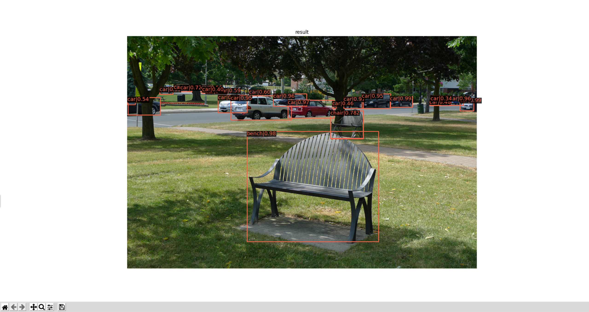
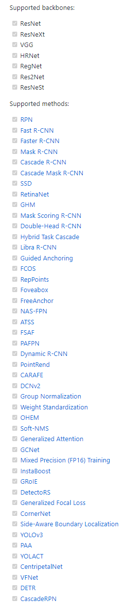

## MMDetection-简介


## 简介

MMDetection是由open-mmlab开发的基于PyTorch的目标检测工具库，和Detectron2一样是目标检测领域非常著名的工具箱，open-mmlab是香港中文大学、商汤等机构联合成立的实验室，主要都是国内的开发者和研究者。MMDetection中目前包含数十种模型和方法，且为开发者提供了非常合适的高层接口以便开发者以MMDetection为基础进行项目的二次开发，这几年也有不少检测领域的论文采用MMDetection实现。

## 安装

MMDetection的版本已经更新到2.8.0了，因此本系列所有的教程文章均以该版本为例，且操作系统为Ubuntu18.04，显卡环境为2080Ti。

> 这里不建议在Windows系统下安装配置MMDetection，一方面官方的支持并不好，另一方面，现在网上很多教程在Windows上安装成功也是比较旧的版本了。

首先，克隆官方仓库源码到本地并切换到源码目录下，使用的命令如下。
```shell
git clone https://github.com/open-mmlab/mmdetection.git
cd mmdetection
```

接着，在该目录下逐行执行下面的命令，这里最好安装并配置了conda国内源之后执行（课参考[conda标准库国内源教程](https://zhouchen.blog.csdn.net/article/details/86086919)和[PyTorch国内源教程](https://zhouchen.blog.csdn.net/article/details/104070680)），并且，由于目前MMDetection支持PyTorch1.3以上的版本，我这里推荐选用比较稳定的PyTorch1.6。（**具体安装时由于每个人的操作系统版本和硬件环境不同可能会出现各种问题，遇到问题可以在本文下面留言或者参考[官方文档关于安装的部分](https://mmdetection.readthedocs.io/en/latest/get_started.html#installation)**。）

```shell
conda create -n mmdet python=3.7 -y
conda activate mmdet
conda install pytorch=1.6 torchvision cudatoolkit=10.2 -y
pip install mmcv-full -f https://download.openmmlab.com/mmcv/dist/cu102/torch1.6.0/index.html
pip install -r requirements/build.txt
pip install -v -e .
```

最后，如果安装过程是正常的，上述任何步骤不会有任何的报错，然后通过运行下面的Python脚本（在项目根目录看下新建输入如下内容并允许即可）来测试mmdetection的安装是否正确，在运行之前首先需要运行下面的命令下载预训练模型。

```shell
mkdir checkpoints
cd checkpoints/
wget http://download.openmmlab.com/mmdetection/v2.0/faster_rcnn/faster_rcnn_r50_fpn_1x_coco/faster_rcnn_r50_fpn_1x_coco_20200130-047c8118.pth
cd -
```

```python
from mmdet.apis import init_detector, inference_detector, show_result_pyplot

config_file = 'configs/faster_rcnn/faster_rcnn_r50_fpn_1x_coco.py'
checkpoint_file = 'checkpoints/faster_rcnn_r50_fpn_1x_coco_20200130-047c8118.pth'
device = 'cuda:0'
# init a detector
model = init_detector(config_file, checkpoint_file, device=device)
# inference the demo image
rst = inference_detector(model, 'demo/demo.jpg')
show_result_pyplot(model, 'demo/demo.jpg', rst)
```
上面的Python脚本执行可能会出现一些警告，主要是新版本API的调整，不影响最后程序通过Matplotlib可视化如下的Demo图像检测结果，如果输出的确实是类似这样的检测结果图片，那代表至此的安装没什么大问题，基本成功了。



## 设计架构

MMDetection将检测分割等任务的Pipeline抽象成了三个大部件，分别是**数据集（包括Dataset和Pipeline）、模型（包括Model）和运行时（包括Schedule和Runtime）**，后文会一一展开这些部件的详细内容，这里只是大体说明一下。其中数据集部分对应了标注和图像的数据处理，模型则通过堆叠backbone、neck、head等决定数据的流动和运算，运行时则控制训练和推理过程中的操作并制定整体的训练流程。

那么，在MMDetection中是什么控制整个Pipeline的设计呢？其实就是整个open-mmlab设计的框架都存在的配置文件，它们一般在根目录的configs目录中，已经包含了一些MMDetection官方复现的检测方法的配置文件，如Faster R-CNN。**正是配置文件负责全局控制，因此官方文档教程上第一个步骤就是介绍配置文件相关内容，本系列也将按照这个思路展开。**

其实仔细观察最基本的Faster R-CNN模型的配置文件，内容是如下的，这是因为MMDetection的配置文件有一个**继承机制**，该检测器的模型配置（ResNet50+FPN）、数据集配置（COCO检测数据集）、运行时配置（单倍计划和默认运行时）均继承自_base_中的内容，该文件夹是MMDetection中最基础的配置。

```python
_base_ = [
    '../_base_/models/faster_rcnn_r50_fpn.py',
    '../_base_/datasets/coco_detection.py',
    '../_base_/schedules/schedule_1x.py', '../_base_/default_runtime.py'
]
```

配置文件的具体讲解我会在本专栏的第二篇文章详细讲解，包括命名原则、继承机制、书写规则等，这里只是简单介绍一下。

## Benchmark

目前MMDetection官方实现的backbone和detector如下图，官方复现基本上能达到论文精度，并且推理速度和Detectron2相比也不遑多让。



## 总结

MMDetection由于其高度封装的机制，非常适合于科研、工程项目和竞赛，是目标检测领域最受欢迎的工具箱之一，因此学习该框架是研究目标检测相当不错的选择，该框架[官方教程](https://mmdetection.readthedocs.io/en/latest/index.html)也是很详尽的。最后，如果我的文章对你有所帮助，欢迎点赞收藏评论一键三连，你的支持是我不懈创作的动力。


