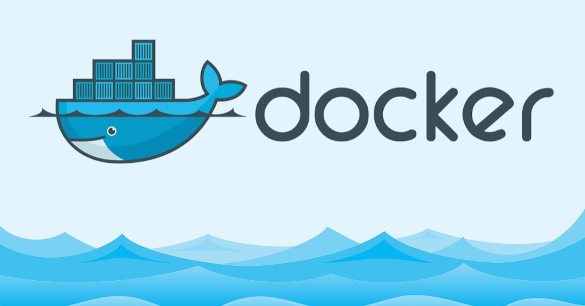

# Docker简介
>最近工作中需要频繁使用到docker，趁着最近比较闲，就初步学习一下，并将学习内容记录为博客，由于这部分知识对我来说也比较陌生，文中若有疏漏，欢迎评论指正。 

## 简介
本文主要包括Docker的介绍、应用场景、优势以及基础架构。Docker其实就是一个虚拟化技术，将应用程序和应用程序需要的依赖环境一起打包，让部署无需担心环境问题。

## 介绍
Docker是一个开源的应用容器引擎，基于Go语言并使用Apache2.0协议开源。它可以让开发者打包他们的应用以及依赖包到一个轻量级、可移植的容器中，然后发布到任何流行的Linux机器上，也可以实现虚拟化。容器是完全使用沙箱机制，相互之间不会有任何接口，且容器性能开销极低。Docker自从17.03版本之后分为社区版（CE）和企业版（EE），对于个人使用社区版足够了。

## 应用场景
- Web应用的自动化打包和发布。
- 自动化测试和持续集成和发布。
- 其他容器技术场景。

## 优势
Docker是一个用于开发、交付和运行应用程序的开放平台。Docker允许用户将应用程序与基础架构分开，从而可以快速交付软件产品。借助Docker这一工具，用户使用与管理应用程序相同的方式来管理基础架构。通过利用Docker的方法来实现快速交付、测试和部署项目代码，从而大大减少编码和生产环境中运行代码之间的延迟。

1. 快速交付
Docker允许开发人员使用提供的应用程序或服务的本地容器在标准化环境中工作，从而缩短开发周期。它非常适合持续集成和持续交付的工作流程，主要有如下的示例场景。
    - 开发者本地编码，使用容器与右工作关系的开发者共享工作结果。
    - 开发者使用Docker将应用程序推送到测试环境中，执行相关的测试工作。若有错误，可以在开发环境中进行修复，然后重新推送到测试环境。
    - 开发者测试完成，将修补程序推送给生产环境，类似推送更新的镜像一样，非常方便。

2. 响应式部署和扩展
Docker是基于容器的平台，允许高度可移植的工作负载。Docker容器可以在开发中机器上、生产环境机器上、云主机上，只要有Linux环境，都可以部署运行。它的可移植和轻量的特点，允许开发者轻松完成动态管理的工作负担，并根据需求，实时扩展或削减应用程序和服务。

3. 同硬件多负载
Docker是轻量且高效的，它为基于虚拟机管理的方案提供了一种可行的、经济的、高效的替代，可以充分利用计算资源。它适合于高密度的中小型部署，不太适合大型部署。

## 架构
Docker包括三个基本概念：
- **镜像（Image）**，包含一整套完整的文件系统，如官方镜像ubuntu:16.04就包含完整的Ubuntu16.04最小的root文件系统。
- **容器（Container）**，它与镜像的关系类似面向对象中的对象和类，镜像是静态的一套定义，容器则是它运行时的实例，容器可以被创建、启动、停止、删除和暂停等等操作。
- **仓库（Repository）**，它是一个代码中心，存放镜像。

Docker使用客户端-服务器架构模式（即CS架构），使用远程API来管理和创建Docker容器。示意图如下，图片来自网络。

Docker客户端（Client）通过命令行等工具与Docker主机（Host）中的Docker守护进程通信，Docker主机是一个执行Docker守护进程和容器的物理或者虚拟的机器。而Docker仓库用来保存镜像，Docker Hub提供庞大的镜像集合供使用，通常，一个Docker仓库包含多个仓库，每个仓库包含多个标签，每个标签对于一个具体的镜像。一个仓库会包含一个软件不同版本的镜像，标签用于区分不同的版本，可以通过`仓库名:标签名`的方式制定镜像，不指定则默认最新版本。

## 补充说明
本文主要介绍了Docker的一些基本知识和比较简单的架构，具体Docker的安装和使用会在下一篇博客中提到。