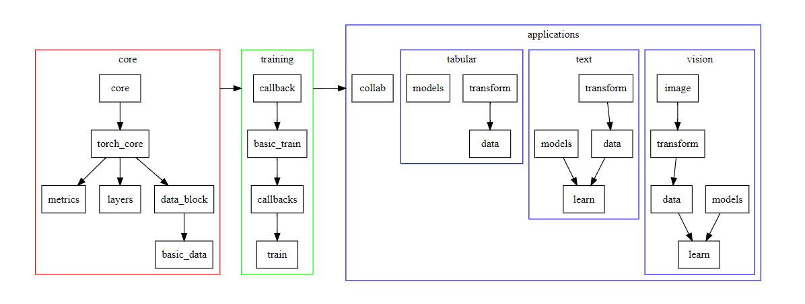

# Fastai简介


## 简介
Fastai是一个课程平台，一个讨论社区，同样也是一个基于PyTorc的顶层框架。Fastai的理念就是让神经网络没那么望而生畏，其课程也是采用项目驱动的方式教学。（不同于很多深度学习课程先教授大量的数学基础，各有利弊。）

目前fastai只在Linux下稳定，mac和windows下不保证稳定性。Fastai类似Keras，封装顶层框架，对新手比较友好。Keras的后端框架为TensorFlow和Theano等，而Fastai的后端为PyTorch。**而且，类似Keras，Fastai不只是将PyTorch功能封装了比较“亲切”的API，而是让PyTorch的强大之处易用了**。

在Kaggle等深度学习竞赛平台上，Fastai逐渐崭露头角。这主要归功于Fastai设计之初就是一个交互式环境支持友好的框架，例如对Jupyter的支持。


## 安装
`conda/pip install fastai`

注意：**目前最新版均为1.x稳定版，均依赖pytorch1.0及以上，安装使用`conda/pip install torch`**。


## 模块
下图是官方给出的核心模块的依赖关系。暂时不理解没关系，用了几次就明白了，和Keras还是很类似的。**不同于其他的顶层深度学习框架，Fastai的模块是安装任务类型划分的，例如`fastai.vison`模块下就包含了视觉方面包括数据准备、模型构建、训练等API。**



在Fastai的设计中，主要有四大应用领域，对应的四个模块名为`collab`（协同过滤问题）、`tabular`（表格或者结构化数据问题）、`text`（自然语言处理问题）以及`vision`（计算机视觉问题）。**本系列所有文章围绕都是图像数据进行处理，也就是说主要使用`vision`模块。****本系列所有文章围绕都是图像数据进行处理，也就是说主要使用`vision`模块。**


## 快速开始
下面给出官方的快速入门代码
```python
from fastai.vision import models, URLs, ImageDataBunch, cnn_learner, untar_data, accuracy

path = untar_data(URLs.MNIST_SAMPLE)  # 下载数据集，这里只是MNIST的子集，只包含3和7的图像,会下载并解压（untar的命名原因）到/root/.fastai/data/mnist_sample（如果你是root用户）下，包含训练数据，测试数据，包含label的csv文件
data = ImageDataBunch.from_folder(path)  # 利用ImageDataBunch读取文件夹，返回一个ImageDataBunch对象
learn = cnn_learner(data, models.resnet18, metrics=accuracy)  # 构建cnn模型，使用resnet18预训练模型
learn.fit(1)  # 训练一轮
```

上面的代码我已经详细备注。

可以看到，使用了ResNet18训练一轮后达到较低的损失较高的准确率（训练集上），由于没有使用GPU，一轮使用了1分30秒,使用GPU只花了7秒。

## 关键步骤
在实际使用时，深度学习项目（尤其比赛）一般关注三个过程。
- 数据集加载
- 模型（预训练模型）
- 训练过程（验证集。测试集评价）


Fastai最核心的数据集加载类为ImageDataBunch，它的几个方法都是去处理常见的数据集存储模式的（如csv+train+test）。底层类为DatasetBase继承自Pytorch的Dataset类，具体后面讲解。Fastai在数据预处理上也有了比较大的改进，如数据增强做了优化。

Fastai包含了PyTorch中torchvision的预训练模型，包括resnet、vgg、densenet等，也有一些Fastai提供的模型，如resnext、inception等，需要在[这个地址](http://files.fast.ai/models/)下载。

Fastai中的训练方法如fit一般有以下参数。
- 设定加载预训练模型，可以选择加载的层数以及是否冻结训练参数
- 设定训练batch_size和epochs
- 设定optimizer
- 设定callback函数实现训练过程回调（支持可视化，利用fastprogress）
- 设定fastai提供或者自己定义的验证指标(metrics)
- 设定训练tricks，例如lr_find和one cycle


## 补充说明
本文初步介绍Fastai框架，这是基于PyTorch的一个上层框架，是2019年以来一个流行的选择，[官方文档地址](https://docs.fast.ai/)给出，目前没有中文文档。具体代码见[我的Github](https://github.com/luanshiyinyang/Tutorial/tree/Fastai)，欢迎star或者fork。关于Fastai更多文章可以查看[我的专栏](https://blog.csdn.net/zhouchen1998/category_8916629.html)。
