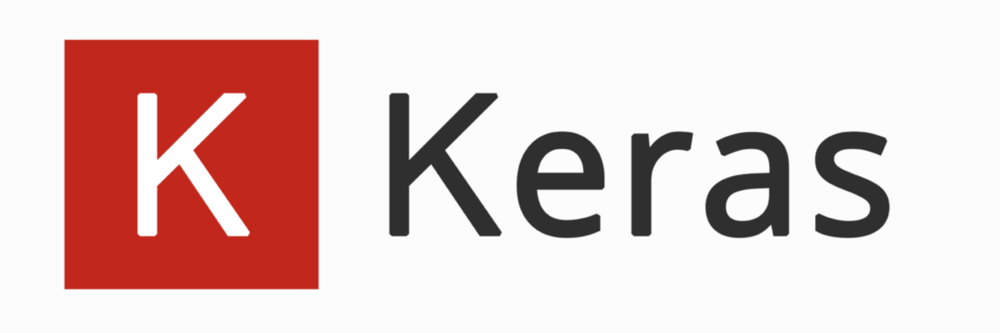
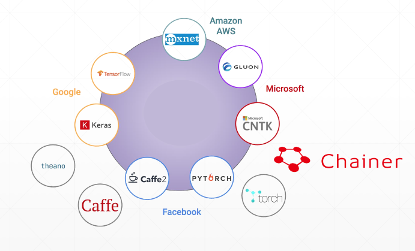

> 尽管 PyTorch 受到的关注越来越多，但是深度学习框架之争永远不会有真正的结果，各有所长罢了，这个系列我想谈一谈对新手极度友好的顶层深度神经网络构建框架---Keras。

# Keras 简介

## 简介

Keras 是一个相当简洁的上层深度学习框架，该框架没有任何底层的张量运算功能，其所有的底层预算操作借由第三方张量运算框架实现（如 TensorFlow）。在过去，Keras 是可以设置后端运算库的，主要支持 TensorFlow、Theano 和 Mxnet 这三个库，随着 Keras 被 Google 收购并入 TensorFlow 体系下，如今新版本已经不再支持其他的运算库了。

## 框架优势

**简单**是 Keras 最大的优势，作为一个被 Google 认可的顶层深度学习框架，Keras 对于快速深度网络的实现和训练都有非常友好的包装，很适合快速成型的项目。

不妨看下图的深度学习框架布局，可以看到，Keras 任然占据深度学习的一席之地，且有 TensorFlow 的鼎力支持，未来 Keras 会变得更好。

## 安装

使用 Keras 不建议直接安装 Keras 库，而是建议安装 TensorFlow 并使用其中的 keras 模块。安装 TensorFlow 推荐版本 2.0 以上，尽管这个版本的出现伴随着吹捧和吐槽，但这不影响 TensorFlow 的发展，如今正式版已经发行了 2.1 版本。

`pip install tensorflow-gpu==2.0`

该命令即可安装 TF2 环境，若没有合适的 Nvidia 显卡，将上述命令中的`gpu`改为`cpu`安装 CPU 版本即可。

## 补充说明

Keras 对于接触深度学习的新手是一个很流行的选择，但如果是定制程度很高的科研方向使用，还是建议 PyTorch，有兴趣可以查看[我的 PyTorch 专栏](https://blog.csdn.net/zhouchen1998/category_8742242.html)。本文只是 Keras 这整个系列的介绍，具体各大模块会在后面介绍，具体可以查看[我的 Keras 专栏](https://blog.csdn.net/zhouchen1998/category_8906034.html)。
