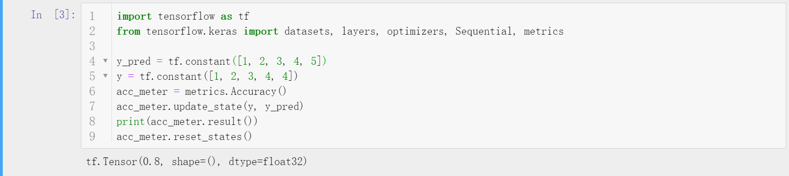
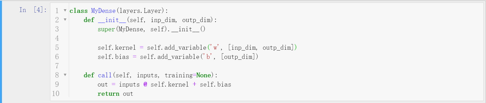
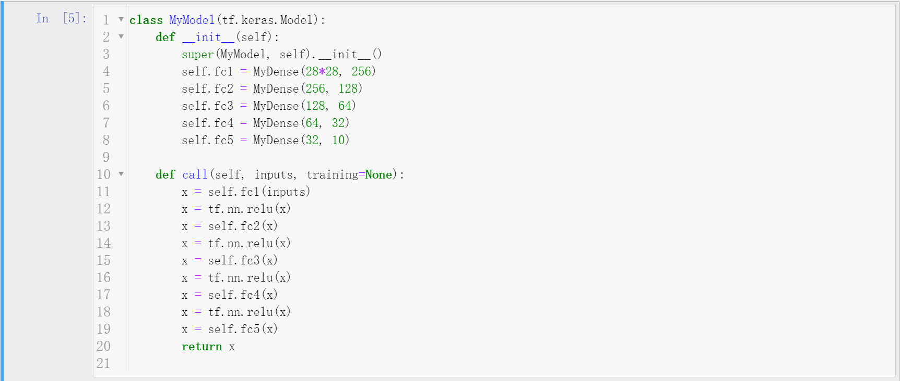
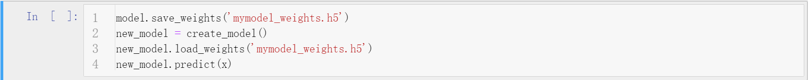
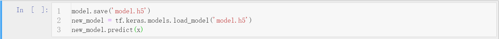
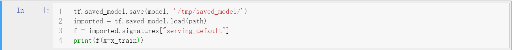

# TensorFlow2高层API接口Keras


## 简介
- Keras是方便神经网络构建的一个高层API库，其本身并没有实现任何的矩阵运算以及GPU加速运算的功能，它只是为深度学习框架提供一个更方便但也更加生硬的接口，底层的运算都是由深度学习框架完成的（支持TensorFlow、Theano、MXNet）。
- 由于Keras的实用性，Google随后收购了Keras并将其功能全部集成到了TensorFlow中，TensorFlow2同样支持这些Keras的内容，均在tf.keras模块下（**Keras是一个第三方库，使用pip安装，支持但不限于TensorFlow这类多种后端，而tf.keras是集成Keras功能的TensorFlow子模块，建议使用tf.keras而不是Keras这个第三方库**）。
- 使用keras模块主要使用其五个主要模块，为datasets、layers、losses、metrics以及optimizers。


## 五大模块
- datasets
  - 前文已经提到，封装了一些对常见的小型数据集的预处理（如MNIST），自动下载并处理数据为numpy矩阵。
- layers
  - 在Keras的神经网络模型概念中，网络是可以按照层进行区分的，一层完成一个或者几个张量运算，如卷积层、池化层等。Keras对这些层进行了封装，只要传入张量，则按照层的运算方式输出运算结果张量。
- losses
  - 损失函数及损失函数的优化是神经网络这类端到端模型关注的重点话题，对于不同的任务不同的损失函数会有不同的效果，一个合适的损失函数非常重要，一般的实际任务中需要设计一个很好的损失函数。Keras对于MSE、CE这类常见的损失函数进行了封装，实例化该损失函数则会自动计算loss值。
- metrics
  - 该模块下封装了很多评估类，用于对数值进行评估，如准确率（Accuracy）、均值（Mean）等。
  - 实例化一个指标对象；调用update_state方法传入数值数据；通过调用result方法得到计算到的指标值；调用reset_states方法清除缓存，重新传入数据。
- optimizers
  - 优化器的选择对于神经网络庞大的参数优化问题是非常重要的，在过去的一段时间内SGD（随机梯度下降）就是非常优秀的优化器了，但是SGD有着很多问题，这就有了依据梯度下降思想产生的动量SGD、Adam、RAdam等等后起之秀。当然，对于一个模型优化问题，往往没有最好的只有最合适的优化器，对于有的任务SGD就是最快最好的方法，而对于有的任务RAdam才是合适的选择。


## 快捷训练
- 纵观神经网络的训练流程，大致流程如下。
  1. 传入输入张量
  2. 进行矩阵运算得到输出张量
  3. 计算损失并将损失反向传播
  4. 根据反向传播的梯度值依据梯度更新算法更新参数
  5. 根据训练好的参数对验证集预测，验证模型预测能力
  6. 重复上面步骤多次，每次称为一个轮次（epoch）的训练。
- 显然，这整个过程可以理解为一个端到端的模型，输入张量，输出预测结果。至于中间的张量流动，是个可以进一步封装的整个模型，Keras实现了这个工作，在Keras中，处理这一切运算的模型是由Model类衍生的。
- 这个model实例主要实现四个方法，compile,fit, evaluate, predict，通过这四个封装的方法完成了很大代码量的神经网络构建和训练过程。
  - compile方法编译模型，要求至少传入优化器（optimizer）、损失函数（loss function）和评估指标（metrics）。
  - fit方法训练模型，要求至少传入训练的数据和轮次（epoch）。也可以传入验证数据validation_data和validation_freq，前者表示验证集数据，后者表示多少个epoch进行一次验证集测试。
  - evaluate方法要求输入验证数据集的x和y，然后按照模型编译指定的metrics给出预测的结果评估。
  - predict方法要求输入测试集的x，根据训练好的网络参数返回模型的预测结果。


## 自定义网络结构
- 深度学习的网络模型结构五花八门，大体上就有卷积神经网络（CNN）、循环神经网络(RNN)、图卷积神经网络（GCN）等等。要想利用Keras这样并不灵活的顶层API实现具体的网络模型，预定义的网络层注定是不够的，自定义网络层的API就显得非常重要了。
- 在Keras中，要想实现自定义网络模型，需要用到三个至关重要的类，keras.Sequential,keras.layers.Layer,keras.Model。其中，Sequential是一个容器，它支持以列表的形式传入多个继承自keras.layers.Layer的实例对象，张量会从输入刘晶列表中的每一个Layer运算，所以**本质上，Sequential表示的是张量的流动，Layer封装的是张量的运算过程**。
- 最终，张量数据的入口是Sequential实例（其实，这个实例就是keras.Model的子类）或者keras.Model的实例，具体的运算流程由keras.layers.Layer完成，keras.Model封装了compile、fit等方法。**所以，自定义的层级运算继承自keras.layers.Layer，自定义的模型继承自keras.Model。**下面演示自定义Layer和Model，注意无论哪种方法，直接使用对象实例处理张量（如`layer(x)`或者`model(x)`），相当于调用call方法，经过实例内部的所有张量运算。


## 模型的保存与加载
- 一方面，作为深度模型最终是需要落地的，因此保存训练好的参数或者干脆保存训练好的整个模型是非常重要的；另一方面，深度模型非常庞大，训练过程有时候很长（几周甚至几个月），很容易出现断电等情况，定时保存模型已经训练的参数是非常重要的。
- Keras实现了很方便的模型保存接口，一般有两种方法save/load weights和save/load entire model，前者表示只保存模型参数，占用内存少，需要重新构建保存参数时的Model对象；后者表示保存整个模型对象，占用内存大，不需要重新构建相同的Model对象，load得到的就是Model对象。Keras保存的本地文件使用HDF5文件实现的。
- 但是，在工业界部署时，一般不使用效率较低的Python环境而是使用C++环境，此时保存Python对象就显得没有意义，而要保存一种通用协议的文件，TensorFlow2也提供了这种借口（所以说TensorFlow在工业界的地位无可替代）。事实上，只需要给出保存目录即可，保存的是一系列相关文件。


## Keras API实现自定义网络分类CIFAR
- 通过对CIFAR10数据集图片进行训练并预测类别。
- 源码
    ```python
    """
    Author: Zhou Chen
    Date: 2019/10/17
    Desc: About
    """
    import tensorflow as tf
    from tensorflow.keras import datasets, layers, optimizers, Sequential, metrics
    from tensorflow import keras
    import os

    os.environ['TF_CPP_MIN_LOG_LEVEL'] = '2'


    def preprocess(x, y):
        # [0~255] => [-1~1]
        x = 2 * tf.cast(x, dtype=tf.float32) / 255. - 1.
        y = tf.cast(y, dtype=tf.int32)
        return x, y


    batch_size = 128
    # [50k, 32, 32, 3], [10k, 1]
    (x, y), (x_val, y_val) = datasets.cifar10.load_data()
    y = tf.squeeze(y)
    y_val = tf.squeeze(y_val)
    y = tf.one_hot(y, depth=10)  # [50k, 10]
    y_val = tf.one_hot(y_val, depth=10)  # [10k, 10]
    print('datasets:', x.shape, y.shape, x_val.shape, y_val.shape, x.min(), x.max())

    train_db = tf.data.Dataset.from_tensor_slices((x, y))
    train_db = train_db.map(preprocess).shuffle(10000).batch(batch_size)
    test_db = tf.data.Dataset.from_tensor_slices((x_val, y_val))
    test_db = test_db.map(preprocess).batch(batch_size)


    class MyDense(layers.Layer):
        def __init__(self, inp_dim, outp_dim):
            super(MyDense, self).__init__()
            self.kernel = self.add_variable('w', [inp_dim, outp_dim])

        def call(self, inputs, training=None):
            x = inputs @ self.kernel
            return x


    class MyNetwork(keras.Model):

        def __init__(self):
            super(MyNetwork, self).__init__()

            self.fc1 = MyDense(32 * 32 * 3, 256)
            self.fc2 = MyDense(256, 128)
            self.fc3 = MyDense(128, 64)
            self.fc4 = MyDense(64, 32)
            self.fc5 = MyDense(32, 10)

        def call(self, inputs, training=None):
            """
            :param inputs: [b, 32, 32, 3]
            :param training:
            :return:
            """
            x = tf.reshape(inputs, [-1, 32 * 32 * 3])
            # [b, 32*32*3] => [b, 256]
            x = self.fc1(x)
            x = tf.nn.relu(x)
            # [b, 256] => [b, 128]
            x = self.fc2(x)
            x = tf.nn.relu(x)
            # [b, 128] => [b, 64]
            x = self.fc3(x)
            x = tf.nn.relu(x)
            # [b, 64] => [b, 32]
            x = self.fc4(x)
            x = tf.nn.relu(x)
            # [b, 32] => [b, 10]
            x = self.fc5(x)

            return x


    network = MyNetwork()
    network.compile(optimizer=optimizers.Adam(lr=1e-3),
                    loss=tf.losses.CategoricalCrossentropy(from_logits=True),
                    metrics=['accuracy'])
    network.fit(train_db, epochs=15, validation_data=test_db, validation_freq=1)

    network.evaluate(test_db)
    network.save_weights('ckpt/weights.h5')
    del network
    print('saved to ckpt/weights.h5')

    network = MyNetwork()
    network.compile(optimizer=optimizers.Adam(lr=1e-3),
                    loss=tf.losses.CategoricalCrossentropy(from_logits=True),
                    metrics=['accuracy'])
    network.load_weights('ckpt/weights.h5')
    print('loaded weights from file')
    network.evaluate(test_db)

    ```


## 补充说明
- 本文主要针对TensorFlow2中Keras这个高层API进行了简单使用上的介绍。
- 博客同步至我的[个人博客网站](https://luanshiyinyang.github.io/tensorflow2/2019/10/17/KerasAPI/)，欢迎浏览其他文章。
- 如有错误，欢迎指正。