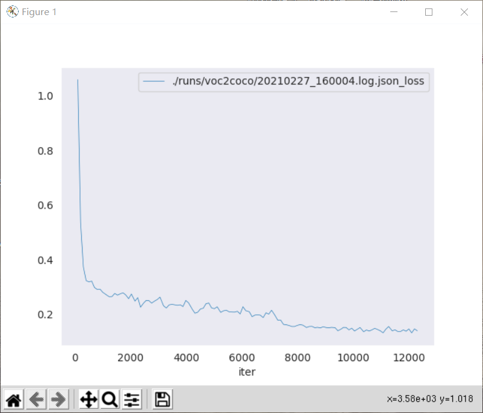

# MMDetection-模型

## 简介

在本专栏的上一篇文章中，介绍了数据集合数据管道的内容，数据是训练的基础，确保数据集加载正常是非常重要的。本篇文章将会介绍关于模型的内容，它在整个工作流中也是非常重要的组件。

## 模型

### 框架设计理念

在MMDetection中，Model（模型）被分为了如下5个组件类型。
1. **backbone**

    backbone是用于提取特征图的骨干网络，它是一个全卷积网络，例如ResNet、MobileNet等。
2. **neck**

    backbone和head之间的组件，通常为FPN等。
3. **head**

    具体的任务head，如边框预测或者掩码预测。
4. **roi extractor**

    从特征图中提取RoI特征的组件，如RoI Align。
5. **loss**

    head部分计算损失的组件，训练必不可少的部分，常见的有FocalLoss、L1Loss和GHMLoss等。

### 自定义模型

官方已经实现了不少模型，它们都在根目录下的`mmdet`目录下的`models`内，按照类型不同，分别在不同的子文件夹内，如backbone就在`backbones`文件夹内，有常见的ResNet、HRNet、ResNeSt等。当我们想要定义一个新模型的时候，也最好将其放在对应组件类型的文件夹内（这只是规范化的建议）。

在了解上面的五类组件的前提下，我们就可以构建自己的模型了，在MMDetection中自定义的模型都是PyTorch模型（也就是继承自torch.nn.Module）同时需要注册为对应的组件，例如我这里需要添加一个轻量级的MobileNet为新的backbone（以官网教程为例），那么就需要创建一个`mmdet/models/backbones/mobilenet.py`文件，并在其中构建模型如下。

```python
import torch.nn as nn

from ..builder import BACKBONES


@BACKBONES.register_module()
class MobileNet(nn.Module):

    def __init__(self, arg1, arg2):
        pass

    def forward(self, x):  # should return a tuple
        pass

    def init_weights(self, pretrained=None):
        pass
```

模型的细节这里都省略了，我们可以看到，它其实就是一个PyTorch的标准格式模型，只不过通过装饰器注册为了构建器（builder）中的BACKBONES了，这是必须的，否则在配置文件中的使用会不合法。然后，需要对该模型进行导入，操作为到`mmdet/models/backbones/__init__.py`文件中，添加如下一行的导入。

```python
from .mobilenet import MobileNet
```

至此，就可以在配置文件中使用该模型了，如下所示。

```python
model = dict(
    ...
    backbone=dict(
        type='MobileNet',
        arg1=xxx,
        arg2=xxx),
    ...
```

至于neck、head等结构的定义都是类似的，这里就不多赘述了，需要补充的是，对于head等结构需要实现的函数比较多且一般需要定义bbox head和roi head两个（它们是包含关系），所以为了方便可以继承自已经实现了部分功能的基本head类，如`StandardRoIHead`。

最后，来聊一聊损失，在任何深度学习训练中，损失函数的重要性不言而喻，它是指导模型训练的关键，它存放在`mmdet/models/losses`文件夹内，例如我们需要定义一个监督边框回归的新损失MyLoss，则需要创建`mmdet/models/losses/my_loss.py`文件，并在其中写入一个类MyLoss，其中的`my_loss`函数使用了一个装饰器`weighted_loss`，该装饰器保证这个损失的每个元素都是可以加权的。

```python
import torch
import torch.nn as nn

from ..builder import LOSSES
from .utils import weighted_loss

@weighted_loss
def my_loss(pred, target):
    assert pred.size() == target.size() and target.numel() > 0
    loss = torch.abs(pred - target)
    return loss

@LOSSES.register_module()
class MyLoss(nn.Module):

    def __init__(self, reduction='mean', loss_weight=1.0):
        super(MyLoss, self).__init__()
        self.reduction = reduction
        self.loss_weight = loss_weight

    def forward(self,
                pred,
                target,
                weight=None,
                avg_factor=None,
                reduction_override=None):
        assert reduction_override in (None, 'none', 'mean', 'sum')
        reduction = (
            reduction_override if reduction_override else self.reduction)
        loss_bbox = self.loss_weight * my_loss(
            pred, target, weight, reduction=reduction, avg_factor=avg_factor)
        return loss_bbox
```

同样的，它也是模型的一种，所以处理方式类似，在`mmdet/models/losses/__init__.py`文件中添加一行如下内容，然后就可以修改配置文件中对应的损失了，比如本例就需要修改model中roi_head字段bbox_head字段内的`loss_bbox`的参数内容。

``python
from .my_loss import MyLoss, my_loss
```

```python
loss_bbox=dict(type='MyLoss', loss_weight=1.0))
```

我这里只是一个非常简单的例子，其实自定义损失这边[官方教程](https://mmdetection.readthedocs.io/en/latest/tutorials/customize_losses.html)是写了不少内容的，包括配置文件的修改、超参数的修改、reduction方式的修改，损失加权等。

## 迁移学习

大多数情况，其实我们不会从头开始构建一个全新的模型，比如在竞赛中，我们一般是在已有的工作基础上进行修改增加trick等，所以我们常常需要使用已有的模型甚至是已有模型在大型数据集上训练得到的参数，这一节就来讲讲如何快速完成新数据集上的迁移学习训练。

MMDetection已有的模型可以查看其[Model Zoo](https://mmdetection.readthedocs.io/en/latest/model_zoo.html)，要想完成新数据集的迁移学习首先需要[我上一篇文章](https://zhouchen.blog.csdn.net/article/details/114140948)数据准备的内容，完成自定义数据集的构建，然后就是修改一些配置文件了。

下文我以VOC数据集使用Faster R-CNN模型在COCO数据集上预训练模型进行迁移训练为例，我这里数据集采用[上一篇文章](https://zhouchen.blog.csdn.net/article/details/114140948)的方式处理为MMDetection支持的COCO格式了。

同样基于继承机制，首先构建配置文件，为了方便后续修改，我们这里进行如下配置继承。

```python
_base_ = [
    '../_base_/models/faster_rcnn_r50_fpn.py',
    '../_base_/schedules/schedule_1x.py', '../_base_/default_runtime.py'
]
```

然后就是修改head了，这里只需要修改roi head部分的num_classes，因为这是各个数据集不同的，其他层的预训练参数一般是可复用的，例如我这里基于继承机制只需要修改下面的内容。

```python
model = dict(
    pretrained=None,
    roi_head=dict(
        bbox_head=dict(num_classes=20)))
```

调整完模型就是修改`data`字段的内容和自己数据集匹配了，我在之前的文章说过了，这里就不详细赘述，直接给出修改后的结果。

```python
dataset_type = 'CocoDataset'
classes = (
        'aeroplane', 'bicycle', 'bird', 'boat', 'bottle', 'bus', 'car', 'cat',
        'chair', 'cow', 'diningtable', 'dog', 'horse', 'motorbike', 'person',
        'pottedplant', 'sheep', 'sofa', 'train', 'tvmonitor'
)
data_root = '自己的数据集根目录'
img_norm_cfg = dict(
    mean=[123.675, 116.28, 103.53], std=[58.395, 57.12, 57.375], to_rgb=True)
train_pipeline = [
    dict(type='LoadImageFromFile'),
    dict(type='LoadAnnotations', with_bbox=True),
    dict(type='Resize', img_scale=(1000, 600), keep_ratio=True),
    dict(type='RandomFlip', flip_ratio=0.5),
    dict(type='Normalize', **img_norm_cfg),
    dict(type='Pad', size_divisor=32),
    dict(type='DefaultFormatBundle'),
    dict(type='Collect', keys=['img', 'gt_bboxes', 'gt_labels']),
]
test_pipeline = [
    dict(type='LoadImageFromFile'),
    dict(
        type='MultiScaleFlipAug',
        img_scale=(1000, 600),
        flip=False,
        transforms=[
            dict(type='Resize', keep_ratio=True),
            dict(type='RandomFlip'),
            dict(type='Normalize', **img_norm_cfg),
            dict(type='Pad', size_divisor=32),
            dict(type='ImageToTensor', keys=['img']),
            dict(type='Collect', keys=['img']),
        ])
]
data = dict(
    samples_per_gpu=2,
    workers_per_gpu=2,
    train=dict(
        type=dataset_type,
        classes=classes,
        ann_file=data_root + 'voc0712_train.json',
        img_prefix=data_root,
        pipeline=train_pipeline),
    val=dict(
        type=dataset_type,
        classes=classes,
        ann_file=data_root + 'voc0712_val.json',
        img_prefix=data_root,
        pipeline=test_pipeline),
    test=dict(
        type=dataset_type,
        classes=classes,
        ann_file=data_root + 'voc0712_val.json',
        img_prefix=data_root,
        pipeline=test_pipeline))
```

最后，也需要修改运行时配置（关于运行时配置下一篇文章会详细讲解），我这里采用如下的运行时配置。

```python
optimizer = dict(type='SGD', lr=0.01, momentum=0.9, weight_decay=0.0001)
optimizer_config = dict(grad_clip=None)

lr_config = dict(
    policy='step',
    warmup='linear',
    warmup_iters=500,
    warmup_ratio=0.001,
    step=[7])
total_epochs = 12
log_config = dict(interval=100)
evaluation = dict(interval=1, metric='bbox')
```

最后的最后，为了使用预训练模型，需要在配置文件中添加`load_from`字段，提供模型的下载地址（可以在[该地址](https://mmdetection.readthedocs.io/en/latest/model_zoo.html)查到），如下（如果网络不稳定可以离线下载好放在家目录的`.cache/torch/hub/checkpoints/`文件夹下）。

```python
load_from = "http://download.openmmlab.com/mmdetection/v2.0/faster_rcnn/faster_rcnn_r50_fpn_1x_coco/faster_rcnn_r50_fpn_1x_coco_20200130-047c8118.pth"
```

最后，可以通过分布式训练脚本进行训练，我这里对log中的loss进行了可视化，结果如下。



## 总结

本文主要介绍了MMDetection模型相关的内容，由于模型的构建本就是PyTorch的内容，所以本文就是简单叙述了一下和MMDetection这个框架对接的一些细节，本文也有[官网教程](https://mmdetection.readthedocs.io/en/latest/tutorials/customize_models.html)对应。最后，如果我的文章对你有所帮助，欢迎点赞收藏评论一键三连，你的支持是我不懈创作的动力。

