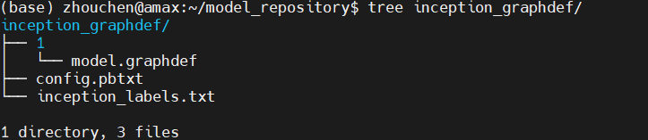

# TIS教程-模型

## 简介

在[本系列](https://blog.csdn.net/zhouchen1998/category_11287638.html)的上一篇文章中，介绍了TIS（triton inference server）的安装和运行，但是深度学习模型的服务器部署的核心依然是模型，因此本文将关注于TIS部署时模型相关的内容，包括**模型仓库、模型配置和模型管理**。

## 模型仓库

使用TIS去部署模型的第一步就是创建一个模型仓库（model repository），这部分参考自官方教程中的[Model Repository](https://github.com/triton-inference-server/server/blob/main/docs/model_repository.md)部分。

模型仓库用于存放各种不同的模型，每个模型对应一个文件夹，模型仓库的文件布局如下所示，其中顶层目录是模型仓库的根目录，该目录下存放着多个以模型名为文件夹名的文件夹，每个文件夹对应一种模型。

```
  <model-repository-path>/
    <model-name>/
      [config.pbtxt]
      [<output-labels-file> ...]
      <version>/
        <model-definition-file>
      <version>/
        <model-definition-file>
      ...
    <model-name>/
      [config.pbtxt]
      [<output-labels-file> ...]
      <version>/
        <model-definition-file>
      <version>/
        <model-definition-file>
      ...
    ...
```

每个模型文件下包含模型的相关信息文件，比如`config.pbtxt`则是一个**模型配置**文件（该文件的格式会在下一节的模型配置中详细讲解），此外对于分类模型还可以有`inception_labels.txt`这样的标签文件，此外，还有必不可少的版本文件夹，这类文件夹每个代表一个版本的模型（后端支持的模型文件，如PyTorch模型），比如下图表示的就是一个分类模型的部署示例，其中`1`就表示版本1的模型文件。



当然，上面关于模型版本，其实可以简单地理解为一个版本放一个模型文件即可，例如上述的TensorFlow模型以如下格式存放。

```
<model-repository-path>/
    <model-name>/
      config.pbtxt
      1/
        model.graphdef
```

再比如，TorchScript模型和ONNX模型可以如下格式存放。

```
 <model-repository-path>/
    <model-name>/
      config.pbtxt
      1/
        model.pt
```
```
  <model-repository-path>/
    <model-name>/
      config.pbtxt
      1/
        model.onnx/
           model.onnx
           <other model files>
```

最后要补充的是，模型仓库通过`tritonserver --model-repository=/models`选项指定即可。

## 模型配置

接下来，我们来看看上面没有西江的模型配置，这部分可以参考官方文档中的[Model Configuration](https://github.com/triton-inference-server/server/blob/main/docs/model_configuration.md)。需要注意的是，每个模型文件夹必须存在一个模型配置文件，该文件提供一些模型的必选和可选信息，最典型的是手写一个`config.pbtxt`文件，我们下面主要讲解这个。

该文件至少应当包含运行平台或后端框架、最大批尺寸、输入输出张量的信息。下面以一个TensoRT模型为例，该模型有两个输入一个输出，那么其最简配置如下。

```
  platform: "tensorrt_plan"
  max_batch_size: 8
  input [
    {
      name: "input0"
      data_type: TYPE_FP32
      dims: [ 16 ]
    },
    {
      name: "input1"
      data_type: TYPE_FP32
      dims: [ 16 ]
    }
  ]
  output [
    {
      name: "output0"
      data_type: TYPE_FP32
      dims: [ 16 ]
    }
  ]
```

下面，我们来一个个看这些必须的配置项。

### Name, Platform and Backend

配置文件中，模型名不是必须的，如果不指定，则会按照模型仓库中该模型所在文件夹的名字作为模型名，如果指定，则必须和该模型所在文件夹名称一致。关于运行平台，TIS支持如下情况：
- 对TensorRT， 'backend'必须设置为tensorrt或者'platform' 必须设置为tensorrt_plan；
- 对PyTorch， 'backend'必须设置为pytorch或者'platform'必须设置为pytorch_libtorch；
- 对ONNX，'backend'必须设置为onnxruntime或者'platform'必须设置为onnxruntime_onnx；
- 对TensorFlow，'platform'必须设置为tensorflow_graphdef或 tensorflow_savedmodel，'backend' 可选择设置为tensorflow；
- 对其他的模型后端， 'backend'必须设置为后端名且'platform'可选是否设置。

### Maximum Batch Size

`max_batch_size `这一项表示支持批处理的模型最大的批处理尺寸，如果模型的batch维度是第一维，且输入输出都有这个维度，那么Triton就可以自动批量运算，这时候最大批处理尺寸设置就是有效的，应当设置大于等于1.如果不需要批处理或者不支持批处理，设置为0即可。

### Inputs and Outputs

我们拿到一个项目的模型去部署，其实整体上这个模型是“黑盒”的，我们能看到就是输入和输出，因此输入输出的配置非常非常关键。`input`和`output`以列表的形式设置，列表中每一项是一个字典，字典必须包含名称、数据类型和张量尺寸的设置。

名称指的是该输入的变量名，这里务必和模型定义的张量名一致。数据类型指的是该张量的数据类型，这里可以参考[类型表](https://github.com/triton-inference-server/server/blob/399f27644d01c1df2d583fde13945d0494085ef2/docs/model_configuration.md#datatypes)。

而shape则用来表示发起请求的输入张量的尺寸或者服务器反馈的输出张量的尺寸，这个shape必须不为空（即`[]`），不过我们自己设置的时候不需要显式设置完整的shape，只需要设置模型除了batch的维度`dims`即可。Triton会自动组合为完整的shape，比如当`max_batch_size`大于0的时候，设置dims为`[16]`则会变为`[-1,16]`，而当`max_batch_size`等于0的时候，shape就是dims。此外，对那些可变的维度，设置为-1即可，例如`[4 -1]`。

此外，官方还有自动生成配置文件、reshape配置、实例组等，这里就先不多赘述，后面用到会提到。

## 模型管理

所谓模型管理指的就是，当Triton运行时，模型仓库有了改变，会如何处理这种改变，共有三种模式，分别为NONE、EXPLICIT和POLL，这部分详细参考官方文档中的[Model Management](https://github.com/triton-inference-server/server/blob/main/docs/model_management.md)，我这里篇幅所限，就简单介绍这三种模式，其中默认为NONE模式。

### NONE模式

**启动时**，首先，Triton尝试在启动时加载模型存储库中的所有模型。Triton无法加载的模型将被标记为UNAVAILABLE并且不可用于推理。

**启动后**，服务器运行时对模型存储库的更改将被忽略。使用模型控制协议的模型加载和卸载请求将没有影响，并将返回错误响应。 

这种模型控制模式通过在启动 Triton 时指定`--model-control-mode=none`来选择，这是默认的模型控制模式。参考[修改模型仓库](https://github.com/triton-inference-server/server/blob/main/docs/model_management.md#modifying-the-model-repository)的内容，在Triton运行时必须小心更改模型存储库。

### EXPLICIT模式

**启动时**，Triton 仅加载使用`--load-model`命令行选项明确指定的那些模型。如果未指定`--load-model`则启动时不会加载任何模型。 Triton 无法加载的模型将被标记为 UNAVAILABLE 并且不可用于推理。

**启动后**，必须使用模型控制协议显式启动所有模型加载和卸载操作。模型控制请求的响应状态指示加载或卸载动作的成功或失败。尝试重新加载已加载的模型时，如果由于任何原因重新加载失败，则已加载的模型将保持加载状态。如果重新加载成功，新加载的模型将替换已加载的模型，而不会损失模型的可用性。

通过指定`--model-control-mode=explicit`启用此模型控制模式。参考[修改模型仓库](https://github.com/triton-inference-server/server/blob/main/docs/model_management.md#modifying-the-model-repository)的内容，在Triton运行时必须小心更改模型存储库。


### POLL 模式

**启动时**，Triton 尝试在启动时加载模型存储库中的所有模型。 Triton 无法加载的模型将被标记为 UNAVAILABLE 并且不可用于推理。

**启动后**，Triton将检测对模型存储库的更改，Triton 将根据这些更改尝试加载和卸载模型。 尝试重新加载已加载的模型时，如果由于任何原因重新加载失败，则已加载的模型将保持加载状态。 如果重新加载成功，新加载的模型将替换已加载的模型，而不会损失模型的可用性。

由于 Triton 会定期轮询存储库，因此可能无法立即检测到对模型存储库的更改。 您可以使用`--repository-poll-secs`选项控制轮询间隔。 控制台日志或模型就绪协议或模型控制协议的索引操作可用于确定模型存储库更改何时生效。

*需要注意的是，Triton 轮询模型存储库和您对存储库进行任何更改之间没有同步。 因此，Triton 可以观察到导致意外行为的部分和不完整的变化。 因此，不建议在生产环境中使用 POLL 模式。*

使用模型控制协议的模型加载和卸载请求将没有影响，并将返回错误响应。 通过指定`--model-control-mode=poll` 并在启动 Triton 时将`--repository-poll-secs`设置为非零值来启用此模型控制模式。 参考[修改模型仓库](https://github.com/triton-inference-server/server/blob/main/docs/model_management.md#modifying-the-model-repository)的内容，在Triton运行时必须小心更改模型存储库。

在 POLL 模式下，Triton 响应以下模型存储库更改：

- 通过添加和删除相应的版本子目录，可以在模型中添加和删除版本。即使使用已删除的模型版本，Triton 也将允许完成inflight的请求。对已删除模型版本的新请求将失败。根据模型的版本政策，对可用版本的更改可能会更改默认提供的模型版本。

- 通过删除相应的模型目录，可以从存储库中删除现有模型。 Triton 将允许完成对已删除模型的任何版本的inflight请求。删除模型的新请求将失败。

- 可以通过添加新模型目录将新模型添加到存储库中。

- 可以更改模型配置文件 (config.pbtxt)，Triton 将卸载并重新加载模型以获取新的模型配置。

- 可以添加、删除或修改为代表分类的输出提供标签的标签文件，Triton 将卸载并重新加载模型以获取新标签。如果添加或删除了标签文件，则必须同时执行对其在模型配置中对应的输出的`label_filename`属性的相应编辑。

### 模型仓库修改

上文反复提到的[修改模型仓库](https://github.com/triton-inference-server/server/blob/main/docs/model_management.md#modifying-the-model-repository)具体指的内容如下。

模型存储库中的每个模型都驻留在其自己的子目录中。模型子目录内容允许的活动因 Triton 使用该模型的方式而异。模型的状态可以通过使用模型元数据或存储库索引 API 来确定。

- 如果模型正在加载或卸载，则不必添加、删除或修改该子目录中的任何文件或目录。
- 如果模型从未加载或已完全卸载，则可以删除整个模型子目录，或者可以添加、删除或修改其任何内容。
- 如果模型已完全加载，则可以添加、删除或修改该子目录中的任何文件或目录；除了实现模型后端的共享库。 Triton 在加载模型时使用后端共享库，因此删除或修改它们可能会导致 Triton 崩溃。要更新模型的后端，您必须首先完全卸载模型，修改后端共享库，然后重新加载模型。在某些操作系统上，还可以简单地将现有共享库移动到模型存储库之外的另一个位置，复制到新的共享库中，然后重新加载模型。


## 总结


本文主要介绍了Triton Inference Server的模型配置教程，具体可以查看[官方文档](https://docs.nvidia.com/deeplearning/triton-inference-server/user-guide/index.html)。


