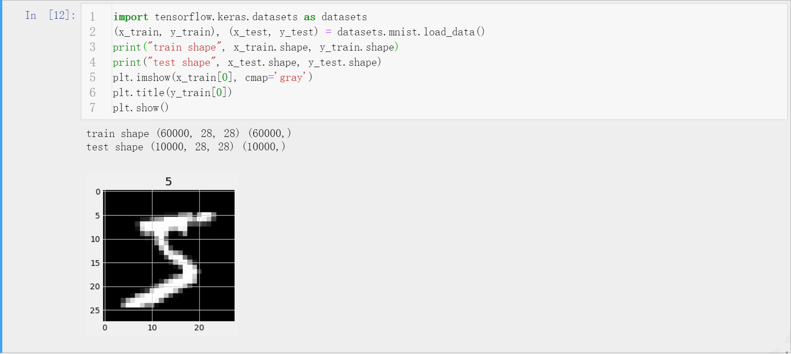
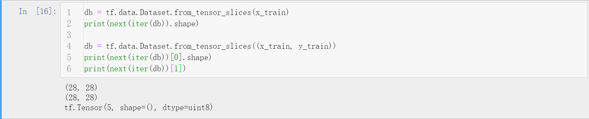
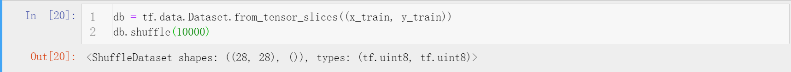
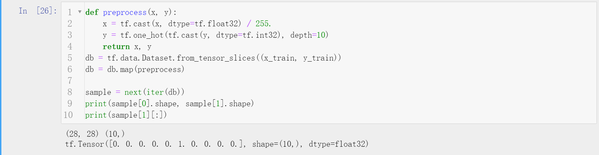
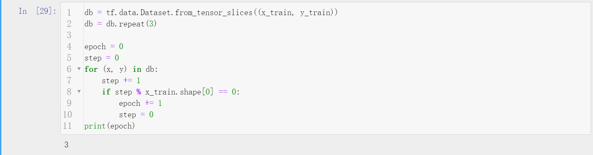
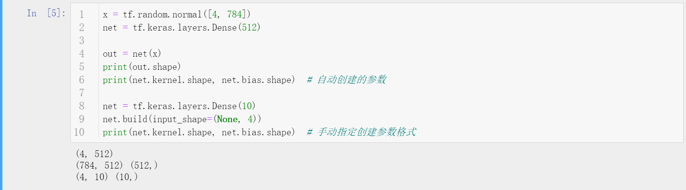
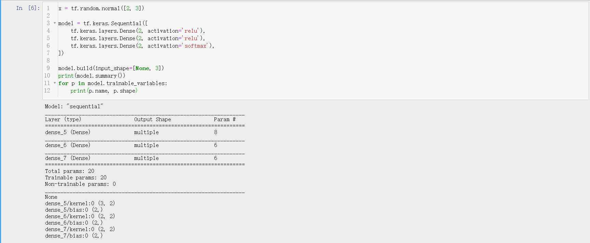
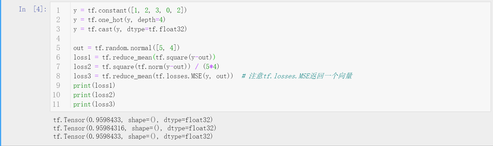
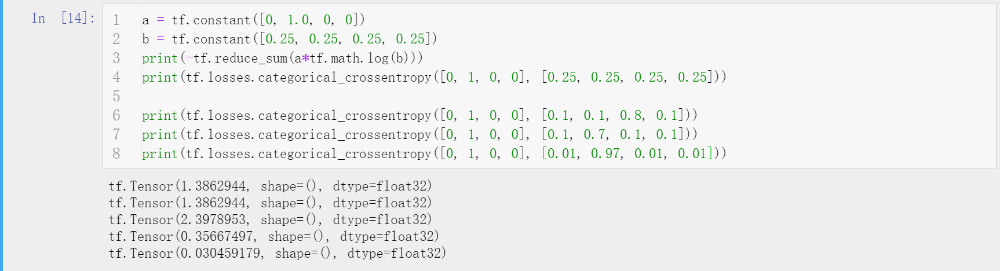

# TensorFlow2神经网络基础

## 数据加载
- TensorFlow依托Keras，预先封装了很多小型的数据集，可以通过接口下载并使用该数据集。包含boston_housing（波士顿房价回归预测数据集）、cifar10（Cifar图像分类数据集共10大类）、cifar100（Cifar图像分类数据集共100小类）、mnist（手写数字识别数据集）、fashion_mnist（常用品分类数据集）、imdb（电影情感评论文本分类数据集）。
- 调用load_data方法TensorFlow会自动从Google下载暂存的数据集到本地（第一次运行，后面不再下载，需要科学上网），然后以numpy格式返回训练集和测试集的x和y。
  - 
- `tf.data.Dataset`
  - 在TensorFlow中，data模块中的Dataset是一个很重要的对象，作为数据加载的接口。
  - Dataset对象的`form_tensor_slices`方法可以很方便地从numpy矩阵等加载数据并进行预处理（注意Dataset对象的使用必须先取得对应的迭代器）。
  - Dataset对象的`shuffle`方法可以很方便地打散数据（特征和标签同步打散），一般只需要一个buffer_size参数，该数值越大，混乱程度越大。
  - Dataset对象的`map`方法可以很方便地进行数据预处理或者数据增广的操作，其功能类似于Python的map方法，传入一个函数对象，对每个数据调用该函数进行处理。
  - Dataset对象的`batch`方法可以直接设定每次取出数据的batch_size（默认为1），这是最核心的功能。
  - Dataset对象的`repeat`方法可以指定迭代器迭代的次数（在Python中对可迭代对象一旦取完就会停止取数据，但是训练往往需要很多轮次），默认不指定repeat的参数则会一直迭代下去。

## 全连接神经网络
- 说明
  - 经典的神经网络结构是由多个隐藏层的神经元级联形成的全连接神经网络，后来各类针对不同任务的神经网络结构的设计都是基于全连接神经网络的思路，如计算机视觉的卷积神经网络、自然语言处理的循环神经网络等。对于全连接神经元的神经网络，由于结构固定，已经做了一定程度的封装。
- `tf.keras.layers.Dense(units)`
  - 可以创建包含参数w和偏置b的一层全连接层网络，units表示神经元的数目。注意在创建Dense对象后，weights参数是默认没有创建的，需要通过build方法创建，使用net实例进行运算时会自动检查参数，若没有创建，则依据参与运算的数据自动创建weights。
- `tf.keras.Sequential`
  - Sequential是用于线性堆叠多层网络结构的一个基础容器，其会自动将输入的张量流过多层得到输出。

## 误差计算
- MSE均方差
  - 计算式为$\operatorname{loss}=\frac{1}{N} \sum(y-o u t)^{2}$，在TensorFlow中对这类简单的误差函数（损失函数）进行了简单封装。**MSE这类损失函数一般都要除以一个样本量N，以保证求得的梯度值不会太大。**
- CrossEntropy交叉熵
  - 计算式为$H(p, q)=-\sum p(x) \log q(x)$，预测的q分布尽量逼近于真实的p分布，此时交叉熵函数值最小，故优化该损失函数合理。在TensorFlow中，对交叉熵函数计算进行了封装。

## 补充说明
- 本文主要针对TensorFlow2中数据加载和误差计算的接口进行了简略说明。
- 博客同步至我的[个人博客网站](https://luanshiyinyang.github.io/tensorflow2/2019/10/10/NeuralNetwork/)，欢迎浏览其他文章。
- 如有错误，欢迎指正。