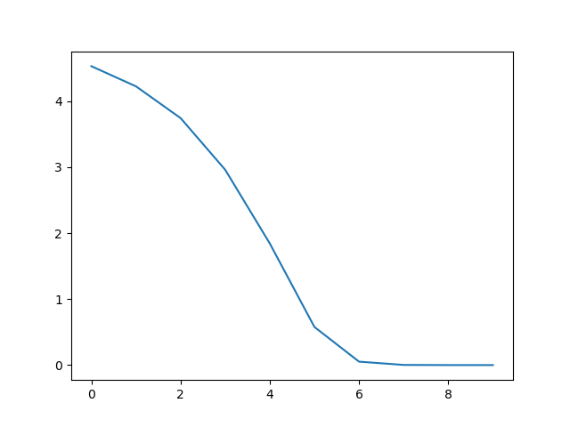

# PyTorch训练


## 简介
在之前[专栏](https://blog.csdn.net/zhouchen1998/category_8742242.html)的两篇文章中我主要介绍了数据的准备以及模型的构建，模型构建完成的下一步就是模型的训练优化，训练完成的模型用于实际应用中。


## 损失函数
损失函数用于衡量预测值与目标值之间的误差，通过最小化损失函数达到模型的优化目标。不同的损失函数其衡量效果不同，未必都是出于最好的精度而设计的。PyTorch对于很多常用的损失函数进行了封装，均在`torch.nn`模块下，它们的使用方法类似，**实例化损失计算对象，然后用实例化的对象对预测值和目标值进行损失计算即可。**

- L1损失
  - `nn.L1Loss(reduction)`
  - 计算L1损失即绝对值误差。
  - **reduce**参数表示是否返回标量，默认返回标量，否则返回同维张量。
  - **size_average**参数表示是否返回的标量为均值，默认为均值，否则为求和结果。
  - **reduction**参数取代了上述两个参数，`mean`、`sum`和`None`的取值对应上面的结果。
  - 下面代码可以演示损失的计算流程。
    ```python
    import torch
    from torch import nn
    pred = torch.ones(100, 1) * 0.5
    label = torch.ones(100, 1)

    l1_mean = nn.L1Loss()
    l1_sum = nn.L1Loss(reduction='sum')

    print(l1_mean(pred, label))
    print(l1_sum(pred, label))
    ```
- MSE损失
  - `nn.MSELoss(reduction='mean')`
  - 计算均方误差，常用于回归问题。
  - 参数同上。
- CE损失
  - `nn.CrossEntropyLoss(weight=None, ignore_index=-100, reduction='mean')`
  - 计算交叉熵损失，常用于分类问题。并非标准的交叉熵，而是结合了Softmax的结果，也就是说会将结果先进行softmax计算为概率分布。
  - **weight**参数是每个类别的权重，用于解决样本不均衡问题。
  - **reduction**参数类似上面的损失函数。
  - **ignore_index**参数表示忽略某个类别，不计算其损失。
- KL散度
  - `nn.KLDivLoss(reduction='mean')`
  - 计算KL散度。
  - 参数同上。
- 二分交叉熵
  - `nn.BCELoss(reduction='mean')`
  - 计算二分交叉熵损失，一般用于二分类问题。
- 逻辑二分交叉熵
  - `nn.BCEWithLogitsLoss()`
  - 输入先经过sigmoid变换再计算损失，类似CE损失。

上述只是提到了几个常用的简单损失函数，更加复杂的可以查看官方文档，一共封装了近20个损失，当然，也可以自定义损失函数，返回一个张量或者标量即可（事实上这些损失函数就是这么干的）。


## 优化器
数据、模型、损失函数都确定了，那这个深度模型任务其实已经完成了大半，接下来就是选择合适的优化器对模型进行优化训练。

首先，要了解PyTorch中优化器的机制，其所有优化器都是继承自Optimizer类，该类封装了一套基础的方法如`state_dict()`、`load_state_dict()`等。

### 参数组（param_groups）
任何优化器都有一个属性为`param_groups`，这是因为优化器对参数的管理是基于组进行的，为每一组参数配置特定的学习率、动量比例、衰减率等等，该属性为一个列表，里面多个字典，对应不同的参数及其配置。

例如下面的代码中只有一个组。
```python
import torch
import torch.optim as optim


w1 = torch.randn(2, 2)
w2 = torch.randn(2, 2)

optimizer = optim.SGD([w1, w2], lr=0.1)
print(optimizer.param_groups)
```

)

### 梯度清零
事实上，PyTorch不会在一次优化完成后清零之前计算得到的梯度，所以需要每次优化完成后手动清零，即调用优化器的`zero_grad()`方法。

### 参数组添加
通过调用优化器的`add_param_group()`方法可以添加一组定制的参数。

### 常用优化器
PyTorch将这些优化算法均封装于torch.optim模块下，其实现时对原论文有所改动，具体参见源码。
- 随机梯度下降
  - `optim.SGD(params, lr, momentum, weight_decay)`
  - 随机梯度下降优化器。
  - **params**参数表示需要管理的参数组。
  - **lr**参数表示初始学习率，可以按需调整学习率。
  - **momentum**参数表示动量SGD中的动量值，一般为0.9。
  - **weight_decay**参数表示权重衰减系数，也是L2正则系数。
- 随机平均梯度下降
  - `optim.Adam(params, lr=0.001, betas=(0.9, 0.999), eps=1e-8, weight_decay=0, amsgrad=False)`
  - Adam优化算法的实现。
  - 参数类似上面。

下图演示了各种算法相同情境下的收敛效果。


## 学习率调整策略
合适的学习率可以使得模型迅速收敛，这也是Adam等算法的初衷，一般我们训练时会在开始给一个较大的学习率，随着训练的进行逐渐下调这个学习率。那么何时下调、下调多少，相关的问题就是学习率调整策略，PyTorch提供了6中策略以供使用，它们都在`torch.optim.lr_scheduler`中，分为有序调整（较为死板）、自适应调整（较为灵活）和自定义调整（适合各种情况）。

下面介绍最常用的自动学习率调整机制。它封装为`optim.lr_scheduler.ReduceLROnPlateau(optimizer, mode='min', factor=0.1, patience=10, verbose=False, threshold=0.0001,threshold_mode='rel', cooldown=0, min_lr=0, eps=1e-8)`。

当指标不再变化时即调整学习率，这是一种非常实用的学习率调整策略。例如，当验证集的损失不再下降即即将陷入过拟合，进行学习率调整。

- **mode**参数由两种为`min`和`max`，当指标不再变低或者变高时调整。
- **factor**参数表示学习率调整比例。
- **patience**参数表示等待耐心，当patience个step指标不变即调整学习率。
- **verbose**参数表示调整学习率是否可见。
- **cooldown**参数表示冷却时间，调整后冷却时间内不再调整。
- **min_lr**参数表示学习率下限。
- **eps**参数表示学习率衰减最小值，学习率变化小于该值不调整。


## 训练流程实战
下面的代码演示了数据的导入、模型构建、损失函数使用以及优化器的优化整个流程，**大部分时候我们使用PyTorch进行模型训练都是这个思路**。

```python
import torch
from torch import nn
import torch.nn.functional as F
from torch import optim


class Net(nn.Module):

    def __init__(self):
        super(Net, self).__init__()
        self.conv1 = nn.Conv2d(in_channels=3, out_channels=32, kernel_size=(3, 3))
        self.pool1 = nn.MaxPool2d(kernel_size=2, stride=2)
        self.conv2 = nn.Conv2d(in_channels=32, out_channels=64, kernel_size=3)
        self.pool2 = nn.MaxPool2d(2, 2)
        self.fc1 = nn.Linear(64*54*54, 256)
        self.fc2 = nn.Linear(256, 128)
        self.fc3 = nn.Linear(128, 101)

    def forward(self, x):
        x = self.pool1(F.relu(self.conv1(x)))
        x = self.pool2(F.relu(self.conv2(x)))
        x = x.view(-1, 64*54*54)
        x = F.relu(self.fc1(x))
        x = F.relu(self.fc2(x))
        x = self.fc3(x)
        return x


net = Net()
x = torch.randn((32, 3, 224, 224))
y = torch.ones(32, ).long()
criterion = nn.CrossEntropyLoss()
optimizer = optim.SGD(net.parameters(), lr=0.001, momentum=0.9, dampening=0.1)
scheduler = torch.optim.lr_scheduler.StepLR(optimizer, step_size=50, gamma=0.1)

epochs = 10
losses = []
for epoch in range(epochs):

    correct = 0.0
    total = 0.0

    optimizer.zero_grad()
    outputs = net(x)
    loss = criterion(outputs, y)
    loss.backward()
    optimizer.step()
    scheduler.step()
    _, predicted = torch.max(outputs.data, 1)
    total += y.size(0)
    correct += (predicted == y).squeeze().sum().numpy()
    losses.append(loss.item())
    print("loss", loss.item(), "acc", correct / total)

import matplotlib.pyplot as plt
plt.plot(list(range(len(losses))), losses)
plt.savefig('his.png')
plt.show()
```

其训练损失变化图如下，由于只是给出的demo数据，训练很快收敛，准确率一轮达到100%。




## 补充说明
本文介绍了PyTorch中损失函数的使用以及优化器的优化流程，这也是深度模型训练的最后步骤，比较重要。本文的所有代码均开源于[我的Github](https://github.com/luanshiyinyang/Tutorial/tree/PyTorch)，欢迎star或者fork。