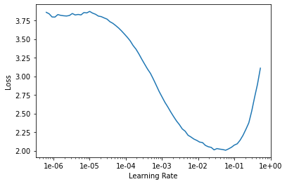
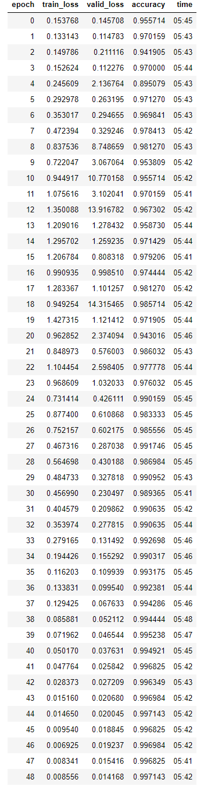
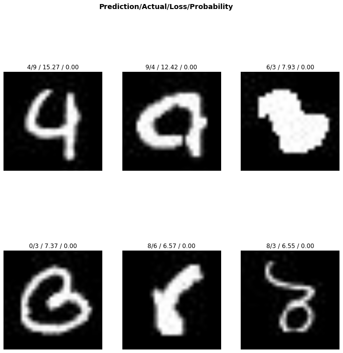
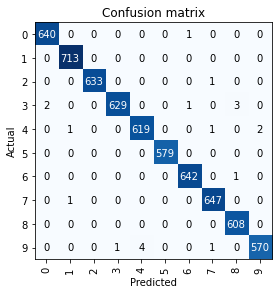
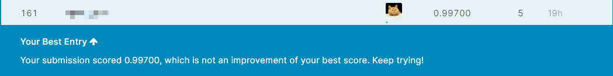

# 竞赛实战
## 简介
可以说，Fastai的出现给Kaggle上很多以迁移学习为主的比赛带来了新的方法，冲击了很多传统框架，因为Fastai的封装更多更详细，使用者更方便。本文以一个简单的分类赛为例，介绍如何在Kaggle中使用Fastai取得不错的成绩。本文只列举代码的细节，主要是Fastai解决视觉问题的**Pipeline**，具体框架用法不多设计，[我的系列博客](https://blog.csdn.net/zhouchen1998/category_8916629.html)已经具体讲解了。


## 赛题
比赛[链接](https://www.kaggle.com/c/digit-recognizer)，老生常谈的MNIST手写体分类，是Kaggle上一个入门级别的赛事，关于Kaggle赛事级别类型等可以参考[我的博客](https://zhouchen.blog.csdn.net/article/details/101356627)。

由于给出的数据集为表格数据，预先处理为了本地的JPG图片并按照ImageNet数据集的风格进行文件存储，方便Fastai
读取。

## 数据准备
本地数据集的存放格式如下。

```
mnist\
    train\
        0\
        1\
        2\
        ...
        9\
    test\
```

Fastai要读取这个数据集非常简单，使用`ImageDataBunch`的`from_folder`方法即可，读取之后这里按照ImageNet的统计信息进行了标准化。
```python
tfms = transform.get_transforms(do_flip=False, max_rotate=5.0)  # 数据变换

db = ImageDataBunch.from_folder(
    "../train/",
    test="../test/",
    valid_pct=0.15,  # 划分训练集
    bs=64,
    size=224,
    ds_tfms=tfms,
)
db = db.normalize(imagenet_stats)
```

得到的数据集输出信息如下。
```
ImageDataBunch;

Train: LabelList (35700 items)
x: ImageList
Image (3, 224, 224),Image (3, 224, 224),Image (3, 224, 224),Image (3, 224, 224),Image (3, 224, 224)
y: CategoryList
5,5,5,5,5
Path: ../train;

Valid: LabelList (6300 items)
x: ImageList
Image (3, 224, 224),Image (3, 224, 224),Image (3, 224, 224),Image (3, 224, 224),Image (3, 224, 224)
y: CategoryList
5,9,9,9,0
Path: ../train;

Test: LabelList (28000 items)
x: ImageList
Image (3, 224, 224),Image (3, 224, 224),Image (3, 224, 224),Image (3, 224, 224),Image (3, 224, 224)
y: EmptyLabelList
,,,,
Path: ../train
```


## 学习器构建
通过`cnn_learner`方法根据resnet模型构建学习器并采用在Imagenet上预训练的参数，成功构建学习器。

```python
learn = learner.cnn_learner(db, models.wide_resnet50_2, metrics=[accuracy, ], model_dir="/tmp/models", callback_fns=ShowGraph)
```
上面设置了数据集、模型、指标、模型存放地址以及预先添加的回调，这种回调添加方式表示自动依据当前`learner`创建默认参数的回调对象而不必像fit时那样初始化对象，通常，这种方法更加普遍。


## 模型训练
首先通过`LR_Finder`来搜索合适的学习率（只需要调用学习器的`lr_find`方法），最后确定了合适的学习率区间。
```python
learn.unfreeze()  # 解冻所有层
learn.lr_find()  # 迭代找寻最优学习率
learn.recorder.plot()
```



接着，按照合适的学习率区间使用one cycle策略进行50轮的训练（解冻所有层），结果如下。




## 推理分析
利用learner生成解释器，可视化识别最差的图片以及混淆矩阵。

```python
interpreter.plot_top_losses(6)
```



```python
interpreter.plot_confusion_matrix()
```



然后，进行测试集上的结果推理，这里注意的是数据集读取的API不是按照要求输出的编号顺序来的，是乱序的，输出的时候要纠正顺序再写入提交的csv文件。

```python
score, y = learn.get_preds(fastai.vision.DatasetType.Test)
lab = np.argmax(score, axis=1)
Id = [int(os.path.splitext(filename)[0]) + 1 for filename in os.listdir(test_folder)]   # 还原id
df_submit['ImageId'] = Id
df_submit['Label'] = lab
```

## 结果提交
得到了合适的CSV文件就可以在平台上进行提交，平台很快会给出public测试的分数，本比赛采用的是准确率作为指标，上述数十行代码获得的得分为0.99700，排名为161/2292，而这只是一个baseline代码，这说明，fastai在比赛这个领域是非常实用的框架，且它支持PyTorch的一切功能，对PyTorch的用户也非常友好。




## 补充说明
本文主要演示了使用Fastai在比赛中如何构建一个Pipeline的baseline，具体代码开源于[我的Github](https://github.com/luanshiyinyang/Tutorial/tree/Fastai)，欢迎star或者fork。