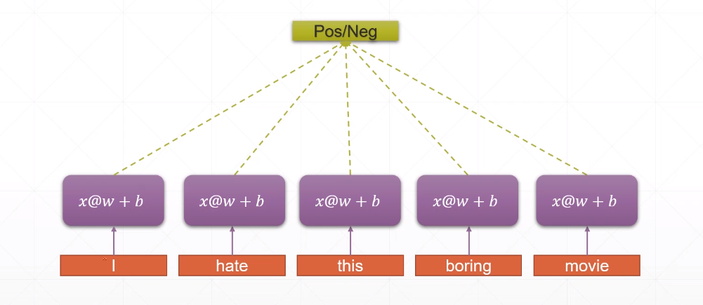
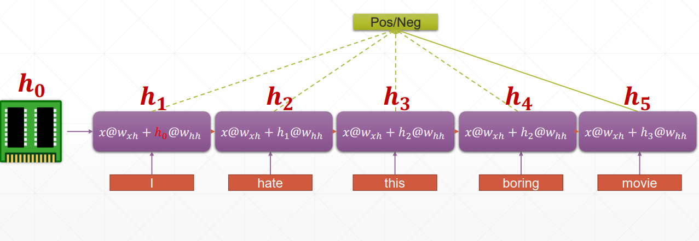
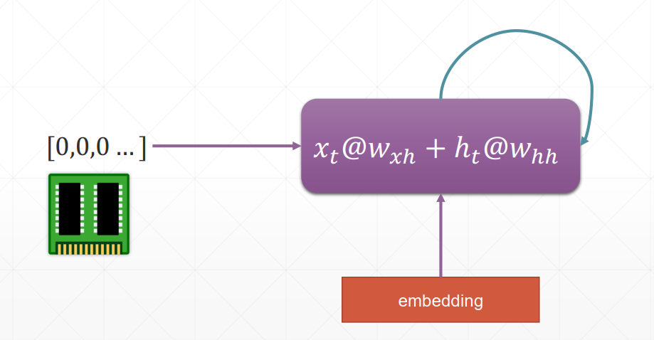
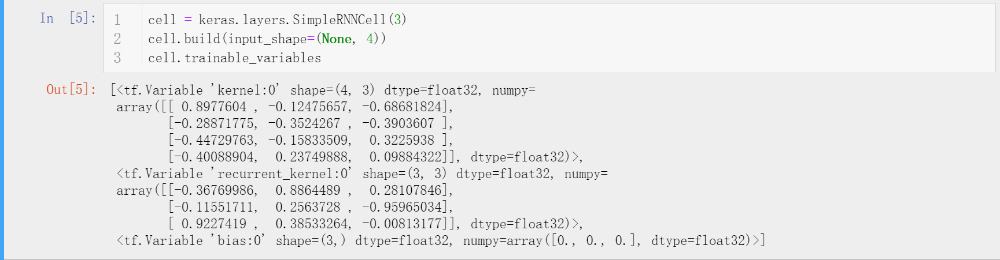
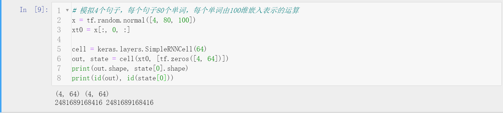
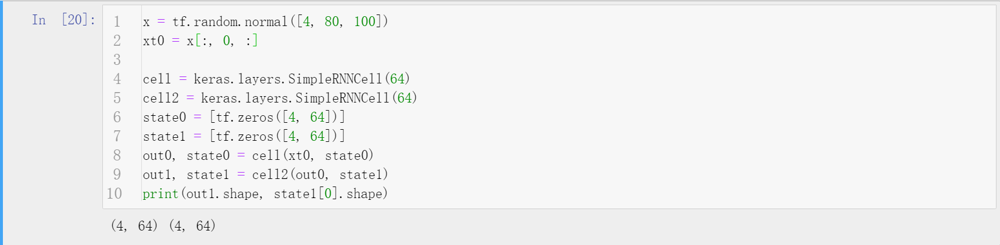
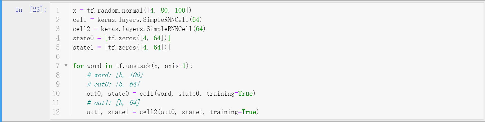
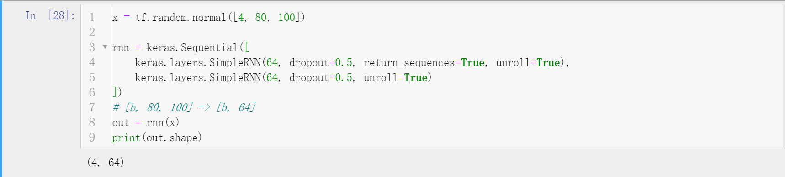

# TensorFlow2循环神经网络


## 简介
循环神经网络（recurrent neural network）由于其对时序数据强大的处理能力，被广泛应用于自然语言处理（NLP）领域。近些年，随着各个研究领域的融合趋势，RNN为基础的一些结构如LSTM也被使用在计算机视觉中的任务中。


## 序列数据
序列信号（Sequence）通常通过序列嵌入（Sequence embedding）来表达，格式为[b, seq_len, feature_len]。用NLP的观点理解，其中b批尺寸（batch size），seq_len为句子单词数目，feature_len为表示一个单词的向量维度（如300维的词向量）。

如果将图片理解为序列数据，[b, 28, 28]则表示每一行是一次采样的结果。当然，RNN在图片上有时有着不错的效果，但是很多时候效果很一般，这是因为RNN本身是用来处理时序数据的，并不擅长处理图片这类数据。

- onehot编码
  - 对共有1000个单词的词表，每个单词用一个1000维的向量表示，其中属于这个单词的位置置1，其余位置为0.这是一种及其暴力简单的编码方式，不过有着不少的缺点：无法衡量不同单词之间的距离（因为任意两个单词之间的距离是相同的）、所占存储空间大（稀疏高维矩阵）。
- word embedding（词嵌入）
  - 词嵌入的产生方法有很多，后来的研究表明比较好的两种方法为Word2Vec和Glove（本质上二者都是上下文预测产生的）。在TF2中，keras模块下的Embedding层用于嵌入的学习。相比于onehot那样的编码方式，embedding为低维密集矩阵，存储方便的同时也保留了语义距离的信息。


## 循环神经网络
如同卷积神经网络提出的初衷一样，如果使用全连接神经网络处理文本信息（如处理后的词嵌入）势必会构建一个非常复杂的网络，参数量相当庞大。而且这种将每个单词的信息送入全连接网络会忽略自然语言的一个重要问题---上下文相关。

在卷积神经网络中，为了解决过多参数采用了参数共享（weight sharing）方法，同样的，在循环神经网络中，也采用类似的方法，通过同一个线性层提取语义信息。

但是，自然语言处理不仅仅需要关注每个单词的信息，还需要关注整个句子的信息，因此需要一个记录之前信息的记忆结构h（memory或state），在每个单词处理是都让它参与运算，这样不断累积，最后一个单词后得到的新h(新memory)就记录了整个句子的语义信息。

上述的模型其实可以折叠，折叠后产生的模型结构如下图，对于不同时间点采样的信息都是以同一种方式提取特征，上一次的信息作为后一次记忆更新的基础，如此反复，形成循环结构，因此成为循环神经网络（RNN）。

数学上表达如下，其中h为中间状态，对于有的模型这个h就是输出，对于有的模型还需要对h进行变换，需要分情况而定。
$$
\begin{array}{c}{h_{t}=f_{W}\left(h_{t-1}, x_{t}\right)} \\ {h_{t}=\tanh \left(W_{h h} h_{t-1}+W_{x h} x_{t}\right)}\end{array}
$$

在探讨完结构后，还有一个关键的问题，就是参数的梯度求解方法，这里依据链式法则拆解并不难求解，其中最为关键的一步求解如下（梯度需要在时间轴上计算，非常复杂，人为难以完成）。
$$
\frac{\partial E_{t}}{\partial W_{R}}=\sum_{i=0}^{t} \frac{\partial E_{t}}{\partial y_{t}} \frac{\partial y_{t}}{\partial h_{t}} \frac{\partial h_{t}}{\partial h_{i}} \frac{\partial h_{i}}{\partial W_{R}}
$$
$$
\frac{\partial h_{k}}{\partial h_{1}}=\prod_{i}^{k} \operatorname{diag}\left(f^{\prime}\left(W_{I} x_{i}+W_{R} h_{i-1}\right)\right) W_{R}
$$


## 循环神经网络单元
在TensorFlow2中，对循环神经网络单元的运算进行了简单的封装，通过不断将t时刻的x作为输入送入RNN模块中进行矩阵运算。而第二节所提出的RNN结构是最为简单基础的RNN结构，在keras模块下封装为SimpleRNNCell。该结构进行运算的输出为`out, h1 = call(x, h0)`，这里的out和h1是同一个东西，之所以返回两次是为了和LSTM等结构做区分。RNNCell也可以堆叠以获取更高层的语义信息。

实际训练过程中，以文本信息为演示场景，共有两种方法，一种是底层控制（较为灵活，写起来繁琐），一种借助keras的api堆叠SimpleRNN（较为死板，写起来简单）。两种方式的输出都是第二层RNN后t=80时的状态（针对本例）。


## LSTM（长短时记忆单元）
传统的RNN固然表现不错，然而RNN中的Memory的记忆能力有限且容易出现梯度弥散（gradient vanishing）现象，对此，LSTM被提出。其最核心的观念是提出了三道门（输入门、遗忘门、输出门）位于sigmoid激活后，控制数据的开度（这个开度也是训练的参数，由反向传播自动调整）。它之所以能够解决梯度弥散，其实可以理解为增加了一条数据通路，保证梯度至少不会消失。

目前，主流的模型中很少使用基本的RNN，而是使用LSTM和GRU（减少了LSTM的一个门，在很多情况下效果更好）。


## GRU
简化了LSTM，设计了重置门和更新门两个门。


## RNN文本情感分类实战
这里通过两种方式构建RNN实现文本情感分类（二分类），数据集使用IMDB电影评论数据集。第一种方法手工实现前向运算，使用SimpleRNN。第二种方法，通过简单的keras接口实现复杂的网络结构堆叠。其代码如下。
```python
"""
Author: Zhou Chen
Date: 2019/11/3
Desc: 底层构建单层RNN实现文本情感分类
"""
import os
import tensorflow as tf
import numpy as np
from tensorflow import keras
from tensorflow.keras import layers

os.environ['TF_CPP_MIN_LOG_LEVEL'] = '2'

total_words = 10000
max_sentence_len = 80  # 每个句子限制80个单词
batch_size = 128
embedding_len = 100
# 加载数据
(x_train, y_train), (x_test, y_test) = keras.datasets.imdb.load_data(num_words=total_words)  # 选取常见的10000个单词
x_train = keras.preprocessing.sequence.pad_sequences(x_train, maxlen=max_sentence_len)
x_test = keras.preprocessing.sequence.pad_sequences(x_test, maxlen=max_sentence_len)

db_train = tf.data.Dataset.from_tensor_slices((x_train, y_train))
db_train = db_train.shuffle(1000).batch(batch_size, drop_remainder=True)
db_test = tf.data.Dataset.from_tensor_slices((x_test, y_test))
db_test = db_test.shuffle(1000).batch(batch_size, drop_remainder=True)
print('x_train shape', x_train.shape, tf.reduce_max(y_train), tf.reduce_min(y_train))
print('x_test shape', x_test.shape)


class MyRNN(keras.Model):

    def __init__(self, units):
        super(MyRNN, self).__init__()

        # [b, 64]
        self.state0 = [tf.zeros([batch_size, units])]
        self.state1 = [tf.zeros([batch_size, units])]

        # transform text to embedding representation
        # [b, 80] => [b, 80, 100]
        self.embedding = layers.Embedding(total_words, embedding_len, input_length=max_sentence_len)

        # [b, 80, 100] , h_dim: 64
        # RNN: cell1 ,cell2, cell3
        # SimpleRNN
        self.rnn_cell0 = layers.SimpleRNNCell(units, dropout=0.5)
        self.rnn_cell1 = layers.SimpleRNNCell(units, dropout=0.5)

        # fc, [b, 80, 100] => [b, 64] => [b, 1]
        self.outlayer = layers.Dense(1)

    def call(self, inputs, training=None):
        # [b, 80]
        x = inputs
        # embedding: [b, 80] => [b, 80, 100]
        x = self.embedding(x)
        # rnn cell compute
        # [b, 80, 100] => [b, 64]
        state0 = self.state0
        state1 = self.state1
        for word in tf.unstack(x, axis=1):  # word: [b, 100]
            # h1 = x*wxh+h0*whh
            # out0: [b, 64]
            out0, state0 = self.rnn_cell0(word, state0, training)
            # out1: [b, 64]
            out1, state1 = self.rnn_cell1(out0, state1, training)

        # out: [b, 64] => [b, 1]
        x = self.outlayer(out1)
        # p(y is pos|x)
        prob = tf.sigmoid(x)

        return prob


def main():
    units = 64
    epochs = 4

    model = MyRNN(units)
    model.compile(optimizer=keras.optimizers.Adam(0.001), loss=tf.losses.BinaryCrossentropy(),
                  metrics=['accuracy'], experimental_run_tf_function=False)
    model.fit(db_train, epochs=epochs, validation_data=db_test)

    model.evaluate(db_test)


if __name__ == '__main__':
    main()

```
```python
"""
Author: Zhou Chen
Date: 2019/11/3
Desc: 通过层堆叠方式构建RNN实现文本情感分类
"""
import os
import tensorflow as tf
import numpy as np
from tensorflow import keras
from tensorflow.keras import layers
os.environ['TF_CPP_MIN_LOG_LEVEL'] = '2'

batchsz = 128
total_words = 10000
max_review_len = 80
embedding_len = 100
(x_train, y_train), (x_test, y_test) = keras.datasets.imdb.load_data(num_words=total_words)
# x_train:[b, 80]
# x_test: [b, 80]
x_train = keras.preprocessing.sequence.pad_sequences(x_train, maxlen=max_review_len)
x_test = keras.preprocessing.sequence.pad_sequences(x_test, maxlen=max_review_len)

db_train = tf.data.Dataset.from_tensor_slices((x_train, y_train))
db_train = db_train.shuffle(1000).batch(batchsz, drop_remainder=True)
db_test = tf.data.Dataset.from_tensor_slices((x_test, y_test))
db_test = db_test.batch(batchsz, drop_remainder=True)
print('x_train shape:', x_train.shape, tf.reduce_max(y_train), tf.reduce_min(y_train))
print('x_test shape:', x_test.shape)


class MyRNN(keras.Model):

    def __init__(self, units):
        super(MyRNN, self).__init__()

        # 生成嵌入的表示
        # [b, 80] => [b, 80, 100]
        self.embedding = layers.Embedding(total_words, embedding_len,
                                          input_length=max_review_len)

        # [b, 80, 100] , h_dim: 64
        self.rnn = keras.Sequential([
            layers.SimpleRNN(units, dropout=0.5, return_sequences=True, unroll=True),
            layers.SimpleRNN(units, dropout=0.5, unroll=True)
        ])

        # fc, [b, 80, 100] => [b, 64] => [b, 1]
        self.outlayer = layers.Dense(1)

    def call(self, inputs, training=None):
        # [b, 80]
        x = inputs
        # embedding: [b, 80] => [b, 80, 100]
        x = self.embedding(x)
        # rnn cell compute
        # x: [b, 80, 100] => [b, 64]
        x = self.rnn(x, training=training)

        # out: [b, 64] => [b, 1]
        x = self.outlayer(x)
        # p(y is pos|x)
        prob = tf.sigmoid(x)

        return prob


def main():
    units = 64
    epochs = 4

    model = MyRNN(units)
    # model.build(input_shape=(4,80))
    # model.summary()
    model.compile(optimizer=keras.optimizers.Adam(0.001),
                  loss=tf.losses.BinaryCrossentropy(),
                  metrics=['accuracy'])
    model.fit(db_train, epochs=epochs, validation_data=db_test)

    model.evaluate(db_test)


if __name__ == '__main__':
    main()

```


## LSTM文本情感分类实战
类似上面的实战任务，利用LSTM实现。
代码类似上面RNN，这里不列举，具体可以在文末给出的Github地址找到。其中也包含GRU实现。


## 补充说明
- 本文介绍了RNN、LSTM、GRU在TensorFlow2中的实现，更详细的可以查看官方文档。
- 具体的代码同步至[我的Github仓库](https://github.com/luanshiyinyang/Tutorial/tree/TensorFlow2)欢迎star；博客同步至我的[个人博客网站](https://luanshiyinyang.github.io)，欢迎查看其他文章。
- 如有疏漏，欢迎指正。