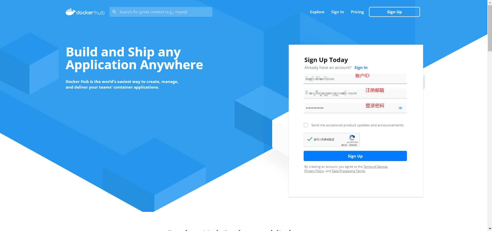
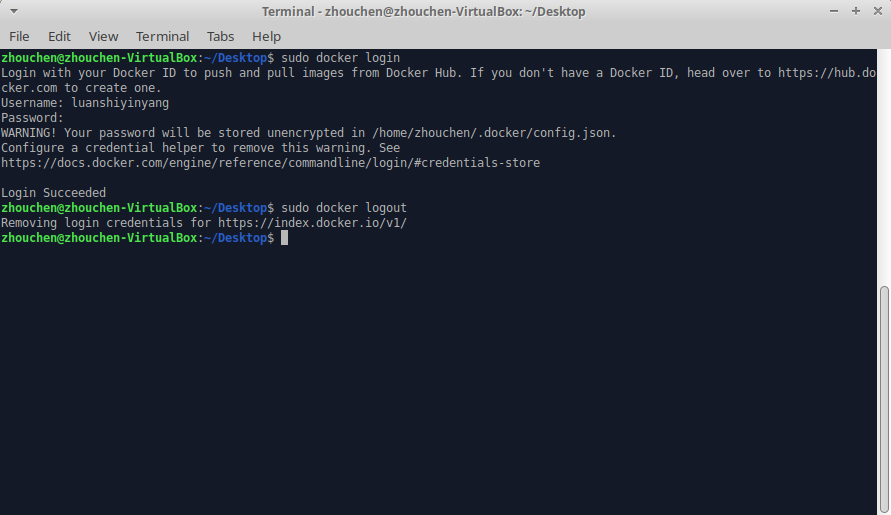
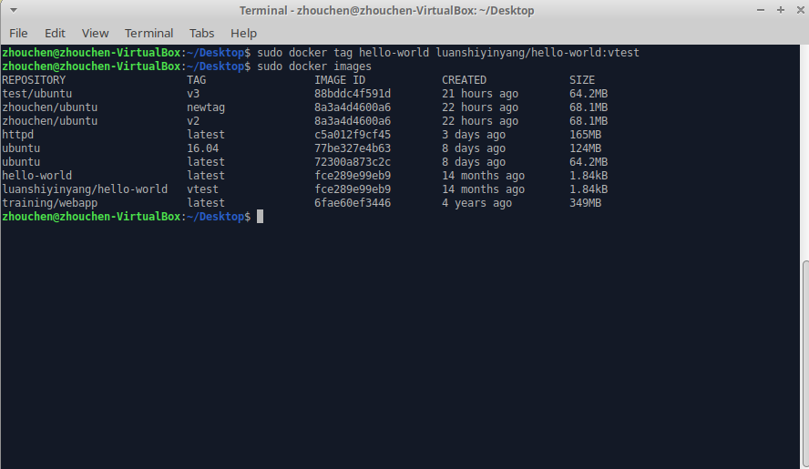
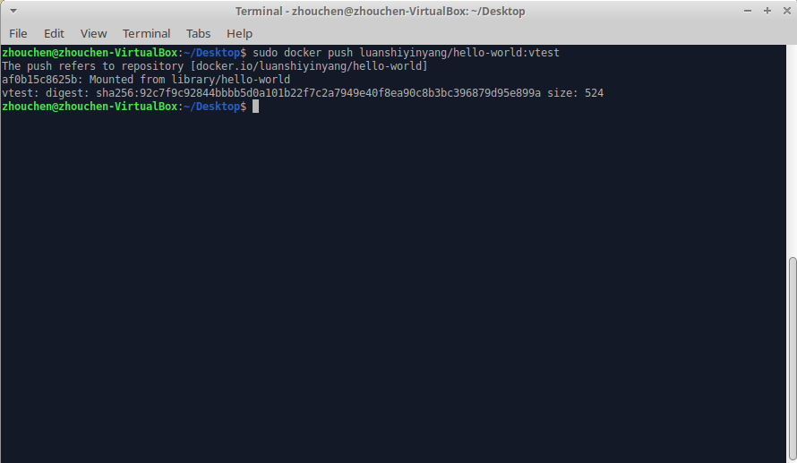
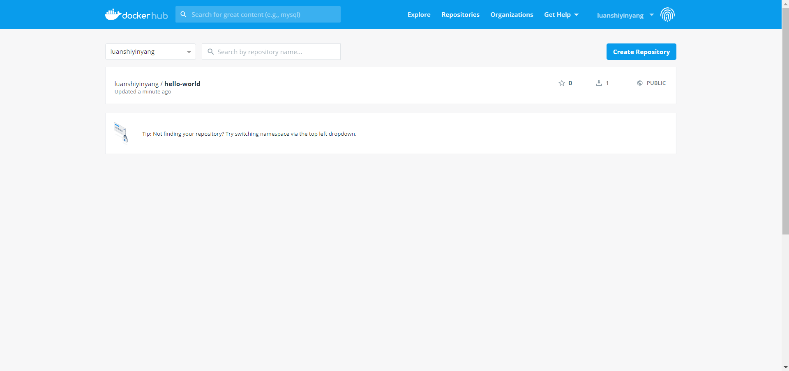
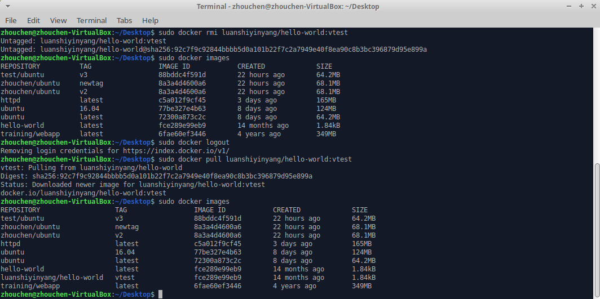
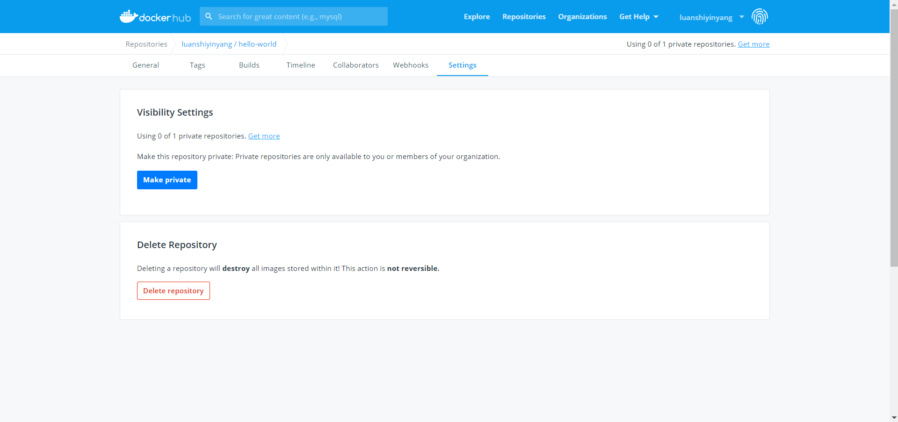

# Docker仓库管理

## 简介
非常类似Git和Github的关系，Docker和Docker Hub也是如此，Docker Hub是Docker官方维护的一个公共仓库，用户可以在这里注册账号，推送自己的本地镜像到远程仓库。目前，绝大多数需求所需要的镜像都可以在Docker Hub上找到。

## Docker Hub注册
点击[官网链接](https://hub.docker.com)进行注册即可，具体填写见下图，点击Sign up注册后会要求填写个人信息，随后到邮箱确认注册邮件即可正常登录Docker Hub。注意，记住自己的用户名ID和密码，在Docker本地机器上需要使用进行登录。

## 本地登录
`docker login`命令用于登录Docker Hub账号，执行该命令会提示输入账号及密码，验证成功即可登录。

`docker logout`命令用于登出Docker Hub账号，执行该命令就代表登出当前Docker账号。

如下图成功登录后，就可以推送（push）或者拉取（pull）自己账号下的镜像了，[此前的博客](https://zhouchen.blog.csdn.net/article/details/104576846)提到了使用`docker search`命令在官方镜像库中查找公开镜像，使用`docker pull`命令来将远程公开镜像拉取到本地，这两个操作是**不需要登录Docker hub账户的**。

## 镜像推送
下面以hello-world镜像修改后为例，演示如何推送和拉取自己的镜像。

首先，通过`tag`命令创建一个以hello-world为蓝本的镜像，也可以是任意来源的镜像，（如DockerFile构建的或者Docker hub拉取修改后的），这里只是提供一个演示的个人镜像而已。

确保自己已经按照上一节的内容登录了Docker hub账号之后，通过命令`docker push username/appname:tag`推送自己的镜像到个人远程仓库。**这里的镜像名必须规范为`username/appname:tag`且username必须是当前登录的用户，否则均会推送失败。**

推送后命令结果如下图，表示推送成功（格式规范基本上网络没问题就能成功）。

此时，登录Docker Hub账号后，查看自己的个人仓库，可以看到该推送内容，具体如下图。**推送到自己账户的镜像都是默认公开的，别人可以在Docker hub上访问到，`docker search`命令只会在Docker官方仓库下搜索镜像，不能找到个人公开的。**

此时，删除本地的该镜像，重新从Docker Hub上拉取到本地。这里要注意，拉取自己的镜像使用标准镜像名，如果该镜像公开（默认push就是公开），无需登录即可pull成功。具体演示见下图。

最后，补充一点，个人镜像是可以私有的，需要在如下图的仓库设置中修改，不过有使用限制，更多仓库的私有需要购买，公开仓库不受限制。

## 补充说明
本文主要介绍了Docker Hub这一远程镜像仓库的使用方法，主要是推送和拉取操作。文章中如有疏漏，欢迎评论指正。