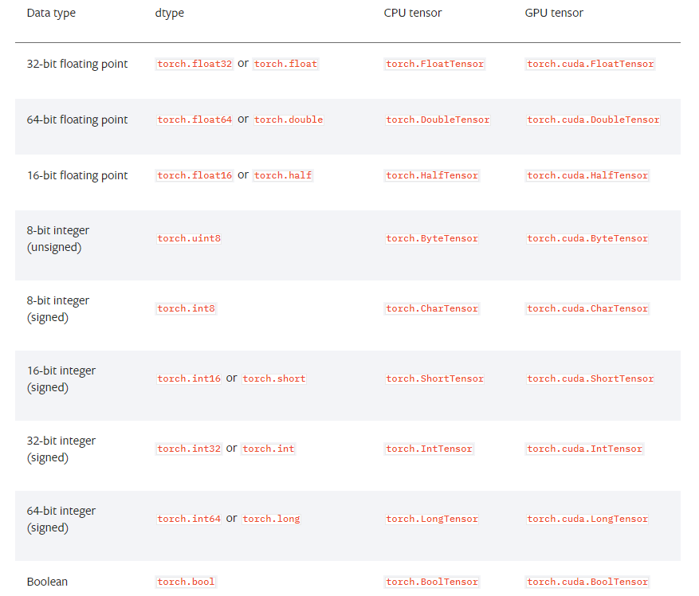

# PyTorch常用代码


## 简介 
之前提到过PyTorch进行深度训练是一套总的来说较为固定的流程，因此学习一些常用的代码段是很有必要的，本文整理了一些常用的代码段，当然最合适的参考资料依然是[官方文档](https://pytorch.org/docs/stable/index.html)。


## 框架配置

### 包导入与信息查看
这部分主要是PyTorch的版本查看、本机是否可以使用GPU训练、可用的GPU数目等，具体如下代码，已经备注详细。
```python
import torch

# PyTorch版本
print(torch.__version__)
# 是否可用GPU
print(torch.cuda.is_available())
# 可用的GPU数目
print(torch.cuda.device_count())
# 可用的第一个GPU（默认从0编号开始）
print(torch.cuda.get_device_name(0) if torch.cuda.device_count() > 0 else "no gpu")
```

### 固定随机数种子
在硬件设备不同的情况下，完整的复现是比较困难的，但是同一个设备上应该尽可能保证可复现性，主要做法就是在程序开始之前固定随机数种子，包括Numpy、Torch的随机数种子。
```python
import numpy as np
import torch

np.random.seed(0)
torch.manual_seed(0)
torch.cuda.manual_seed_all(0)
```

### 显卡设置
单显卡设置如下。
```python
import torch
device = torch.device('cuda' if torch.cuda.is_available() else 'cpu')
```
指定多张显卡设置（下面代码示例指定0和1号显卡）。
```python
import os
os.environ['CUDA_VISIBLE_DEVICES'] = '0,1'
```


## 张量运算
PyTorch总共提供了9种CPU张量类型以及对应的GPU张量类型，这部分主要是张量的一些常用操作，不包括基本的张量创建之类的API。



### 张量信息
对于一个张量，有时代码调试时关注其基本信息如维度、数据类型。
```python
import torch

t = torch.randn(2, 3, 4, 4)
# 张量的数据类型
print(t.type())
# 张量的维度信息
print(t.size())
# 张量的维度数量
print(t.dim())
```

### 数据类型转换
PyTorch经常涉及到不同数据类型之间的转换，尤其是CPU数据转为GPU数据，有时候为了方便运行也需要设置默认的数据类型（在PyTorch中Float类型远超Double类型的速度）。
```python
import torch

# 设置默认数据类型
torch.set_default_tensor_type(torch.FloatTensor)

t = torch.randn(1)
print(t.type())
# 转为GPU数据类型
t = t.cuda()
# 转为CPU数据类型
t = t.cpu()
t = t.float()
t = t.long()
```

### Numpy转换
除了字符类型，其他类型的张量都支持转换为Numpy的数组，也支持Numpy的数组转为PyTorch的张量。
```python
import torch

t = torch.randn(1, 2, 3)
# Tensor转ndarray
t = t.cpu().numpy()
# ndarray转tensor
t = torch.from_numpy(t).float()
```

### PIL转换
PyTorch中图片采用`[N,C,H,W]`的顺序存放，且数值在`[0,1]`之间，其他任何图像库读取的图片要在PyTorch中使用必须规范为该格式。这个转换可以自己通过张量变换完成，也可以直接调用torchvision封装好的函数。
```python
import torch
import torchvision
import numpy as np
from PIL import Image

# tensor转pil image
t = torch.randn(32, 3, 224, 224)
image = Image.fromarray(torch.clamp(t*255, min=0, max=255).byte().permute(1, 2, 0).cpu().numpy())
image = torchvision.transforms.functional.to_pil_image(t)

# pil image转tensor
path = 'test.jpg'
tensor = torch.from_numpy(np.asarray(Image.open(path).convert('RGB'))).permute(2, 0, 1).float() / 255
tensor = torchvision.transforms.functional.to_tensor(Image.open(path))
```

### 单元素张量值获取
有时候对于loss这些值虽然结果是一个张量，但是这个张量其实就只含有一个值，这种张量通过item方法取出这个值。
```python
import torch

a = torch.randn(1)
print(a)
print(a.item())
```


## 模型操作

### 模型定义
主要的注意点就是继承自`nn.Module`类且需要定义前向传播运算，下面是个简单的示例，具体可以查看[我之前关于模型的文章](https://zhouchen.blog.csdn.net/article/details/104099788)。
```python
import torch
import torch.nn as nn
import torch.nn.functional as F


class Net(nn.Module):

    def __init__(self):
        super(Net, self).__init__()
        self.conv1 = nn.Conv2d(in_channels=3, out_channels=32, kernel_size=(3, 3))
        self.pool1 = nn.MaxPool2d(kernel_size=2, stride=2)
        self.conv2 = nn.Conv2d(in_channels=32, out_channels=64, kernel_size=3)
        self.pool2 = nn.MaxPool2d(2, 2)
        self.fc1 = nn.Linear(64*54*54, 256)
        self.fc2 = nn.Linear(256, 128)
        self.fc3 = nn.Linear(128, 101)

    def forward(self, x):
        x = self.pool1(F.relu(self.conv1(x)))
        x = self.pool2(F.relu(self.conv2(x)))
        x = x.view(-1, 64*54*54)
        x = F.relu(self.fc1(x))
        x = F.relu(self.fc2(x))
        x = self.fc3(x)
        return x
```

### 模型总参数量
对所有层参数数目求和即可。
```python
model = Net()
num_parameters = sum(torch.numel(parameter) for parameter in model.parameters())
print(num_parameters)
```

### 模型参数查看
通过`model.state_dict()`或者`model.named_parameters()`查看所有可训练参数，包括父类参数。
```python
params = list(model.named_parameters())
(name, param) = params[0]
print(name)
print(param.grad)
```

### 模型可视化
通过pytorchviz或者pytorch-summary两个工具进行结构可视化。

### 模型权重初始化
这方面我在之前的博客中提到过，一般区分不同的层进行不同的初始化，例如模型中定义如下的成员函数。**尤其注意，model.modules()和model.children()都会返回模型的成员层，但是model.modules()会迭代地遍历模型的所有子层，而model.children()只会遍历模型下的一层。**
```python
def init_weights(self):
    for m in self.modules():
        if isinstance(m, nn.Conv2d):
            nn.init.xavier_normal_(m.weight.data)
            if m.bias is not None:
                m.bias.data.zero_()
        elif isinstance(m, nn.BatchNorm2d):
            m.weight.data.fill_(1)
            m.bias.data.zero_()
        elif isinstance(m, nn.Linear):
            nn.init.normal_(m.weight.data, 0, 0.01)
            m.bias.data.zero_()
```

### 提取模型某层
`model.modules()`会返回模型中所有模块的迭代器，它能够访问到最内层。
```python
new_model = nn.Sequential()
for layer in model.named_modules():
    if isinstance(layer[1],nn.Conv2d):
         new_model.add_module(layer[0],layer[1])
```

### 使用预训练模型参数
使用预训练模型一般是加载模型训练好的参数，大多时候训练到部署还会涉及到GPU模型参数加载到CPU模型上。
```python
model.load_state_dict(torch.load('model.pkl'), strict=False)
model.load_state_dict(torch.load('model.pth', map_location='cpu'))
```


## 数据处理
### 视频基本信息
通过opencv-python得到视频的信息。
```python
import cv2
video = cv2.VideoCapture('v.mp4)
height = int(video.get(cv2.CAP_PROP_FRAME_HEIGHT))
width = int(video.get(cv2.CAP_PROP_FRAME_WIDTH))
num_frames = int(video.get(cv2.CAP_PROP_FRAME_COUNT))
fps = int(video.get(cv2.CAP_PROP_FPS))
video.release()
```

### 图像常用预处理
各种处理方法的含义我在[数据准备的博客](https://zhouchen.blog.csdn.net/article/details/104087727)中介绍过。
```python
import torchvision
train_transform = torchvision.transforms.Compose([
    torchvision.transforms.RandomResizedCrop(size=224,
                                             scale=(0.08, 1.0)),
    torchvision.transforms.RandomHorizontalFlip(),
    torchvision.transforms.ToTensor(),
    torchvision.transforms.Normalize(mean=(0.485, 0.456, 0.406),
                                     std=(0.229, 0.224, 0.225)),
])
val_transform = torchvision.transforms.Compose([
    torchvision.transforms.Resize(256),
    torchvision.transforms.CenterCrop(224),
    torchvision.transforms.ToTensor(),
    torchvision.transforms.Normalize(mean=(0.485, 0.456, 0.406),
                                     std=(0.229, 0.224, 0.225)),
])
```

### 分类模型训练及验证
训练的大致流程代码。
```python
for epoch in range(epochs):
    # 训练集训练
    train_loss = 0.0
    correct = 0.0
    total = 0.0
    for step, data in enumerate(train_loader):
        x, y = data
        out = model(x)
        loss = criterion(out, y)
        optimizer.zero_grad()
        loss.backward()
        optimizer.step()

        _, pred = torch.max(out.data, 1)
        total += y.size(0)
        correct += (pred == y).squeeze().sum().numpy()
        train_loss += loss.item()

        if step % 100 == 0:
            print("epoch", epoch, "step", step, "loss", loss.item())

    train_acc = correct / total

    # 验证集验证
    valid_loss = 0.0
    correct = 0.0
    total = 0.0

    for step, data in enumerate(valid_loader):
        model.eval()
        x, y = data
        out = model(x)
        out.detach_()
        loss = criterion(out, y)

        _, pred = torch.max(out.data, 1)
        valid_loss += loss.item()
        total += y.size(0)
        correct += (pred == y).squeeze().sum().numpy()
    valid_acc = correct / total

    scheduler.step(valid_loss)
    writer.add_scalars('loss', {'train_loss': train_loss, 'valid_loss': valid_loss}, epoch)
    writer.add_scalars('accuracy', {'train_acc': train_acc, 'valid_acc': valid_acc}, epoch)
```

### 自定义损失
PyTorch中损失也是继承自`nn.Module`类，通过`forward`方法计算损失值。
```python
from torch import nn
class MyLoss(nn.Moudle):
    def __init__(self):
        super(MyLoss, self).__init__()
        
    def forward(self, x, y):
        loss = torch.mean((x - y) ** 2)
        return loss
```

### 梯度裁减
这是一个防止梯度爆炸的有效手段，但也会带来一些问题。
```python
torch.nn.utils.clip_grad_norm_(model.parameters(), max_norm=20)
```


## 其他

### 模型状态 
训练和验证是对模型的要求是不一样的，通过模型前向计算输出前调整模型状态。（通过`model.train()`和`model.eval()`进行调整。）

### 交叉熵损失
PyTorch中的交叉熵损失不需要经过Softmax，因为其内置了softmax计算。同时，也不需要进行onehot编码，内置了。

### 梯度置零
`model.zero_grad()`会把整个模型的参数的梯度都归零, 而`optimizer.zero_grad()`只会把传入其中的参数的梯度归零。

### 反向传播
`loss.backward()`进行反向传播之前要用用`optimizer.zero_grad()`清除累积的梯度。

### GPU数据IO
尽量减少CPU和GPU之间的数据交互，因为这种交互很费时间。如要获得每个batch的loss 和acc，可以将它们累积在GPU中等整个epoch结束后一起传输到CPU（使用`loss.cpu()`方法）会比每个batch 都进行一次GPU到CPU的IO快很多。


## 补充说明 
本文主要介绍PyTorch中常用的一些代码段，都是比较实用的代码，部分参考PyTorch CookBook。本文涉及到的所有代码都可以在[我的Github](https://github.com/luanshiyinyang/Tutorial/tree/PyTorch)找到，欢迎star或者fork。


