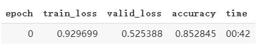
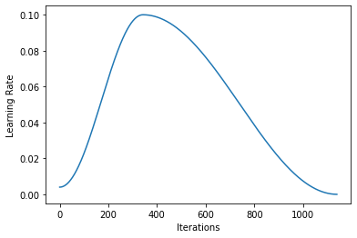

# 模型训练


## 简介
在Fastai框架下，其实完成了[前文](https://zhouchen.blog.csdn.net/article/details/89891569)所说的数据准备工作，就已经完成了深度网络训练的一半工作。剩下的就是学习器的构建以及训练效果的分析，也就是模型训练的部分。


## 学习器
在Fastai中，关于模型的构建并没有具体的API，要想实现自定义模型需要通过PyTorch的接口实现（参考我PyTorch模型的[博文](https://zhouchen.blog.csdn.net/article/details/104099788)），所以Fastai中模型都是基于预定义的一些模型，这些模型都在`fastai.vision.models`下，是对torchvision定义的一些模型结构的引用和完善。

所以可以看出，Fastai的主要思想就是基于迁移学习（Transfer Learning），具体可以查询迁移学习的一些文章了解。总之，关于组合预定义的模型（如resnet，这些模型都是torchvision定义的，具体哪些可以自行查看）和数据集(DataBunch)，然后投入训练，Fastai提供了一个非常方便的工厂方法`cnn_learner`，它能够自动初始化合适的预训练模型并构建顶层结构以适应数据集。事实上，`fastai.vision.learner`最核心的两个方法就是`cnn_learner`和`unet_learner`，它们都会返回一个`fastai.vision.Learner`对象，该对象包含训练（`fit`）、预测（`predict`）等方法。

```python
cnn_learner(
    data:DataBunch,  # 传入的数据集
    base_arch:Callable,  # 要进行Finetune的主干网络，接受`torch.nn.Model`的所有类型，包括自定义的
    cut:Union[int, Callable]=None,  # 在那一层分割网络
    pretrained:bool=True,  # 是否使用预训练模型，若使用则除顶层网络都会被冻结
    lin_ftrs:Optional[Collection[int]]=None,  # 添加头部网络中线性层特征数
    ps:Floats=0.5,  # 添加头部网络中Dropout概率
    custom_head:Optional[Module]=None,  # 自定义头部网络
    split_on:Union[Callable, Collection[ModuleList], NoneType]=None,  # 主干网络分组函数
    bn_final:bool=False,  # 分类前是否bn层
    init='kaiming_normal_',  # 头部网络参数初始化方法，默认kaiming初始化
    concat_pool:bool=True,  # 连接池化层
    **kwargs:Any)
```

该方法从数据`data`和模型`base_arch`中生成一个`Learner`对象，它会截断原始模型（backbone，主干网络）（该截断默认在最后一个包含pooling层处分割）并在顶层添加线性分类层（head，头部网络），具体添加的结构可以查看[官方文档](https://docs.fast.ai/vision.learner.html#Transfer-learning)。该方法参数丰富是为了方便自定义结构，实际进行使用时，很多默认参数就是很合理的，不需要过多调整。关于模型结构，[该链接](https://github.com/osmr/imgclsmob/tree/master/pytorch/pytorchcv/models)提供了很多比较常用的PyTorch实现的模型结构。

至此，就创建了一个很实用的学习器，下面将研究具体的训练过程。


## 训练
Fastai中最核心的训练方法为`learn.fit()`方法，很多demo中会提到`learner.fit_one_cycle()`方法，事实上这个方法在最新的Fastai中已经不建议使用了，它本质上就是`fit`方法添加OneCycleScheduler（one cycle策略）的回调组成的训练方法，自己在`fit`中添加即可。

`fit`是整个Fastai最为核心的训练函数，在`fastai.basic_train`模块中定义，具体参数和说明如下。

```python
fit(
    epochs:int,  # 训练轮次
    lr:Union[float, Collection[float], slice]=slice(None, 0.003, None),  # 学习率
    wd:Floats=None,  # 学习率衰减比例
    callbacks:Collection[Callback]=None)  # 回调列表
```
该函数表示在学习器上训练模型，使用包含每轮学习率衰减的训练方法，并添加一些回调函数。这里比较特殊的参数就是学习率，`lr`会被进一步处理为一个浮点型数组，数组长度和`learner.layer_groups`一致，用于不同深度的网络层的差异化训练，而根据不同的`lr`参数值会有不同的构造方式。
- 数值：返回的lr数组为全为lr值的数组；
- slice对象(含start和stop)：返回一个等比序列，起始值和终止值如slice设定；
- slice对象（含stop）：最后一个lr为stop，其余为stop/10。

例如，下面的一段代码，就表示完整的数据读入、学习器构建、训练、验证的过程。
```python
ds = data.ImageDataBunch.from_folder("101_ObjectCategories/", valid_pct=0.2, size=128)
learner_ = learner.cnn_learner(ds, models.resnet50, metrics=[metrics.accuracy])
learner_.fit(1)
```
Jupyter环境下的输出为下图，一轮的训练模型效果还是不错的。



在上面的三行代码中，在学习器构建的时候，使用了`metrics`参数，该参数表示训练中使用的评估指标，上述代码指定的为准确率。

### metrics
常用的评估指标都封装于`fastai.metrics`模块下，它们接受模型输出`outputs`和标签`targets`作为输入并计算相应指标值，训练时提供的metrics会被封装为回到，在每一轮训练中使用，具体工作流程这里不多叙述，稍有点复杂。可以查阅[文档](https://docs.fast.ai/metrics.html)了解具体的指标，包括准确率、mse、r2得分等各类指标。

### callbacks
训练过程中难免需要进行一些特殊的操作，如及时停止陷入过拟合的模型、每个batch后进行学习率调整等等，这些操作被称为回调（callbacks），封装在`fastai.callbacks`模块下，但是在`fastai.callback`模块下封装了一些回调的机制，如果不是想要了解Fastai的源码实现的话，可以不做深入探究，它主要将训练分为了多个阶段，并在合适的阶段通过回调处理器来进行回调操作。

下面介绍一些常用的回调，他们封装于`keras.callbacks`中，以类的形式存在，使用时只需要实例化一个对象出来即可。
```python
LRFinder
OneCycleScheduler
MixUpCallback
CSVLogger
GeneralScheduler
MixedPrecision
HookCallback
RNNTrainer
TerminateOnNaNCallback
EarlyStoppingCallback
SaveModelCallback
ReduceLROnPlateauCallback
PeakMemMetric
StopAfterNBatches
LearnerTensorboardWriter
# train and basic_train
Recorder
ShowGraph
BnFreeze
GradientClipping
```
上面的就是全部的回调方法（也可以自定义），下面具体说明几个常用的。
```python
Recorder(
    learn:Learner, 
    add_time:bool=True, 
    silent:bool=False)
```
可以理解为一个记录器，用于记录学习器的状态，Jupyter环境下训练时输出的表格就是该回调实现的，类似于Keras中的`History`，是默认添加的回调，可以通过`learner.recoder`获取该对象。该对象有一系列的方法，比较实用的有`recoder.plot()`（绘制损失随学习率变化曲线）、`recoder.plot_losses`（绘制训练和验证时的损失曲线）等。

```python
lr_find(learn:Learner, start_lr:Floats=1e-07, end_lr:Floats=10, num_it:int=100, stop_div:bool=True, wd:float=None)
```
这是`fastai.train`中定义的函数，通过训练若干个batch绘制学习率曲线找到较为合适的学习率（上下界可以指定），也会进行训练的控制（如停止训练）。主要通过`fastai.callbacks.LRFinder`类实现，将其加入回调即可。

```python
OneCycleScheduler(learn:Learner, lr_max:float, moms:Floats=(0.95, 0.85), div_factor:float=25.0, pct_start:float=0.3, final_div:float=None, tot_epochs:int=None, start_epoch:int=None)
```
按照著名的one cycle策略进行学习率的调整，可以设置一个cycle的epoch数等参数。

除此之外，还有很多实用的回调函数，这里不一一分析，可以查阅[文档](https://docs.fast.ai/callbacks.html)。

下面的代码就是添加了一个one cycle回调后的训练学习率变化的代码和学习率变化曲线（通过`learner.recoder.pplot_lr()`）绘制。
```python
from fastai.vision import data, learner, models
from fastai import metrics
from fastai import callbacks

ds = data.ImageDataBunch.from_folder("101_ObjectCategories/", valid_pct=0.2, size=128)
learner_ = learner.cnn_learner(ds, models.resnet50, metrics=[metrics.accuracy])
one_cycle = callbacks.OneCycleScheduler(learner_, lr_max=0.1)
learner_.fit(10, lr=3e-4, callbacks=[one_cycle, ])
```





## 推理
学习器训练完成了，当然就要用于实际的推理中，关于学习器的推理（预测）设计了诸多API，常用的有如下几种。

### 单个数据推理
`learn.predict(data)`来获得单个数据的推理结果，如执行`print(learner_.predict(learner_.data.train_ds[0][0]))`会对训练集第一个图片进行预测，结果是个三元组，`(类别名,类别索引,网络输出向量)`。

### 批量数据推理
`learn.pred_batch(ds)`对一批数据进行推理预测，返回一批数据的网络输出，本例就是`(64, 101)`的张量输出。

### 数据集推理（训练集或者测试集）
```python
get_preds(
    ds_type:DatasetType=<DatasetType.Valid: 2>,  # 指定推理数据集类型
    activ:Module=None,  # 
    with_loss:bool=False,  # 是否返回loss
    n_batch:Optional[int]=None,  # 批处理尺寸
    pbar:Union[MasterBar, ProgressBar, NoneType]=None)
```
指定`with_loss`后返回三个值，分别表示输出向量、标签索引、损失值，不设定`with_loss`则只输出前两者。

### 数据集推理（指标）
通过`learner.validate(dl, callbacks, metrics)`对任意数据集生成的数据加载器进行结果推理（用于计算指标值，如损失和准确率等）。

例如对验证集计算默认指标使用`learner_.validate(learner_.data.valid_dl)`就可以了。也可以通过`learner.show_results(ds_type, rows)`对数据集进行抽样推理并可视化。

### 解释器
Fastai实现了非常丰富的结果解释器模块，在每个application下都有具体实现，`fastai.vision.interpret`中就是视觉方面的具体实现。主要由`ClassificationInterpretation`（该类在`fastai.train`模块下）、`SegmentationInterpretation`等解释器类构成。
这些类含有`from_learner()`方法用于从学习器创建解释器，也可以通过`learn.interpret()`来获得解释器，这种方法获得的解释器依据`learner`类型进行创建。 

分类解释器使用较多，它的具体[文档](https://docs.fast.ai/vision.learner.html#ClassificationInterpretation)可以查阅。它有很多常用的方法，举例如下。

`interpreter.top_losses(k)`会返回损失最大的k个损失值和数据下标。`interpreter.plot_top_losses(k)`对损失最大的k个图像可视化。

`interpreter.confusion_matrix()`计算验证集上的混淆矩阵，可以修改数据集。同时`interpreter.plot_confusion_matrix()`表示绘制混淆矩阵。


## 模型的保存与加载
分为参数保存和整个模型的保存，后者通过`export()`和`load_learner()`方法实现，使用较少，主要是保存模型参数。

```python
learner.save(
    file:PathLikeOrBinaryStream=None,  # 文件路径
    return_path:bool=False,  # 是否返回路径字符串
    with_opt:bool=True)  # 是否保存优化器及其参数
```
若`file`参数是相对路径，则会使用`learner.path`作为目录，创建models文件夹后存放权重文件。

相应的，构造完成`learner`后调用`load`方法就可以加载模型参数了。
```python
learner.load(
    file:PathLikeOrBinaryStream=None, 
    device:torch.device=None, 
    strict:bool=True,
    with_opt:bool=None, 
    purge:bool=False, 
    remove_module:bool=False)
```

至此，模型训练的整个内容就完成了。


## 补充说明
本文主要讲解Fastai框架下学习器的构建、训练、推理分析、保存和加载等操作，更多请了解[官方文档](https://docs.fast.ai/)，具体代码开源于[我的Github](https://github.com/luanshiyinyang/Tutorial/tree/Fastai)，欢迎star或者fork。