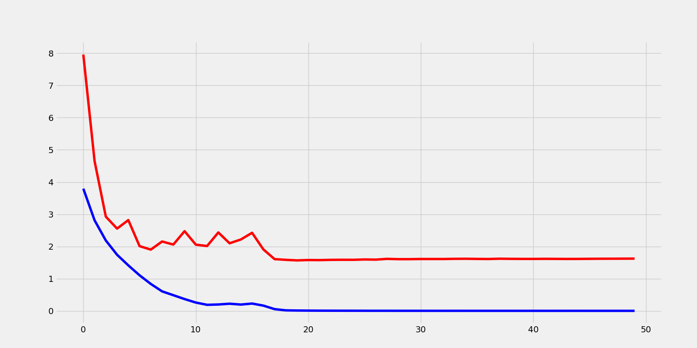

# Keras训练


## 简介
在Keras中，模型的训练其实并不是一件很复杂的事情，甚至相当简单，只需要准备好数据和模型，训练只是调用相关的接口而已。


## 数据和模型
关于数据加载和模型构建的内容我已经在[本系列](https://blog.csdn.net/zhouchen1998/category_8906034.html)之前的博客中单独介绍，这里不多赘述。具体设计的代码也可以在文末Github找到。主要工作是构建ResNet50模型并加载Caltech101数据集。


## 训练
在此之前，已经准备好了模型和数据，不过，训练之前还需要对模型进行编译指定必要的参数。一般而言，下面代码示例的三个参数是必须的，其中`optimizer`指的是优化器对象，具体封装在`keras.optimizers`模块下，常用的有SGD、Adam等；`loss`参数则是指的是模型最终的损失计算方式，常用的有MSE、CE等，也可以自定义loss函数；metrics要求传入指标列表，常用的有accuracy、mse等，这些可以字符串表示的都是已经封装的指标，也可以自定义。

```python
model.compile(optimizer=keras.optimizers.Adam(0.001), loss='categorical_crossentropy', metrics=['accuracy'])
```


编译完成模型之后，模型的训练非常简单，只需要调用`model`对象的`fit`或者`fit_generator`方法即可，具体参数如下。
```python
def fit(
        x=None,
        y=None,
        batch_size=None,
        epochs=1,
        verbose=1,
        callbacks=None,
        validation_split=0.,
        validation_data=None,
        shuffle=True,
        class_weight=None,
        sample_weight=None,
        initial_epoch=0,
        steps_per_epoch=None,
        validation_steps=None,
        validation_freq=1,
        max_queue_size=10,
        workers=1,
        use_multiprocessing=False,
        **kwargs)
```
**该接口适合训练较小的数据集，其中x为训练集数据，y为训练集标签，实际对深度学习任务而言，数据量很大，内存不可能存放的了这样大小的张量，必然需要分批次本地读取数据。**
下面详细叙述上述函数的主要使用的参数。
- `x`表示训练集数据
- `y`表示训练集标签
- `batch_size`表示批量输入模型的尺寸，当使用`fit`方法时指的是从整个张量中截取一部分，当使用`fit_generator`方法时必须与数据读取的批尺寸一致。
- `epochs`表示训练总轮数。
- `verbose`表示训练过程是否可见，设置可见会输出进度条。
- `callbacks`训练过程中的回调函数。具体下文介绍。
- `validation_split`验证集划分比例。
- `validation_data`验证集张量。
- `shuffle`是否打乱训练集次序。

```python
def fit_generator(
        generator,
        steps_per_epoch=None,
        epochs=1,
        verbose=1,
        callbacks=None,
        validation_data=None,
        validation_steps=None,
        validation_freq=1,
        class_weight=None,
        max_queue_size=10,
        workers=1,
        use_multiprocessing=False,
        shuffle=True,
        initial_epoch=0)
```
该接口则比较适合实际训练，分批次从生成器中获取数据并送入模型。下面介绍`fit_generator`相对于`fit`方法不同的必要参数。 
- `generator`表示训练集生成器。
- `steps_per_epoch`表示每轮循环的步数，一般使用`generator.n // generator.batch_size`自动计算。
- `validation_data`验证集数据，这里一般用验证集生成器。
- `validation_data`验证步数，同上面计算方法。
- `validation_freq`验证频率，默认一轮训练进行一次验证，改成其他整数表示n轮验证一次。

无论是哪种fit方法最终fit函数会返回一个History对象，该对象是一种默认添加的回调（下文具体提到），该对象包括每一轮的loss和相关指标数据，可以用于训练后的绘图等。

上文主要介绍了Keras中两个最主要的训练API，调用训练函数即可，上文忽略了一个问题---**训练回调函数**。实际上深度学习训练是个比较漫长且复杂的过程，重复代价过大，在训练过程中若出现问题终端会带来巨大的损失，所以添加一些必要的回调函数是非常重要的，例如保存模型的最优参数、自动调整学习率等。常用的一些回调函数下一节具体介绍。


## 回调函数
目前，最新版的TensorFlow2.1中的Keras模块封装了如下常用的训练回调`CSVLogger `、`EarlyStopping`、`History`、`LearningRateScheduler`、`ModelCheckpoint`、`ProgbarLogger`、`ReduceLROnPlateau`等，实际使用时只需要设定这些回调类的对象组合成列表传给训练方法的callbacks参数即可。

下面介绍几个个人常用的回调的使用。
```python
tf.keras.callbacks.EarlyStopping(
    monitor='val_loss', min_delta=0, patience=0, verbose=0, mode='auto',
    baseline=None, restore_best_weights=False
)
```
该回调表示当`monitor`指定的指标不再变好则提前停止训练，`monitor`一般是指验证集指标如`val_accuracy`、`val_loss`等，“早停”是非常常用的防止过拟合的手段。

```python
tf.keras.callbacks.ModelCheckpoint(
    filepath, monitor='val_loss', verbose=0, save_best_only=False,
    save_weights_only=False, mode='auto', save_freq='epoch', **kwargs
)
```
该回调表示当`monitor`指标变好后，会将模型或者模型参数自动保存到`filepath`指定的文件或者文件夹里，`monitor`同上一般是验证集指标，若设置`save_best_only`为`True`则只会保存模型`monitor`参数最好的那一次，`save_weights_only`表示是否只保存参数。

```python
tf.keras.callbacks.ReduceLROnPlateau(
    monitor='val_loss', factor=0.1, patience=10, verbose=0, mode='auto',
    min_delta=0.0001, cooldown=0, min_lr=0, **kwargs
)
```
该函数表示学习率自动衰减，当`monitor`指标不再变好时会根据变化因子`factor`进行学习率衰减`new_lr = factor * lr`，patience表示容忍`monitor`不变好的轮数以防波动，设置`min_lr`之后学习率如何都不会降到`min_lr`之下。如果想要自定义学习率调度机制则可以使用`keras.callbacks.LearningRateScheduler(schedule)`回调进行自定义，其中`schedule`是以`epoch`为输入的学习率为输出的函数，例如下面代码中的。
```python
def scheduler(epoch):
  if epoch < 10:
    return 0.001
  else:
    return 0.001 * tf.math.exp(0.1 * (10 - epoch))
```


## 训练加速
在Keras中用户不必自己进行GPU配置，Keras会默认自动调用GPU进行加速训练（包括多卡训练），当然这依赖于安装的TensorFlow是GPU版本的，如果想要进行简单的GPU配置需要使用TensorFlow的相关模块，如`tf.config`下的一些模块，具体可以查看[我TF2的系列文章](https://blog.csdn.net/zhouchen1998/category_9370890.html)。


## 实战
利用上文提到的Caltech101数据集以及ResNet50网络模型在V100显卡训练50轮的源码如下。

```python
from model import ResNet50
from dataset import Caltech101
import tensorflow.keras as keras
import pickle
import os
os.environ['TF_CPP_MIN_LOG_LEVEL'] = "2"

model = ResNet50((224, 224, 3), n_classes=101)
model.compile(optimizer=keras.optimizers.Adam(3e-4), loss='categorical_crossentropy', metrics=['accuracy'])
train_generator, valid_generator, test_generator = Caltech101()
callbacks = [keras.callbacks.EarlyStopping(monitor='val_accuracy', patience=10),
             keras.callbacks.ModelCheckpoint('weights.h5', monitor='val_loss', save_best_only=True, save_weights_only=True),
             keras.callbacks.ReduceLROnPlateau()]

history = model.fit_generator(
    train_generator,
    steps_per_epoch=train_generator.n // train_generator.batch_size,
    epochs=1,
    callbacks=callbacks,
    validation_data=valid_generator,
    validation_steps=valid_generator.n // valid_generator.batch_size
)

model.save_weights('final_weights.h5')
with open('his.pkl', 'wb') as f:
    pickle.dump(history.history, f)
print(model.evaluate(test_generator, steps=test_generator.n // test_generator.batch_size))
```

训练过程可视化如下图，50轮的训练损失已经下降到很低但并未出现过拟合，这一方面归功于ResNet的结构，另一方面也是训练回调的效果（如学习率衰减）。




## 补充说明
本文介绍了Kera中训练相关的一些API的使用并演示了一个图像分类的详细过程，设计的代码开源于[我的Github](https://github.com/luanshiyinyang/Tutorial/tree/Keras)，欢迎star或者fork。