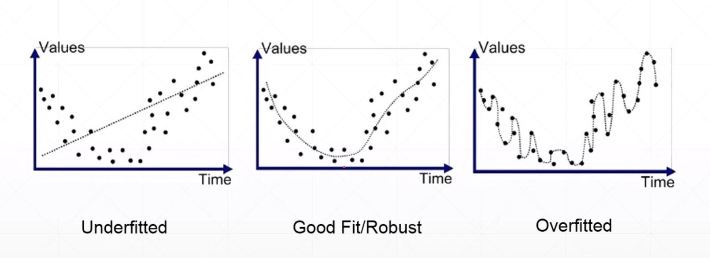
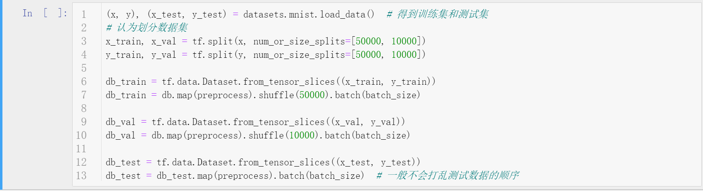
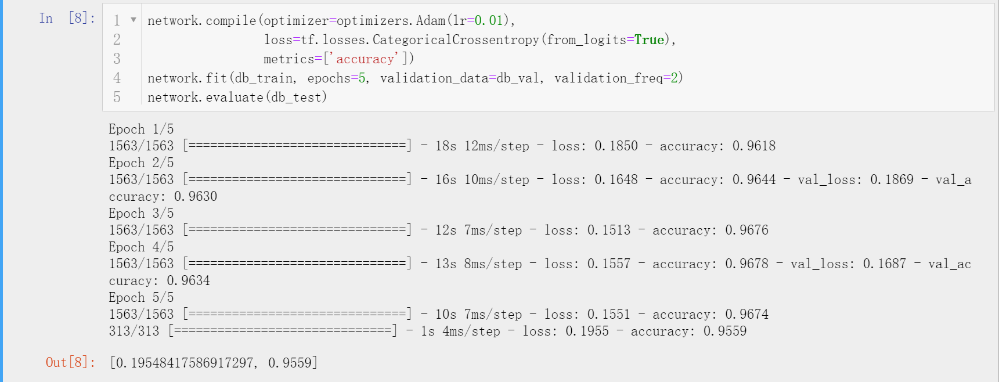
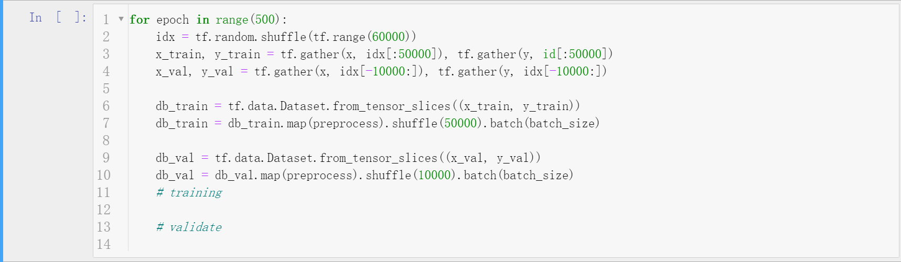
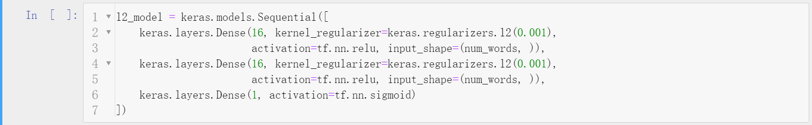
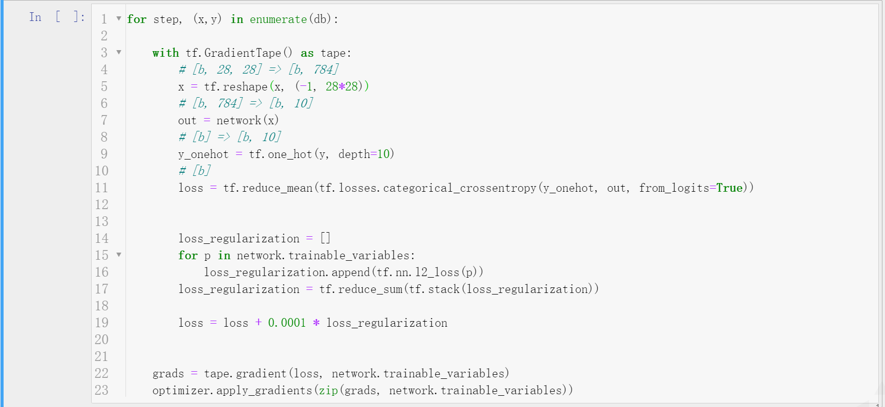

# TensorFlow2网络训练技巧

## 简介
- 在神经网络这种端到端模型的训练过程中，主要的关注点实际上并不多，参数初始化、激活函数、损失函数、优化方法等，但是过深的模型不免会带来欠拟合和过拟合的问题，为了解决过拟合带来的问题，采用了诸如数据增强、参数正则化、Dropout、Batch Normalization、划分验证集（交叉验证）等方法，这些被称为训练技巧（trick）。
- 当然，为了应对训练速度慢的问题，有时候也采用一些特殊的训练技巧于优化器上，如加入动量的SGD等。
- 上述的训练trick在TensorFlow2中都提供了简介高效的API接口，使用时直接调用这些接口即可很方便的控制训练、可视化训练、数据增广等。


## 过拟合与欠拟合
- 模型的表达能力（Model Capacity）是多变的。一元线性回归模型的表达能力很弱，它只能拟合线性分布的数据；神经网络的表达能力很强，参数量庞大，可以拟合非常复杂的分布。
- 深度学习中的模型都是层次非常深的，参数极其复杂。要训练这样的网络是比较困难的，需要大量的数据用于参数的学习调整。数据量过少，网络难以被充分训练，无法达到拟合训练集分布的效果，这种问题是机器学习中常见的欠拟合问题（underfitting），该情况下模型的表达能力不够，模型复杂度（estimated）小于数据真实复杂度（ground-truth）。还有另一种情况，模型复杂度（estimated）大于数据真实复杂度（ground-truth），这是因为训练后期模型为了降低loss过分拟合训练数据，从而导致拟合程度过高，模型失去泛化能力。这种问题在机器学习中称为过拟合问题（overfitting）。过拟合现象在训练可视化过程中的表现为随着训练轮次增加，训练集损失不断减少，验证集损失先减少后增加。
- 现代机器学习中，神经网络这样的模型深度很深，模型的表达能力很强，常出现的问题是过拟合问题，欠拟合问题已经较少出现。



## 过拟合问题
- 检测
  - 划分数据集（Splitting）
    - 将有标注的训练数据拿出小部分划分为验证集，验证集由于包含标签数据，可以利用训练好的模型进行预测得到相关metrics（如accuracy等），用于检测模型的训练情况（包括是否过拟合）。
    - 可以对tensor进行直接划分（该方法不会随机打乱数据集）。训练时可以直接将验证集作为参数传入，在验证集上评测的指标与training设定的metric相同。验证集用于训练过程控制训练，模型最终应用在测试集上。
  - k折交叉验证（K-fold cross validation）
    - 之前的划分是一次性划分，有较大概率无法利用所有数据，因为只能使用划分的训练集进行训练，而不能使用验证集进行训练，这部分验证集数据信息就被放弃了。k折交叉验证是为了充分利用数据性能，多次进行数据集划分，要求每次划分的那部分验证集（如20%）在后面的4折中会作为训练集，这样5折下来，每一部分数据都被作为训练数据过(5折交叉验证是最常见的，更少不能充分验证，更多训练量过大)。
    - 在TensorFlow2中可以自行实现k折划分。当然，TensorFlow2也提供比较简单的接口，只需要指出划分比例，则会自动划分出验证集。
- 处理
  - 充分的数据
    - 充分的数据可以有效训练网络，要求网络进行更多学习，减轻过拟合。正是ImageNet这样的大规模标注数据集，深度学习的发展才会如此迅速。
  - 降低模型复杂度
    - 正则化（Regularization）方法通过在loss函数中添加惩罚项，迫使参数的范数趋近于0，从而使得低复杂的参数较大，使得复杂网络退化。在有些地方，该方法也叫作weight decay（参数衰减）。
    - keras模块下的layer中参数正则化非常简单，只要传入正则化方法对象即可。实际使用中，TensorFlow2提供更灵活的方法。
  - Dropout方法
    - 一个简单粗暴的防止过拟合的方法，以一定概率关闭神经元连接，迫使网络学习更多。
    - 在TensorFlow2中，keras的layers模块将Dropout操作封装为一层的操作，通过堆叠使用。但是注意，添加了Dropout的网络前向传播是必须制定training参数，因为测试集上预测是不应该断开连接，这只是训练时的技巧。
        ```python
        network = Sequential([layers.Dense(256, activation='relu'),
                            layers.Dropout(0.5), # 0.5 rate to drop
                            layers.Dense(128, activation='relu'),
                            layers.Dropout(0.5), # 0.5 rate to drop
                            layers.Dense(64, activation='relu'),
                            layers.Dense(32, activation='relu'),
                            layers.Dense(10)])
        ```
  - 数据增广
  - Early Stopping
    - 早停是防止过拟合的一种常用手段，当训练时验证集metric已经饱和或者开始变坏达到指定次数时，停止训练。
    - 通过keras的callbacks模块可以很方便实现这个功能。
        ```python
        es = rl = keras.callbacks.EarlyStopping(monitor='val_acc', patience=5)
        ```


## 动量（Momentum）SGD
- 梯度更新的方向不仅仅依赖于当前梯度的方向，而且依赖于上一次梯度的方向（可以理解为惯性）。
- 通过添加动量项，可以使得梯度下降算法找到更好的局部最优解或者全局最优解。但是，有时候动量SGD有可能花费更多的时间找到不是很好的解。
- 在TensorFlow2中，动量项的梯度更新不需要人为完成，只需要指定动量超参数权值，其余交由优化器完成即可。很多优化算法如Adam是默认使用momentum策略的，不需要人为指定。其中，指定动量项权值为0.9是一个常用策略。


## 学习率衰减（learning rate decay）
- 训练后期，过大的学习率可能导致不断波动，难以优化。此时采用学习率衰减策略会是一个不错的方法，该策略后期会自动调整学习率。
- 同样的，keras的callbacks模块提供了回调函数用于减少学习率。这里的衰减是触发执行的，即后期monitor监控的值不再变好的次数达到patience则会降低学习率。
    ```python
    rl = keras.callbacks.ReduceLROnPlateau(monitor='val_acc', patience=5)
    ```
- 也可以在训练过程中，手动确定衰减策略降低学习率。
    ```python
    optimizer.learning_rate = 0.2 * (100-epoch)/100
    ```


## 补充说明
- 本文主要针对TensorFlow2中训练技巧进行了简单使用上的介绍。
- 博客同步至我的[个人博客网站](https://luanshiyinyang.github.io/tensorflow2/2019/10/28/TrainingTricks/)，欢迎浏览其他文章。
- 如有错误，欢迎指正。