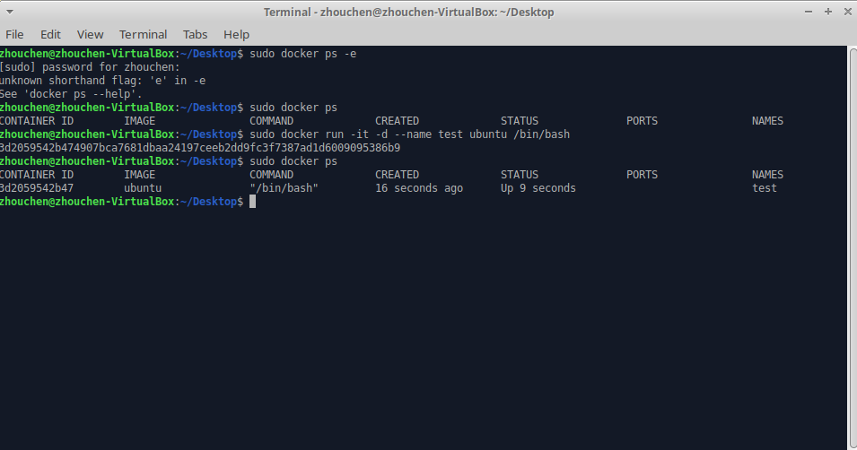
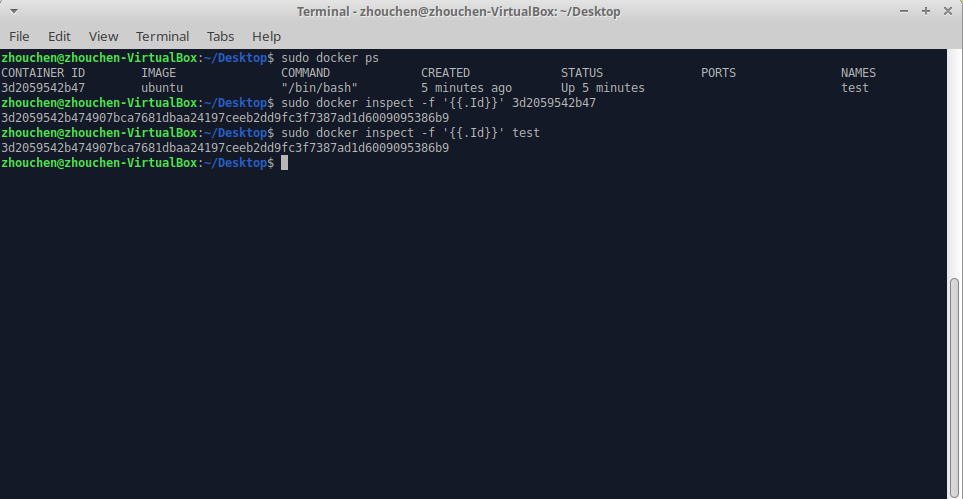
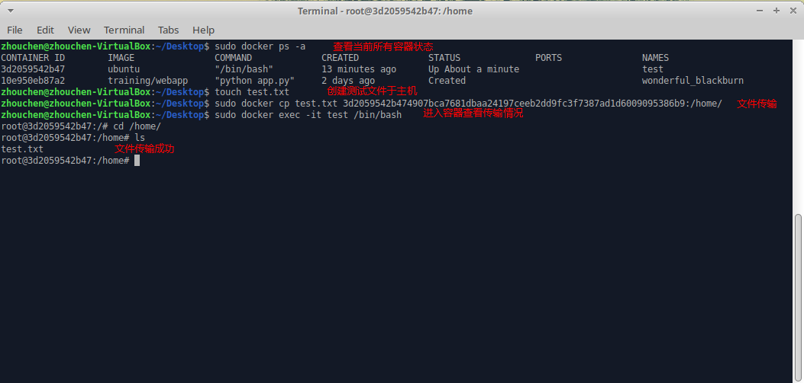
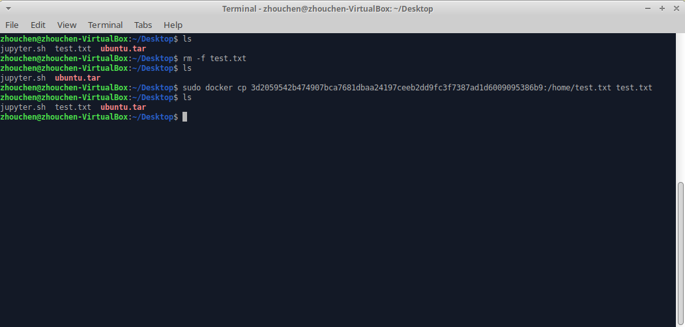
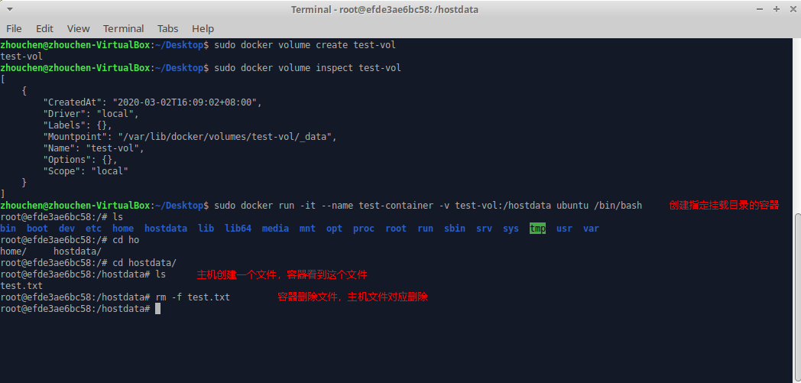
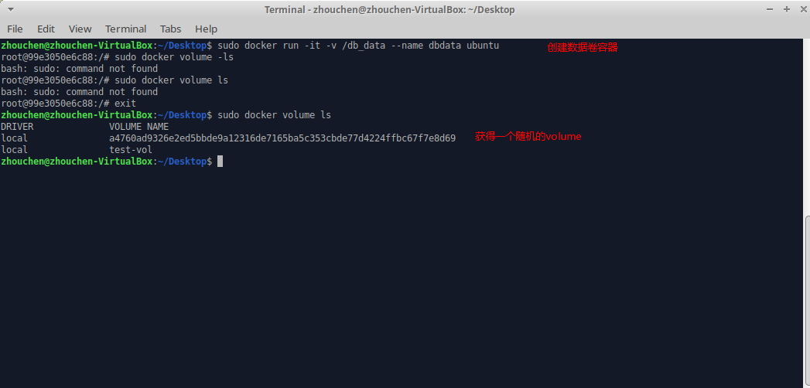
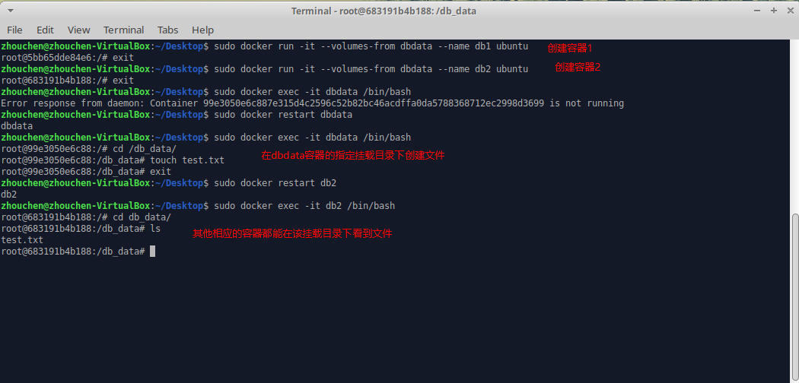

# Docker文件传输

## 简介
本文介绍如何在宿主机和Docker容器之间进行文件传输，主要采用两种方法，分别是cp拷贝方法和volume挂载方法两种，后者为官方推荐方法之一，效率更高。

## 拷贝命令
`docker cp 本地文件路径 ID全称:容器内文件路径`命令将主机文件拷贝到容器中，而`docker cp 本地文件路径 ID全称:容器内文件路径`命令将容器内文件拷贝到主机中。

下面，具体介绍用法。

首先，创建一个容器，指定name（可以不指定，这里为了方便）。具体命令执行情况如下，容器创建运行后返回的长字符串就是容器ID全称，也是`cp`命令需要使用的，但是随着任务的处理，这个ID需要重新查询。

通过执行`docker ps -a`可以查询到容器的短Id和容器名称，知道任意一个均可通过`docker inspect -f '{{.Id}}' 短Id/容器名称`命令查询该容器的完整长Id。

知道了完整Id，就可以使用本节开头处提到的命令进行主机和容器间的文件传输，具体执行情况如下，已经进行了图片备注。

同样的，将容器内的文件传输到主机中，也是类似可行的。

## 挂载方式
这种方法相比于上面的方法效率更高，也是官方推荐的[三种Docker文件管理方法](https://docs.docker.com/storage/)之一，具体点击链接查看即可。

### 普通卷
首先，创建一个Volume，指定名称即可。创建的命令为`docker volume create 名称`，查看创建的Volume信息命令为`docker volume inspect 名称`，如下图所示，其中Mountpoint这一项就是挂载点，也就是主机和容器进行文件传输的目录。

在通过`run`命令**启动一个容器**的时候可以通过`-v`选项将主机目录挂载到容器中，此时主机的文件变动会影响容器内的对应目录，反之，容器内指定目录的文件变动也会影响主机。具体的命令为`docker run -it --name test-container -v volume名称:容器对应目录 镜像名 可执行文件`，示例如下图。**有点需要特别注意，上面命令中的volume名称也可以使用主机中的文件目录，这样可以创建一个指定位置的目录来进行文件传输，而不用由docker指定。**

### 数据卷
还有一种提到的很多的方法，就是使用数据卷容器来实现多个容器之间的数据共享，具体如下。

首先，创建一个数据卷容器名为`dbdata`并将其中的`/db_data`目录作为Volume挂载目录，具体命令为`sudo docker run -it -v /db_data --name dbdata ubuntu`，此处没有指定volume名则系统会自动创建一个名称随机的volume用于挂载。

随后，在启动其他容器是，通过`--volumes-from`选项指定数据卷容器的名称即可将该容器挂载的主机目录页挂载到当前容器的相同挂载目录下，下图演示这个过程。

其实，数据卷容器和普通卷方法是一致的，只是更方便指定那个volume而已，未必是必要的。

最后，上述提到的使用Volume进行数据传输都是要在创建容器时指定挂载的，那么是否也可以对运行中的容器动态添加挂载呢？

答案是可以的，这里也不多提，比较前者使用面较广，想要具体了解，可以自行搜索。

## 补充说明
本文主要介绍cp和volume命令来进行宿主机与容器之间的文件传输，文章中若有疏漏，欢迎评论指正。