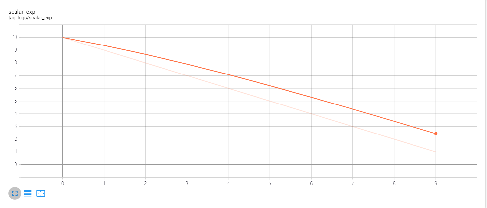
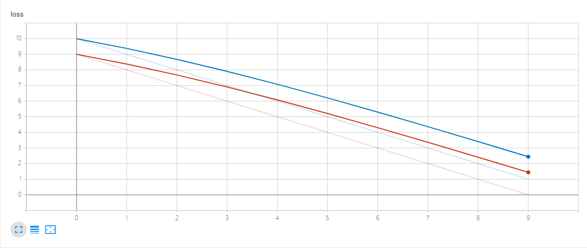
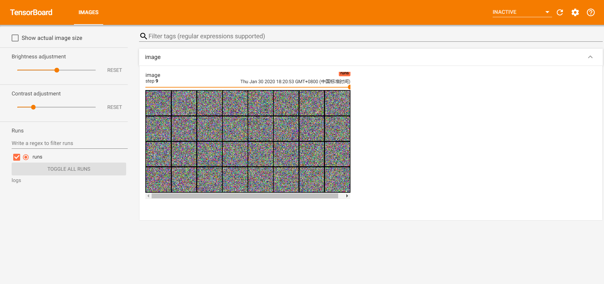
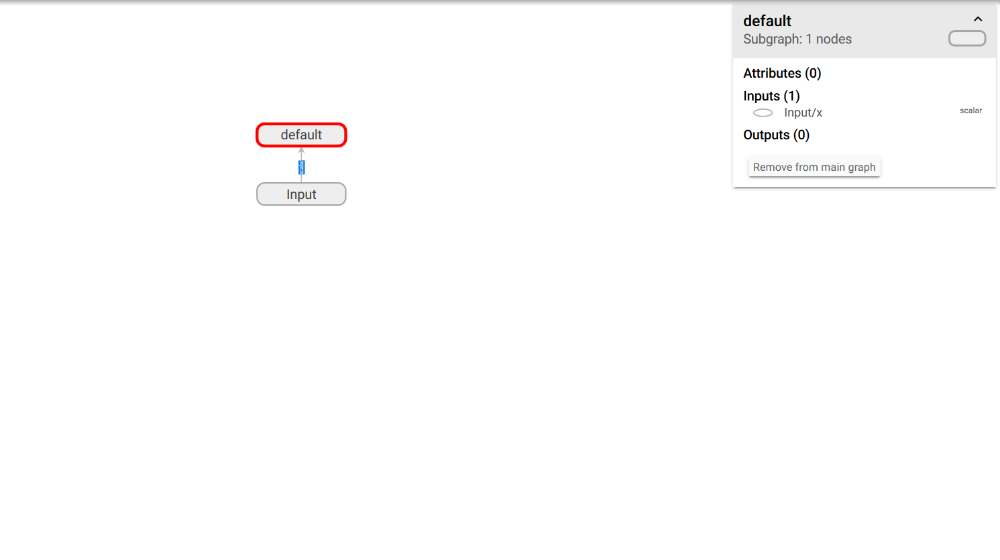
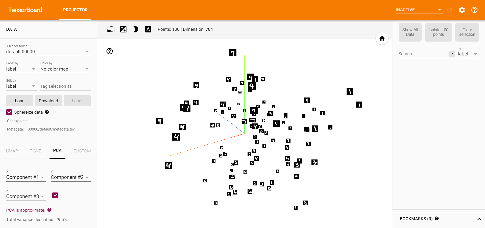

# 训练可视化

## 简介
深度神经网络是一个复杂的数学模型，其可解释性长时间为人质疑，被称为“黑盒”模型。但是其本质上就是个数学模型，很多统计学的方法可以用来观察理解这类深度模型。在PyTorch中并没有内置很完善的可视化功能，一般是借助TensorFlow的TensorBoard进行可视化（使用TensorBoardX这个工具）或者使用Visdom这个可视化工具，这两种方法是比较主流的手段。

## TensoBoardX
通常神经网络的训练过程是漫长且复杂的，可视化训练过程对于问题的发现和模型收敛效果的确定非常重要，需要可视化的通常由Loss曲线、Accuracy曲线、特征图可视化、预测混淆矩阵等。

TensorBoardX包是为了让TensorFlow以外的框架可以使用TensorBoard进行训练可视化，其[官方文档](https://tensorboard-pytorch.readthedocs.io/en/latest/tutorial_zh.html#)可以自行查阅。

### 安装
使用Pip工具安装该包即可。（在安装了tensorboard的前提下，使用命令`pip install tensorboardx`进行安装。）

### 启用监控
TensorBoard可视化的数据来自于本地log文件，该文件存在于一个文件夹，且在控制台开启TensorBoard服务时指定该文件夹为监控文件夹。

在该虚拟环境下启用tensorboard服务，启用命令为`tensorboard --logdir=logs`（已经创建了`logs`文件夹），默认开启6006端口提供服务，通过`http://localhost:6006/`可以访问可视化结果。

### API函数接口
一般需要构建一个全局的事件写入器（event writer），然后通过调用writer对象的`add_x`方法添加相关的数据、图片等，构建writer对象传入监控目录即可，本文指`logs`文件夹。

本部分所有测试代码文末的Github给出。

- `writer.add_scalar(tag, scalar_value, global_step=None, walltime=None)`
  - 在一个图表中记录一个标量的变化情况，常用于Loss曲线的绘制。
  - **tag**参数为该图的标题。
  - **scalar_value**参数表示该步的数值，为纵坐标。
  - **global_step**参数表示步数，为横坐标。
  - **walltime**参数表示为event文件的文件名设置时间，默认当前时间。
例如绘制一个一次函数衰减的loss图如下。

- `writer.add_scalars(main_tag, tag_scalar_dict, global_step=None, walltime=None)`
  - 在一个图表中记录多个标量的变化情况，常用于对比训练集损失和测试集损失。
  - **main_tag**参数设置该图的标签。
  - **tag_scalar_dict**参数表示字典形式的多个标量，key为tag，value为标量的值，它们都是纵坐标。
  - 其他参数同上。
例如绘制一个训练集和验证集损失变化的图像如下。

- `writer.add_histogram(tag, values, global_step=None, bins='tensorflow', walltime=None)`
  - 绘制直方图和分位数折线图，用于检测权值和梯度的分布变化，观察网络更新的方向是否正确。
  - **values**参数表示绘制直方图的数值。
  - **bins**参数确定如何取bins。
  - 其余参数同上。

例如绘制模型参数的图，注意需要在顶部选项栏切换到其他视图，如HISTOGRAMS。

- `writer.add_image(tag, img_tensor, global_step=0, walltime=0)`
  - 绘制图片，常用于检测模型的输入、特征图、权重等，但是该接口只能可视化一张图片，所以通常借助`torchvision.utils.make_grid()`将多个图片拼接为一张图片，其API如下，具体查看官方文档，`torchvision.utils.make_grid(tensor, nrow=8, padding=2, normalize=False, ra
nge=None, scale_each=False, pad_value=0)`。
  - **img_tensor**参数表示需要可视化的图片数据，要求`(C, H, W)`格式。
  - 其余参数同上。
下图是多个随机噪声图片的结果，同样需要顶部导航栏切换查看。

- `writer.add_graph(model, input_to_model=None, verbose=False)`
  - 绘制深度神经网络结构拓扑图。
  - **model**参数表示模型实例。
  - **input_to_model**参数表示模型的输入数据，给一个随机数符合shape要求即可。
生成的是一个可编辑的模型可视化结果。

- `writer.add_embedding(mat, metadata=None, label_img=None, global_step=0, tag='default', metadata_header=None)`
  - 在三维或者二维空间内展示数据分布，可选T-SNE、PCA或者Custom方法。
  - **mat**参数表示需要绘制的数据，一个样本必须是一个向量，即为`(N,D)`维度。
  - **metadata**参数表示数据的标签，为一个长度为`N`的列表。
  - **label_img**参数表示空间中展示的图片，shape为`(N,C,H,W)`。
  - 其他参数同上。
可视化MNIST数据集结果如下。

- `add_text(tag, text_string, global_step=None, walltime=None)`
  - 记录文字信息。
- `add_text(tag, text_string, global_step=None, walltime=None)`
  - 记录视频信息。
- `add_figure(tag, figure, global_step=None, close=True, walltime=None)`
  - 添加plt的图片到图像中。
- `add_figure(tag, figure, global_step=None, close=True, walltime=None)`
  - 在图像中绘制边界框，常用于目标检测。
- `add_figure(tag, figure, global_step=None, close=True, walltime=None)`
  - 绘制PR曲线。
- `export_scalars_to_json(path)`
  - 导出scalars信息为json文件，方便后续使用。

上面就是TensorBoardX常用的一些接口，通过这些接口可以实现很多复杂的可视化操作，如卷积核可视化、特征图可视化、梯度分布可视化等等，这里就不提及了，后面的实战文章我会用到。

## 补充说明
本文介绍了TensorBoardX这个训练可视化工具，这是非常实用的适合PyTorch使用者的工具，当训练遇到问题时方便的可视化会很容易判断出模型的问题，从而优化得到较好的模型设计。本文涉及到的代码均可以在[我的Github](https://github.com/luanshiyinyang/Tutorial/tree/PyTorch)找到，欢迎star或者fork。